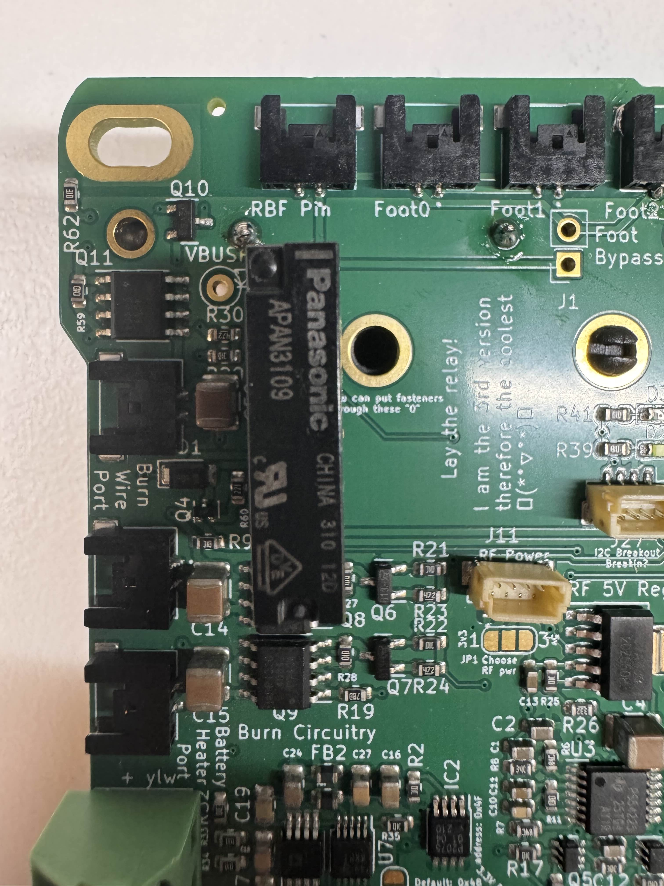

# Chapter 1: Battery Board Assembly
In this chapter, the user will learn the proper steps to assemble an Electrical Power System (EPS) board. The steps can be followed again to create an optional ballast to add weight to the satellite, or while not recommended, additional power to the satellite.

***Before continuing:** it is important to note that gloves should be worn when soldering and it should be done in a well-ventilated area to avoid the harmful fumes.*

## Soldering the Relay
1. Align the relay onto the white box by the top left corner of the battery board. Make sure the dot on the top side of the relay is closest to the slot hole as seen as figure 1.1.

   
Figure 4.1: Flight Controller Board (FCB) 
