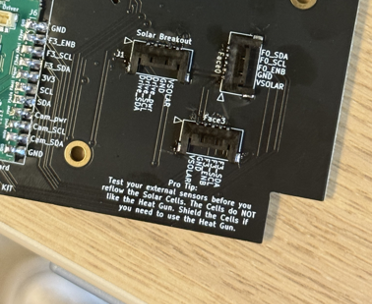
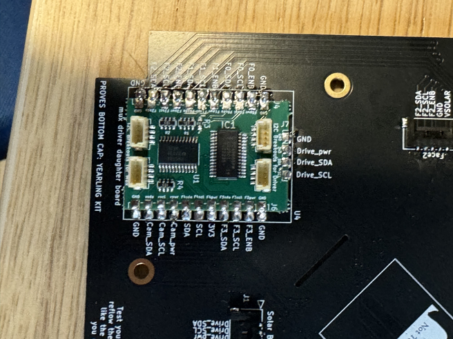

# Chapter 3: Solar Assembly

Before continuing it is important to note that gloves should be worn prior to applying solder paste to avoid ingestion of a lead-based material.

# Z Faces

4. **Z- Face Solar Boards**
   a. Install the Solar Cells (KXOB101K08F-TR) using low temperature solder paste and a reflow oven.
   b. Apply Low Temperature Solder Paste to the pads on the Solar Board as seen in Figure 3.4.
   
Figure 3.4: Z-Face Solar Board Preparation

   c. Check that the positive and negative terminals on the back side of the cells are matched with the plus and minus silk screened on the PCB.
   
   d. For cells that are immediately next to each other, scoot them together so that the gap between them is as small as possible.
   e. Reflow on low heat (the low temperature for the solder that you use is recommended) and do not touch until completely cool.

**Soldering the pins to the board**
7. Move heat shrink tubing up and use hot air to shrink tubing around heater leads

1.	5pin Headers. 
1. 
a.	Look for the footprint on the board (face up) labeled Face 0, Face 1, Face 2, Face 3, and Solar Breakout. Take your five pin headers and solder them individually onto each of these five imprints. Make sure the ends are lined up with the two gold squares in the corners. When soldering, try to ensure that the picolock headers are flat on the board (not elevated). Solder individual pins to the corresponding pin. (don't connect all together/will scrabble the connections together). Then solder a little bit on the sides of the gold sides to ensure the five head picolock headers are secure on to the board. Repeat that till all the five (5 pin) picolock headers are placed.

# XY Faces 
1. **Hand solder pico-lock connector following silkscreen and pad outlines.**
   a. Follow the silkscreen pattern on the board to place the components in the correct positions/orientations. For the pico-lock connectors line up the mounting pads when soldering connectors.

!!! warning
      Test all sensors for full functionality prior to solar cell installation (see Chapter 7 that identifies the proper test to complete for the solar boards). If sensors are faulty and need to be reflowed or removed with a heat gun, the cells will be damaged in the process.

2. **Install the Solar Cells (KXOB101K08F-TR) using low temperature solder paste and a reflow oven.**
   a. Apply Low Temperature Solder Paste to the pads on the Solar Board as seen in Figure 3.1.
   
Figure 3.1: Before and After Solder Paste Application

   b. Check that the positive and negative terminals on the back side of the cells are matched with the plus and minus silk screened on the PCB (Note: you cannot tell the orientation of the cell from the top of the cell so make sure it is placed properly).
   
   c. For cells that are immediately next to each other, scoot them together so that the gap between them is as small as possible. Otherwise, the fishing wire to stow the antenna may get caught in the cracks.

## Optional: Motor Driver Modification
3. **OPTIONAL: Remove 0 ohm resistor for motor driver as seen in Figure 3.3**
   a. If the solar board has already been removed from the oven, the resistor can be removed by a fine tip soldering iron heating each pad simultaneously. If the board is still hot from the oven, tweezers can be used very swiftly to remove the resistor.
   
Figure 3.3: Motor Driver Resistor Removal

!!! note
      This step is completely optional as the magnetorquers can be deactivated in software. Only one X Magnetorquer and one perpendicular Y Magnetorquer need to remain active in order to detumble the satellite effectively. The Z- Solar board should let the magnetorquer coil remain active as this is the only coil on the Z faces.

 
 retake this image, not the best quality (edit) 

   
Figure 4.4: Pre-tinned pads

   
   
Figure 4.4: solar board w/ daugher and 5 pin 
  

  