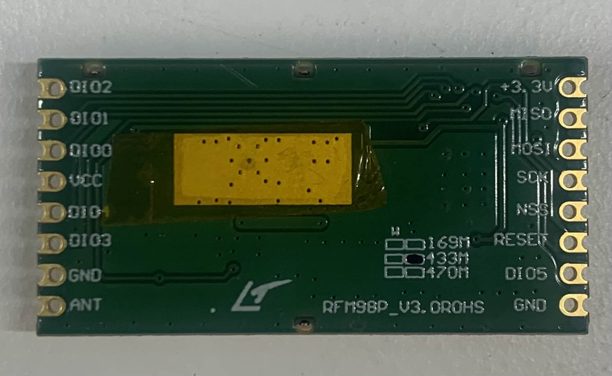
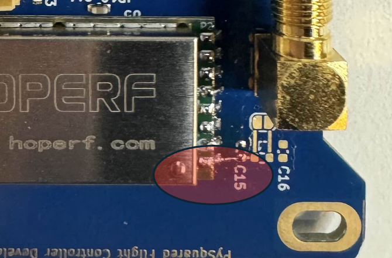
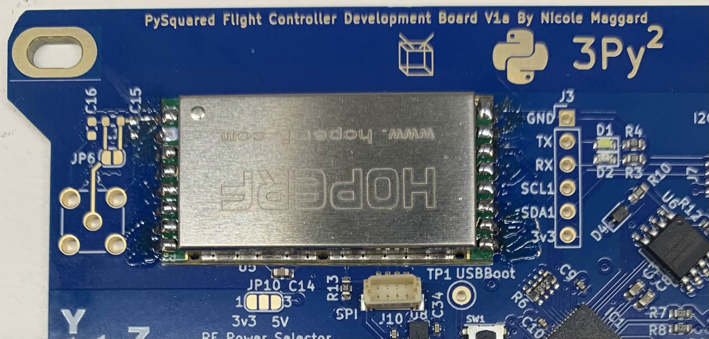
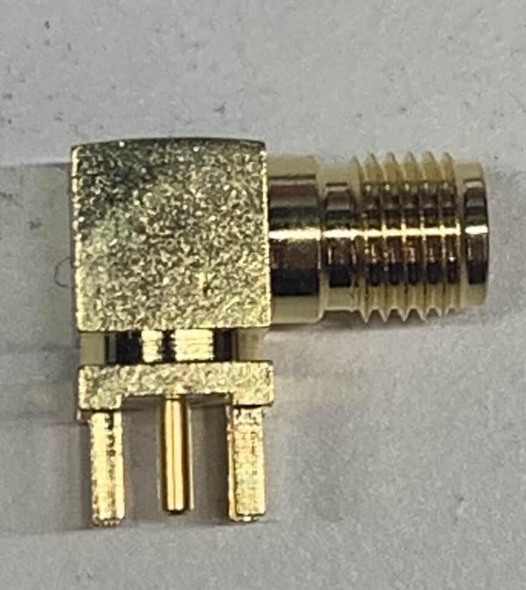

# Chapter 4: Flight Controller (FC) Board 
***Before continuing:** it is important to note that gloves should worn when soldering and it should be done in a well-ventilated area to avoid the harmful fumes.*

## Installing the 433 MHz HOPERF (Radio Module)

**0.** Locate the HopeRF Radio Module Footprint on the FC Board.
**a.** The HopeRF Radio Module Footprint is portrayed as the big rectangle footprint with 8 copper pads located on each side. You can also locate it below the CubeSat Logo. This can be seen in Figure 4-1.

!!! Note
    The Radio Module Footprint is located below the CubeSat Logo and has a white rectangle

**1.** When soldering the radio, the exposed metal part on the underside of the module should be taped up with Kapton Tape in order to avoid contact with the copper pads on the HopeRF footprint of the FC Board.

  *
 Figure 4.2 Taped Section of Radio Module
*

**2.** Align the radio module to the white rectangular outline 

**3.** On the radio module, there is a dot on the metal side which should be next to the C15 connection.
 
 *
Figure 4.3 Front Side of Radio Module 
*

**4.** Tape down the radio module to ensure that it stays in place while soldering the pins of the radio module to the copper pads of the footprint on the FC Board.

**5.** Once the radio module is aligned and secured, begin soldering.

*
Figure 4.5: FC Board with Soldered Radio Module
*

## Installing the RFMA adapter

1. The RF-SMA Adapter that will be used for this section is seen in Figure 4-5.

 

 *
Figure 4.5 RF-SMA Adapter
*
 
**1.** The RF-SMA that will be used for this section is seen in Figure 4-5.
  <figure>
    
  </figure>
  
  *
Figure 4-5 RF-SMA
*

!!! Note
    Ensure that the RF-SMA Adapter that you are using matches the footprint seen on the Internal FC Board. Check the KiCAD Schematics for further details.
