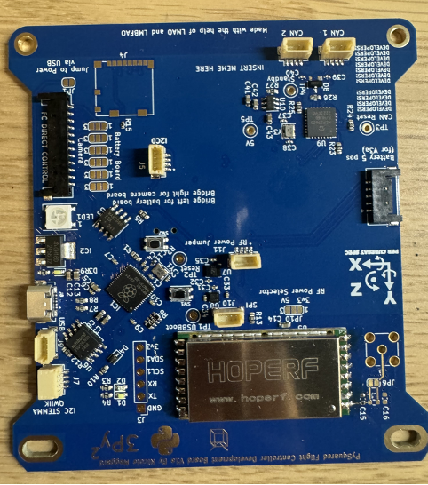
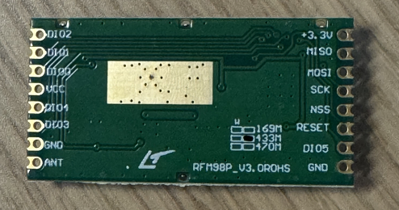
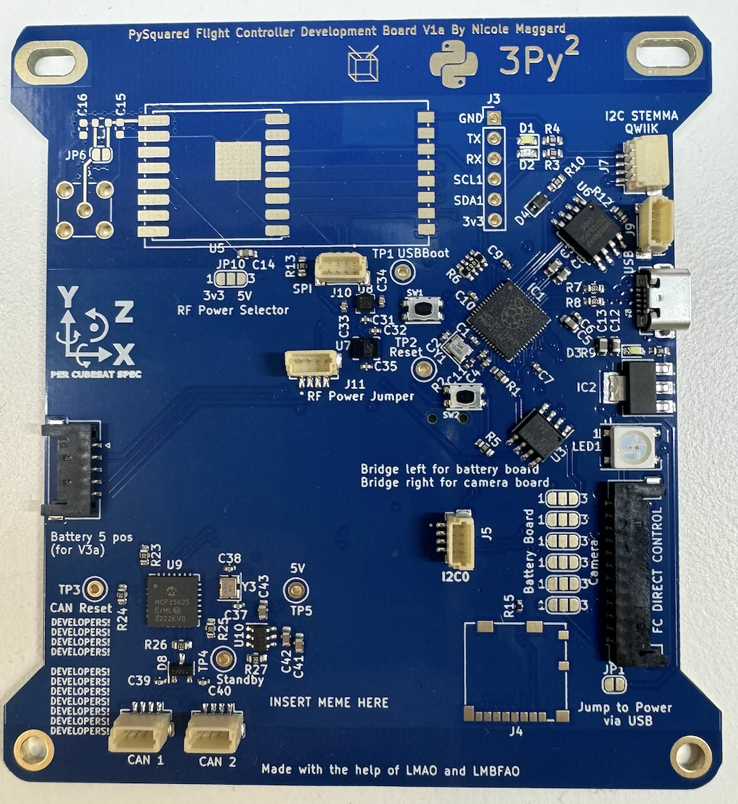

# Chapter 3: Flight Controller Board (FCB)

First, get a radio module as seen in figure 2.1 and tape down the green pcb side so it covers the small metal squares to prevent the radio’s connection to the board. Afterwards, align the radio module onto the rectangle footprint on the corner of the internal flight control board. Make sure the dot on the metal side of the radio module is next to the C15 connection. Tape down the module to make sure it does not move while you solder on the first connections onto the board. Once everything is aligned correctly, solder on the gold squares on both sides and it should look like figure 2.3.

   
Figure 4.4: Pre-tinned pads

   
   
Figure 4.4: Pre-tinned pads

   
   
   
Figure 4.4: Pre-tinned pads

