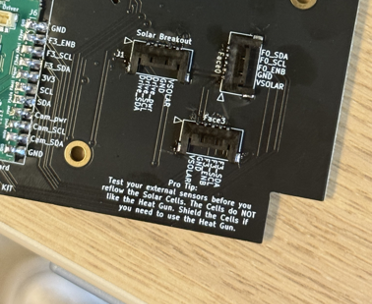

# Chapter 3: Solar Boards Preintegration
# Z Faces
 1.  **Soldering the pins to the board**

 
!!! warning
      Test all sensors for full functionality prior to solar cell installation (see Chapter 7 that identifies the proper test to complete for the solar boards). If sensors are faulty and need to be reflowed or removed with a heat gun, the cells will be damaged in the process.

7. Move heat shrink tubing up and use hot air to shrink tubing around heater leads

1.	5pin Headers. 
a.	Look for the footprint on the board (face up) labeled Face 0, Face 1, Face 2, Face 3, and Solar Breakout. Take your five pin headers and solder them individually onto each of these five imprints. Make sure the ends are lined up with the two gold squares in the corners. When soldering, try to ensure that the picolock headers are flat on the board (not elevated). Solder individual pins to the corresponding pin. (don't connect all together/will scrabble the connections together). Then solder a little bit on the sides of the gold sides to ensure the five head picolock headers are secure on to the board. Repeat that till all the five (5 pin) picolock headers are placed.

  retake this image, not the best quality (edit)
   
Figure 4.4: Pre-tinned pads

   
   
Figure 4.4: solar board w/ daugher and 5 pin 
  

   
Figure 4.4: Pre-tinned pads

   
   
Figure 4.4: Pre-tinned pads

   
   
   
Figure 4.4: Pre-tinned pads

  