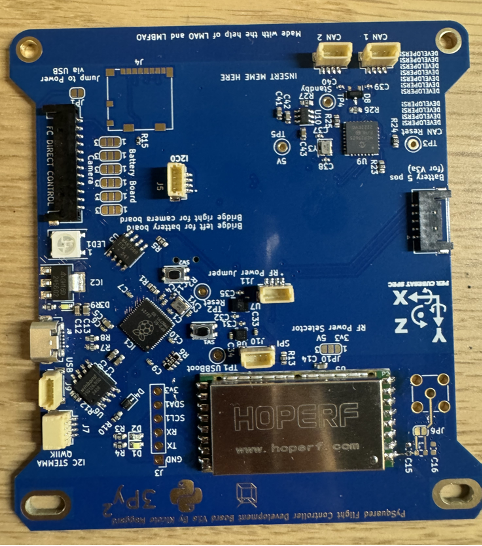

Z- Solar Board V2 Breakdown
By. Pragun, Sherwin, and Austin 
Welcome to the assembly and integration guide for the Z-Solar Board V2! In this guide we will detail all the steps needed to take your kit and make it a functioning satellite!
Chapter 0: Parts and tools 
Chapter 1:Battery Board Preintegration 
Chapter 2: Solar Boards Preintegration
Chapter 3: 
Step 1- Soldering 
Face 0-3/ Solar Breakout 
Knowing your nomenclature 
•	FO_SDA/ FO_SCL= data communication that can be used simultaneously using the same language to communicate.
•	FO_ENB=enable turns on faces 
•	GND=Ground
•	SOLAR=Power
1.	5pin Headers. 
a.	Look for the footprint on the board (face up) labeled Face 0, Face 1, Face 2, Face 3, and Solar Breakout. Take your five pin headers and solder them individually onto each of these five imprints. Make sure the ends are lined up with the two gold squares in the corners. When soldering, try to ensure that the picolock headers are flat on the board (not elevated). Solder individual pins to the corresponding pin. (don't connect all together/will scrabble the connections together). Then solder a little bit on the sides of the gold sides to ensure the five head picolock headers are secure on to the board. Repeat that till all the five (5 pin) picolock headers are placed.

   
Figure 4.4: Pre-tinned pads

   
   
Figure 4.4: Pre-tinned pads

   
   
   
Figure 4.4: Pre-tinned pads

    retake this image, not the best quality (edit)
   
Figure 4.4: Pre-tinned pads

   
   
Figure 4.4: solar board w/ daugher and 5 pin 
