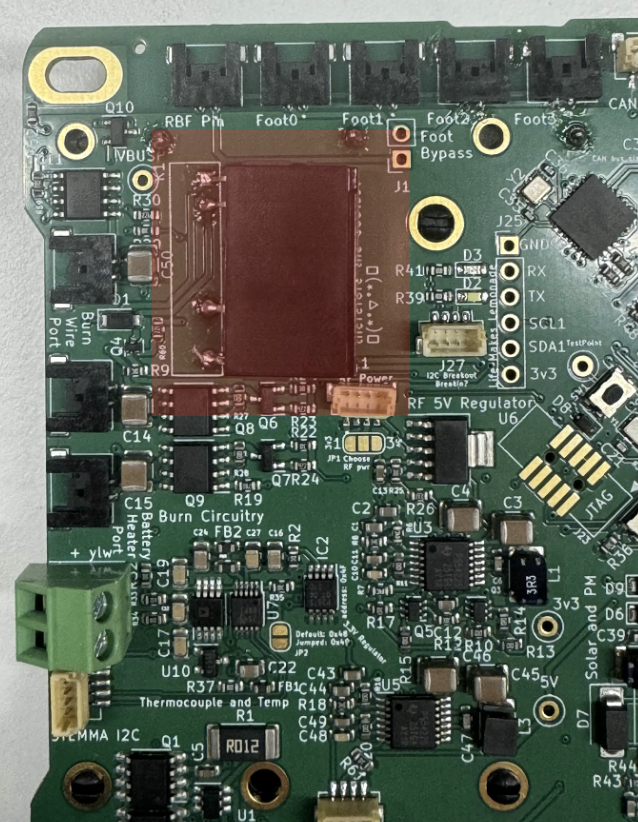
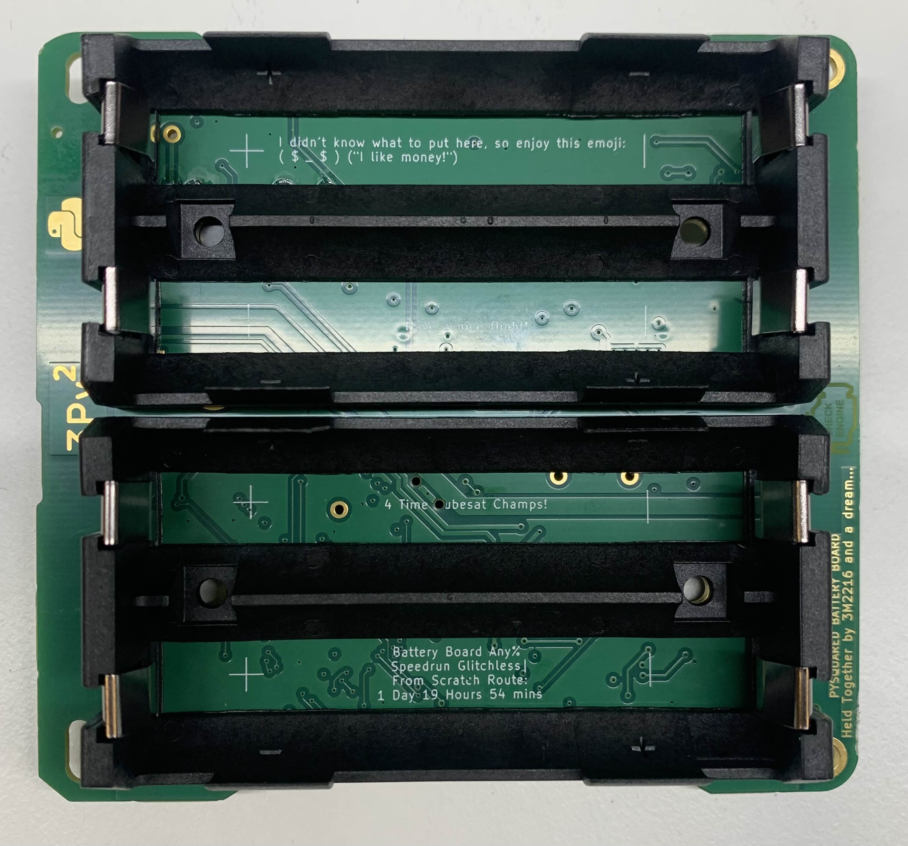

# Chapter 1: Battery Board Assembly
In this chapter, the user will learn the proper steps to assemble an Electrical Power System (EPS) board. **These steps can be followed again to create an optional ballast. These instructions are included below.**

!!!Warning
    ***Before continuing:** it is important to note that gloves should be worn when soldering and it should be done in a well-ventilated area to avoid the harmful fumes.*

## Soldering the Relay
**1.** Align the relay onto the white outline by the top left corner of the battery board.

**2.** On the top side of the relay there is a dot that must be aligned to the slot hole as seen in Figure 1.1
 
   *
**Figure 1.1: Flight Controller Board** 
*

**3.** On the bottom side of the EPS board there are through connections where the Relay must be sodered as seen in Figure 1.2

 *
**Figure 1.2**  
* 

**4.** The sodering **should not** be flush to the board, rather there should be room for the   relay's legs bend which will allow it to lay on it's side. This is stated on the board and is shown figure 1.3

*
**Figure 1.3**: 
*

 

   ## Soldering the Battery Holders

**1.** Insert the battery holders into the board from the backside. 

**2**. Solder the through hole battery terminals on the top side of the EPS as seen in Figure 1.5
 *
**Figure 1.5:** 
*
 

## **OPTIONAL**: Ballast Board creation

**1.** Follow all of the prior steps to create a secondary EPS

!!!WARNING
    It is not recommended that additional power be added to this satellite
**2.** If additional power is desired for the satellite, a wire can be soldered to the Pack+ Test point between both boards, and a wire can be soldered to the B- Test point between both boards.

 *
**Figure 1.6:** 
*

## Check your work
If all steps were followed correctly, the EPS should appear as it does in Figure 1.7.

!!!Note
    This does not include the secondary EPS or additional power modifications stated above

 *
**Figure 1.7:** 
*
  