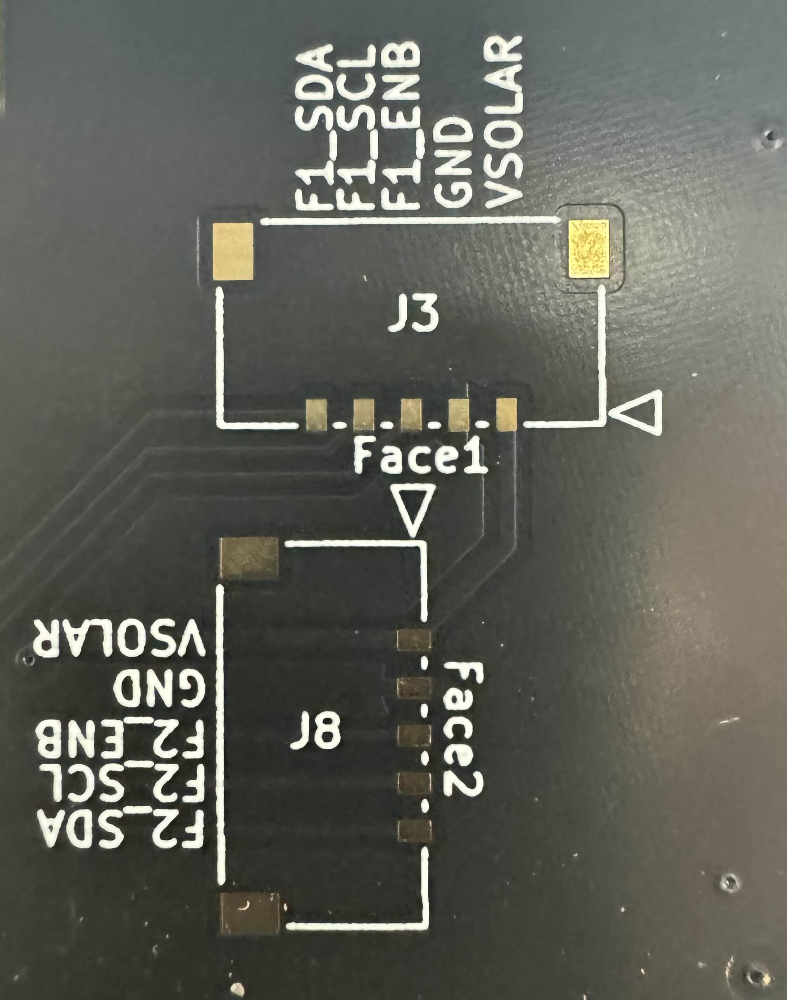
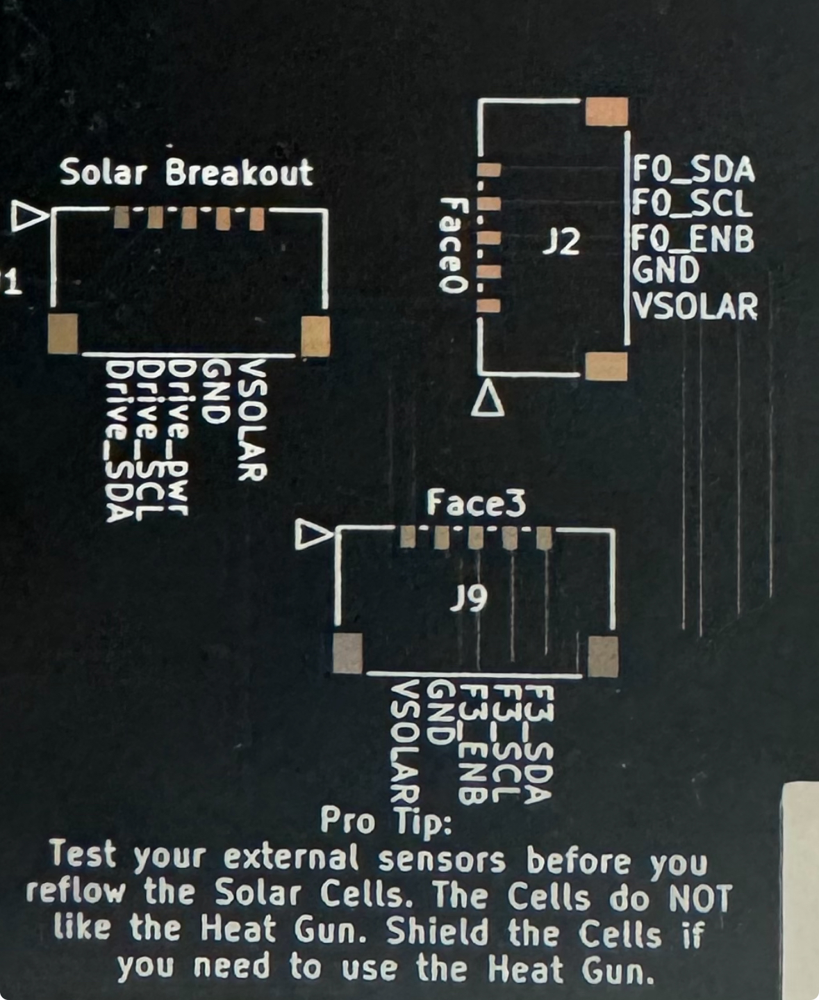

# Chapter 3: Solar Assembly
In this chapter, the user will learn how to properly assembly the PROVES Z- Face and XY Face Solar Boards.

!!! Warning
    ***Before continuing:*** it is important to note that gloves should be worn prior to applying solder paste to avoid ingestion of a lead-based material.

## Z- Face

 ### Solar Cells

 !!!Note
      This section **requires** low temperature solder paste and a reflow oven.

   **1.** Apply Low Temperature Solder Paste to the pads on the Solar Board as seen in Figure 3.1.

   *
**Figure 3.1: Z- Face Solar Board Preparation**
*

   **2.** Check that the positive and negative terminals on the back side of the cells are matched with the plus and minus silk screened on the PCB.
   
   **3.** For cells that are immediately next to each other, scoot them together so that the gap between them is as small as possible.

   **4.** Reflow on low heat (the low temperature for the solder that you use is recommended) and do not touch until completely cool.

 ### Soldering 5 pin headers

 !!!Note
      If your Z- Face does not come with 5 pin headers installed, follow this section on how to properly solder them on. Otherwise, you can skip this section

**1.** Get five 5 pin connectors and align them onto the white rectangular outline as seen in Figure 3.2 and 3.3. Ensure that the pins are aligned to the copper pads.

*
**Figure 3.2: Face 1 and Face 2 5-pin headers**
*

*
**Figure 3.3: Face 0, Face 3 and Solar Breakout 5-pin headers**

**2.** Tape down the 5-pin header with tape to ensure it does not move while you solder it on. 

!!! Note
      The tape should be placed vertically on the header, covering the 5 pins and exposing the two larger square pads on the sides

**3.** Ensure that the 5-pin header is completely flat and rested on to the board 

**4.** First solder on the two metal pads and remove the tape.

**5.** Solder the five pins on the back of the connector to the corresponding 5 copper pads. 

!!! Tip
      To properly solder the pins to the pads for step 5, warm up the pin and quickly touch the pin with solder. 
      
      This prevents the pins from being soldered too much.

**6.** Repeat until all 5 pin picolock headers are soldered to all 5 footprints.

## XY Faces 

 ### Hand solder 5 pin header

!!!Note
      If your XY Face does not come with 5 pin headers installed, follow this section on how to properly solder them on. Otherwise, you can skip this section
   
   a. Follow the silkscreen pattern on the board to place the components in the correct positions/orientations. For the pico-lock connectors line up the mounting pads when soldering connectors.

!!! warning
      Test all sensors for full functionality prior to solar cell installation (see Chapter 7 that identifies the proper test to complete for the solar boards). If sensors are faulty and need to be reflowed or removed with a heat gun, the cells will be damaged in the process.

2. **Install the Solar Cells (KXOB101K08F-TR) using low temperature solder paste and a reflow oven.**
   a. Apply Low Temperature Solder Paste to the pads on the Solar Board as seen in Figure 3.3.
   
Figure 3.3: Before and After Solder Paste Application

   b. Check that the positive and negative terminals on the back side of the cells are matched with the plus and minus silk screened on the PCB (Note: you cannot tell the orientation of the cell from the top of the cell so make sure it is placed properly).
   
   c. For cells that are immediately next to each other, scoot them together so that the gap between them is as small as possible. Otherwise, the fishing wire to stow the antenna may get caught in the cracks.

## Optional: Motor Driver Modification
3. **OPTIONAL: Remove 0 ohm resistor for motor driver as seen in Figure 3.4S**
   a. If the solar board has already been removed from the oven, the resistor can be removed by a fine tip soldering iron heating each pad simultaneously. If the board is still hot from the oven, tweezers can be used very swiftly to remove the resistor.
   *
**Figure 3.4: Motor Driver Resistor Removal**
*

!!! Note
      The Motor Driver Modification step is completely optional as the magnetorquers can be deactivated in software. Only one X Magnetorquer and one perpendicular Y Magnetorquer need to remain active in order to detumble the satellite effectively. The Z- Solar board should let the magnetorquer coil remain active as this is the only coil on the Z faces.
  