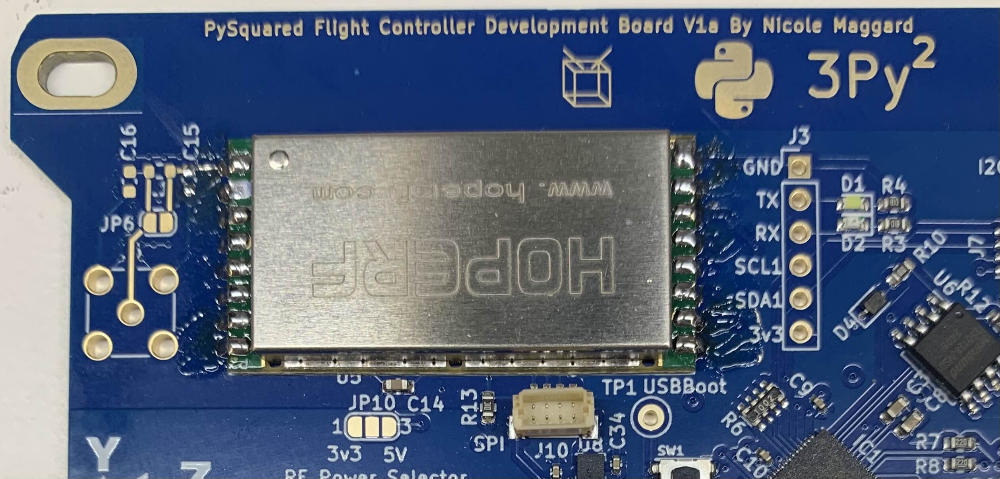
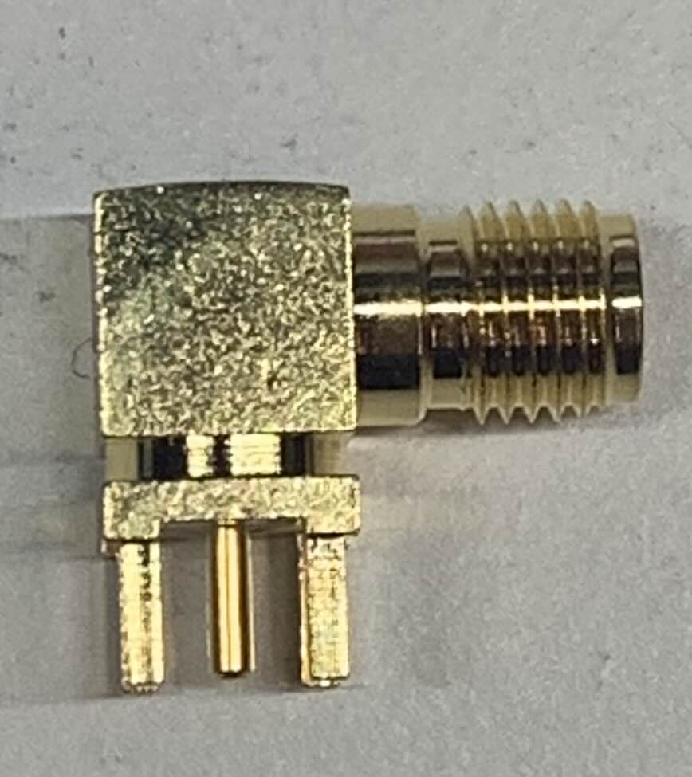
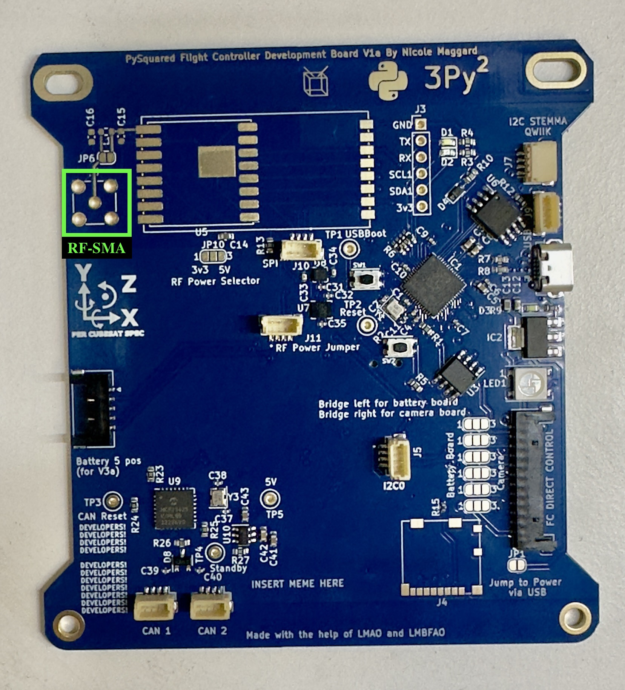
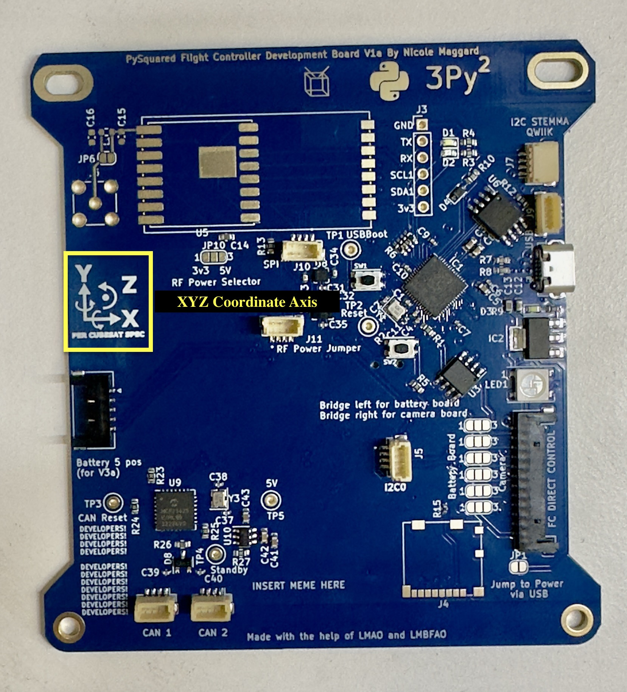

# Chapter 4: Flight Controller (FC) Board 
In this chapter, the user will learn how to assemble the PROVES Flight Controller (FC) Board.

!!!Warning
    ***Before continuing:** it is important to note that gloves should worn when soldering and it should be done in a well-ventilated area to avoid the harmful fumes.*

### Installing the 433 MHz HOPERF (Radio Module)

!!! Note
    The Radio Module Footprint is located below the CubeSat Logo and has a white rectangle

**1.** When soldering the radio, the exposed metal part on the underside of the module should be taped up with Kapton Tape in order to avoid contact with the copper pads on the HopeRF footprint of the FC Board.
*
 **Figure 4.1a: Taped Section of Radio Module**

  

**2.** Align the radio module to the white rectangular outline. Refer to Figure 4-1b. 
    *
**Figure 4.11b: Radio Module Footprint**
*
    
  <figure>
    
  </figure>
  
 

**3.** On the radio module, there is a dot on the metal side which should be next to the C15 connection.
 
 *
**Figure 4.2: Front Side of Radio Module** 
*

**4.** Tape down the radio module to ensure that it stays in place while soldering the pins of the radio module to the copper pads of the footprint on the FC Board.

**5.** Once the radio module is aligned and secured, begin soldering.

**6.** Once radio module is properly soldered, it should the same as Figure 4.4.

*
**Figure 4.3: FC Board with Soldered Radio Module**
*

**6.** Solder the copper pads of **JP6** together to make a connection for the radio module.

**7.** On **JP10**, create a jump by soldering the middle pad to the 5V pad together.

## Installing the RF-SMA (Radio Frequency - Surface Mount Adapter)

**1.** The RF-SMA that will be used for this section is seen in Figure 4.4.
   *
**Figure 4.4: RF-SMA**
*
   <figure>
    
  </figure>
  
 

!!! Note
    Ensure that the RF-SMA that you are using matches the footprint seen on the Internal FC Board. Check the KiCAD Schematics for further details. Refer to Figure 4-5 to located the footprint. 
  *
**Figure 4.5: RF-SMA Footprint**
*
  <figure>
    
  </figure>
  

**2. Proper Orientation**

&nbsp;  **a.** Refer to the XYZ Coordinate Axis on the FC Board as seen in Figure 4-6. 

&nbsp; **b.** Point the **connector side** of the RF-SMA in the **Y-** direction relative to the XYZ coordinate axis on the board. 
  *
**Figure 4.6: XYZ Coordinate Axis**
*
   <figure>
    
  </figure>
  
 

**3. Soldering the RF-SMA** 

!!! Tip 
    Tape down the RF-SMA to secure it and ensure that it is not loose when soldering the pins to the holes of the footprint.
    
    If Tape is not available, try and find an item or object to keep the board level to ensure the RF-SMA is secure and not loose.

&nbsp; **a.** Solder the 5 pins of the RF-SMA to the 5 holes of the footprint.

&nbsp; **b.** Refer to Figure 4.8, to see what proper installation should look like.
*
**Figure 4.8 Proper Installation**
*
  <figure>
    
  </figure>
  
  

