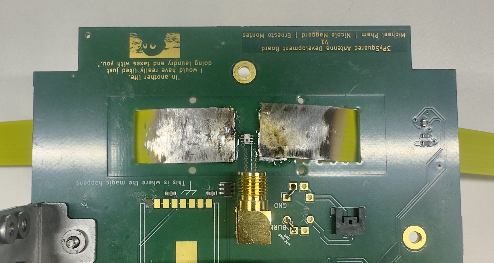
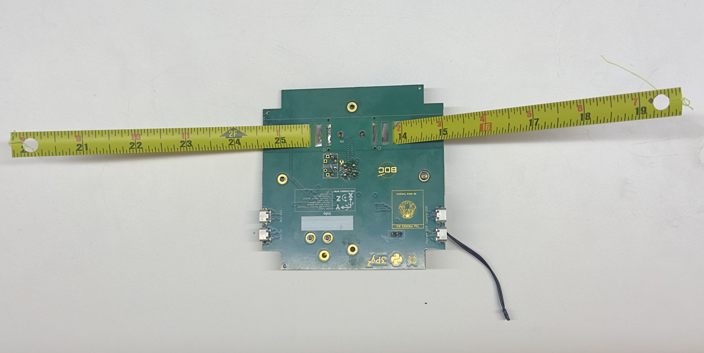

# Chapter 5: Antenna Board

 **Cutting and Drilling the Antenna**

**1.** Pull out the tape measure from a Milwaukee 6ft keychain measuring tape.

**2.** Cut the measuring tape into 180 mm lengths using a pair of scissors and trim the lengths based on the desired radio frequency.
      
      
!!!Note 
      The antenna lengths need to be 165mm to broadcast in the 437.4MHz range. Only 2 lengths are necessary for the satellite. If you are interested in broadcasting in other frequencies, use a dipole antenna calculator to find out the proper element length for your desired frequency.

*
**Figure 5.1: Lengths of measuring tape cut for use as antenna.**
*
  
   
**3.** Using a Dremel or sandpaper, sand off roughly ½-inch of the paint off the end of the measuring tape. Do the same to the opposite side of the measuring tape.

*
**Figure 5.2: Antenna length with sanded end and mount hole after drilling.** 
*
   

**4.** Drill a hole through the exposed aluminum roughly 1-3mm away from the end of the length of measuring tape. Ensure you create a horizontal hole precisely in the center of the tape measure.
 Refer to Figure 5.1.
  <figure>
    
  </figure>
  
  
**Figure 5.1 Hole made in the measuring tape **

**Soldering Antenna to Board**
   **1.** Feed the drilled side of the measuring tape through the outermost rectangular hole of the Top Cap. 
    
**Figure 5.3: Initial insert of antenna in Top Cap before soldering.** 

   
   !!!TIP 
      Make sure to feed it through the outward-facing side of the Top Cap so when the Top Cap is flipped over, the drilled hole of the antenna lines up with the open hole on the inward-facing side of the Top Cap
     

   **2.** Hold the antenna in place to solder it to the board. You can have someone hold it in place so it rests flush against the Top Cap or use a c-clamp to hold it as you are soldering. Refer to Figure 5.2 for example of a soldered result.
   
 <figure>
    
  </figure>
  
  
**Figure 5.2 Soldered to board. **

   
   **3.** Repeat steps a and b with the other length of measuring tape for the 2nd antenna of the satellite. Refer to Figure 5.3 for example end result. 
   <figure>
    
  </figure>
  
  
**Figure 5.3 Finshed Soldered Antennas **

   
   !!! Note Optional:
      Secure the two antennas to the top-cap by feeding a white 2.5mm nylon screw through the outward-facing side of the top-cap and secure it with a matching white 2.5mm nylon nut
