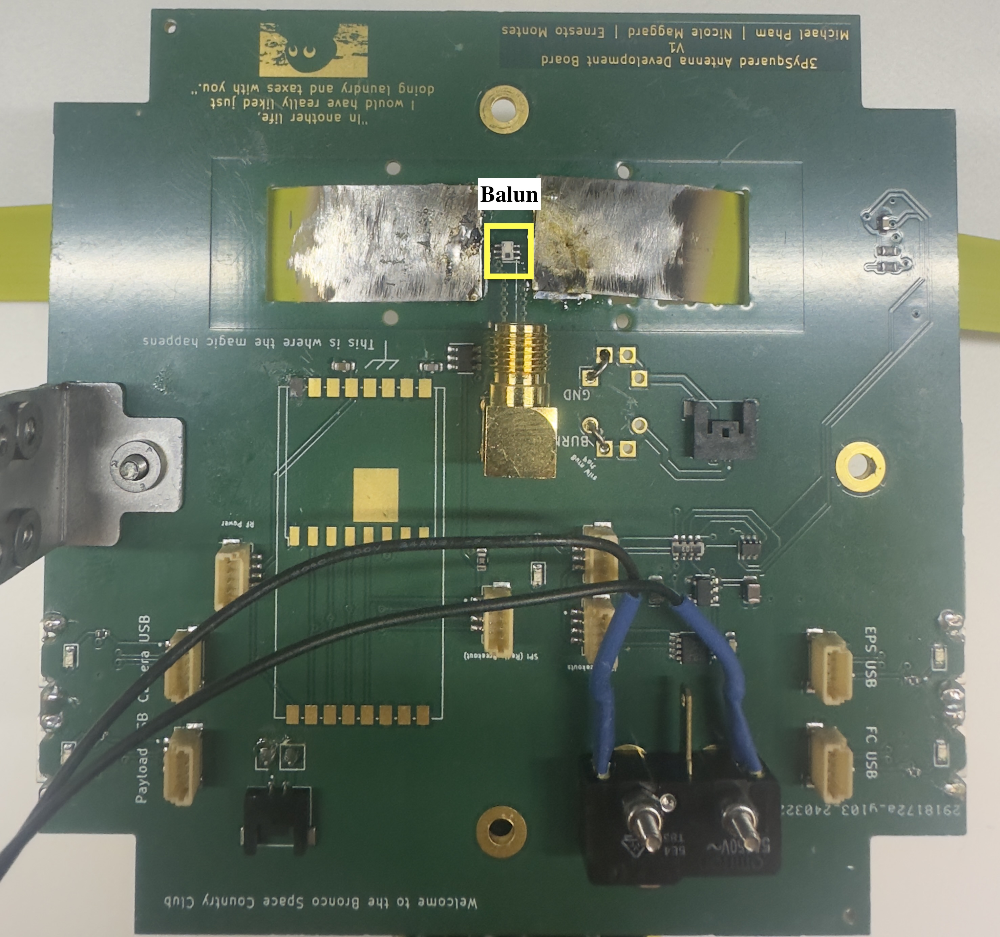

# Chapter 5: Antenna Board

 ## Cutting and Drilling the Antenna

**1.** Pull out the tape measure from a Milwaukee 6ft keychain measuring tape.

**2.** Cut the measuring tape into 180 mm lengths using a pair of scissors and trim the lengths based on the desired radio frequency.
      
      
!!!Note 
      The antenna lengths need to be 165mm to broadcast in the 437.4MHz range. Only 2 lengths are necessary for the satellite. If you are interested in broadcasting in other frequencies, use a dipole antenna calculator to find out the proper element length for your desired frequency.

*
**Figure 5.1: Lengths of measuring tape cut for use as antenna.**
*
<figure>
    
  </figure>
  
  **
Figure 5.1 Measured 165mm length. 
**
  
   
**3.** Using a Dremel or sandpaper, sand off roughly ½-inch of the paint off the end of the measuring tape. Do the same to the opposite side of the measuring tape.

**4.** Drill a hole through the exposed aluminum roughly 1-3mm away from the end of the length of measuring tape. Ensure you create a horizontal hole precisely in the center of the tape measure.
 Refer to Figure 5.1a.
  <figure>
    
  </figure>
  
  **
Figure 5.1a Hole made in the measuring tape
**
   
!!!TIP 
   Make sure to feed it through the outward-facing side of the Top Cap so when the Top Cap is flipped over, the drilled hole of the antenna lines up with the open hole on the inward-facing side of the Top Cap
     
## Soldering the Balun
   
   Before soldering the Antennas, we must solder the balun.The balun should be placed right in the middle of where we would feed the antennas. Refer to Figure 5.2 to see location.

<figure>
    
  </figure>
  
  **
Figure 5.2 Soldered Balun.
**

## Soldering the Lidar

 Flip the board over to the topside (the side with BOC and The PROVES Kit Ad Astra Tempore symbol). The lidar footprint is directly beneath the FPS USB ports, on the same side of the board. Refer to Figure 5.3 to see location.

 <figure>
    
  </figure>
  
**
Figure 5.3 Soldered Balun.
**

## Soldering Burn Wire

!!! Note
   This section **requires** Nichrome Wire

   1. **Prepare the Burn Wire:** Flip the board to the topside and locate two white squares labeled "Burn Wire Port" with a fire symbol next to them. These squares each have two separate sections. 

   2. **Thread the Burn Wire:** Take one end of the burn wire and thread it through the bottom left corner of the **top** square. Then, thread the other end of the burn wire through the top left corner of the **bottom** square. Refer to Figure 5.4.
   <figure>
    
  </figure>
  
  **
Figure 5.4 How to feed each wire. Top and Bot. 
**

   3. **Flip and Locate Wires:**  Flip the board back over (bottom side facing you). You should now see two wires poking out from the bottom of the board.

   4. **Solder the Burn Wire:**

       -**Burn Side:** Identify the wire coming from the top square (now on the bottom) - this is the burn wire. Feed it through the hole directly to its left (adjacent hole). Solder this wire to the topside of the board for a secure connection.

         -**Ground Wire:** The other wire from the bottom square (GND) goes to the next hole directly to its left (adjacent hole). Before soldering, bend the wire slightly to create a small arch on the topside of the board. Now, solder both the ends poking out the topside and the base of the arch you created. Refer to Figure 5.5.
<figure>
    
  </figure>
  
  **
Figure 5.5 Ideal burn wire loop and location.**

## Soldering the Antennas

   Hold the antenna in place to solder it to the board. You can have someone hold it in place so it rests flush against the Top Cap or use a c-clamp to hold it as you are soldering. Refer to Figure 5.6 for how to feed teh antenna through. Then refer to Figure 5.6 a to see the full soldered antennas on the bottom of the board.
<figure>
    
  </figure>
  
  **
Figure 5.6 Fed Antenna end on one side. 
**

  <figure>
    
  </figure>
  
  **
Figure 5.6a Soldered Antenna ends. 
**

## Soldering RFSMA Adapter

1. **Locate and Position:** Find the RFSMA Adapter. Hold it with the five pins facing down towards the bottom side of the board (the side where you previously soldered the Balun). Ensure the pointed tip with grooves is facing the Balun. Refer to Figure 5.7 for postion and location.
<figure>
    
  </figure>
  
  **
Figure 5.7 Soldered RFSMA Adapter facing the direction of the Balun.
**

2. **Secure the Adapter:** Once the pins are aligned with their designated holes on the board, carefully secure the adapter in place using tape.

3. **Flip and Prepare for Soldering:** Flip the board over so the topside (with the lidar) is facing you. We'll now solder the five pins from this topside for a strong connection. 

## RBF Switch

Finally we will soldar the RBF Switch onto the bottom side of the board (the side we have the balun on). Postion the RBF switch ends and pin to face in the direction of the RFSMA Adapter. Refer to Figure 5.8 to see location and ideal postion.
<figure>
    
  </figure>
  
  **
Figure 5.8 Soldered RBF Switch. 
**
   
   
   !!! Note Optional:
      Secure the two antennas to the top-cap by feeding a white 2.5mm nylon screw through the outward-facing side of the top-cap and secure it with a matching white 2.5mm nylon nut
