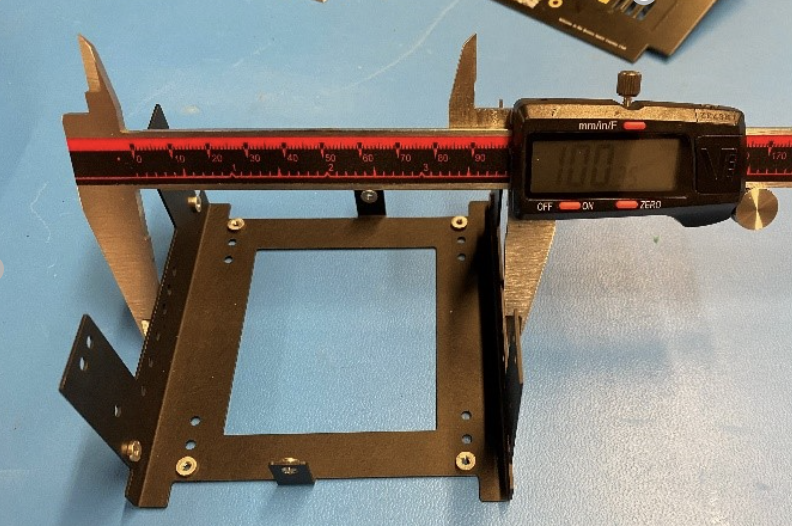
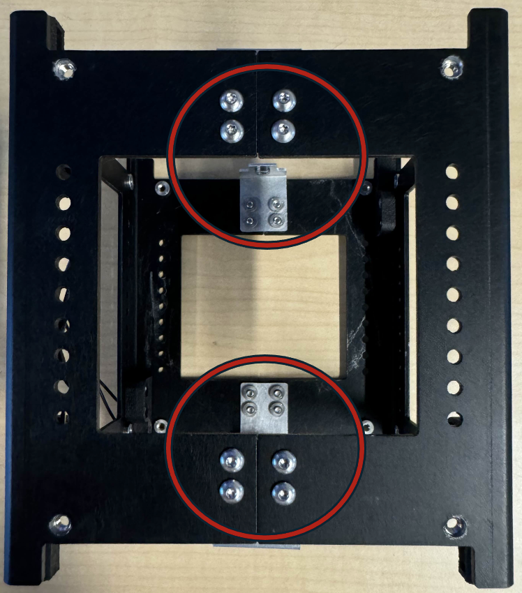

# Chapter 6: Structure Pre-Integration

## **Cataloging Parts**
  #### The Structure
!!! warning 
      When measuring it is important to **not** bend the U-shape inwards. Take the measurement as close to the “closed” side of the U as possible. 

1. Measure the dimensions of each half of the anodized Main “U” structure and label them. Use calipers to measure the width of each of the two sheet metal halves. 

*
**Figure 6.1: How to make measurements of Main “U” structure.**
*

!!!note
    These additional measurements are useful for verifying that your satellite will fit inside a launch vehicle pod after integration is complete and to ensure no damage has occurred during shipping.

*
**Figure 6.2: Sample measurements of the U structure** 
*

   |                |Width (mm)  | Height (mm)|
   |--------|-------------|-----------|
   | s1     | Danger Zone |Width      |
   | s2     | Low         |Width      |
   | s3     | Normal      |Width      |
   | s4     | High        |Width      |
   | s5     | Danger Zone |Width      |
   | s6     | Danger Zone |Width      |
   | s7     | Danger Zone |Width      |
   | s8     | Danger Zone |Width      |
   

!!! tip
    It is important to record and identify which "U" structure halves are most optimal for flight if you have **more than two "U" structure halves**  The structures should come in at about 99.77mm nominally, but they will vary depending on the bends and the anodizing.

2. **Checking out the PEM-Nuts**
   i. The structure and brackets all contain PEM-Nuts.

*
**Figure 6.3: Locations of PEM-Nuts** 
*
  
  
!!! note
    The Jig is needed in order to ensure the satellite is squared up enough to fit into its deployment mechanism.

3. **Accessing the Jig STL File**
   ii. Access the GitHub Documentation repository where an STL file can be obtained and printed for the jig.

4. **Repeat steps 1 through 3 for each solar board.**
