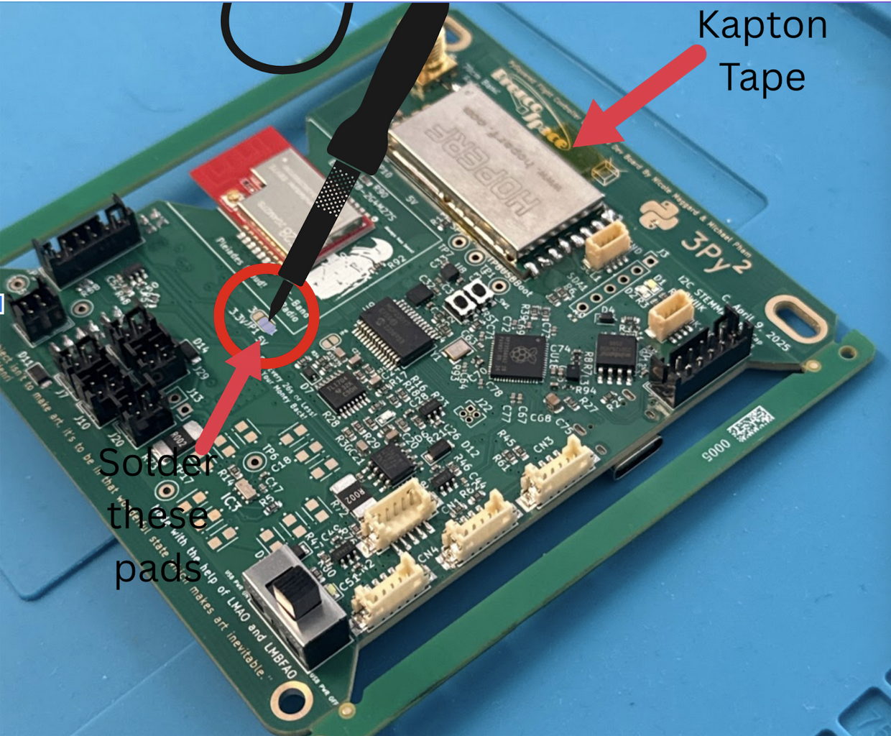

# Chapter 1: Flight Controller Board

In this chapter, the user will learn the proper steps to assemble a Flight Controller Board.

!!!Warning
    ***Before continuing:** it is important to note that gloves should be worn when soldering and it should be done in a well-ventilated area to avoid the harmful fumes.*

## Soldering the Radio Component
**1.** Place a piece of Kapton tape between the radio and the flight controller board. The exposed metal part on the underside of the module should be taped up with Kapton tape in order to avoid contact with the copper pads on the HopeRF footprint of the FC Board.

**2.** On the radio module, there is a dot on the metal side which should be next to the C15 connection. Tape down the radio module to ensure that it stays in place while soldering the pins of the radio module to the copper pads of the footprint on the FC Board. Once the radio module is aligned and secured, solder it.

*
**Figure 1.1: Flight Controller Board with tape and pads labelled**
*

**3.** Locate the pads circled on Figure 1.1. Solder together the two pads located next to the 5V label in order to turn on the radio. Make sure not to put solder on the third pad.

**4.**  Plug in the flight controller board with a USB-C cable, and flip on the switch. Turn on the board switch. The flight controller board has an LED that turns on.

**5.** Next, follow the steps in the [Software Setup Guide](https://proveskit.github.io/pysquared/getting-started/). This will help you test the boards in the future steps.

!!!Note
    The rest of the tutorial is structured by showing you how to solder or assemble a board and then connect it to the flight controller board and test that it works. You will have to come back to the software, so keep it open (and you can keep the flight controller connected) or remember how to connect for the next time. You can also do all the builds and come back and do all the tests, but this will help you catch errors in assembly quicker.
   

