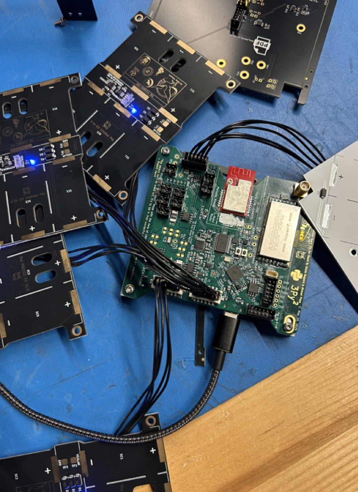
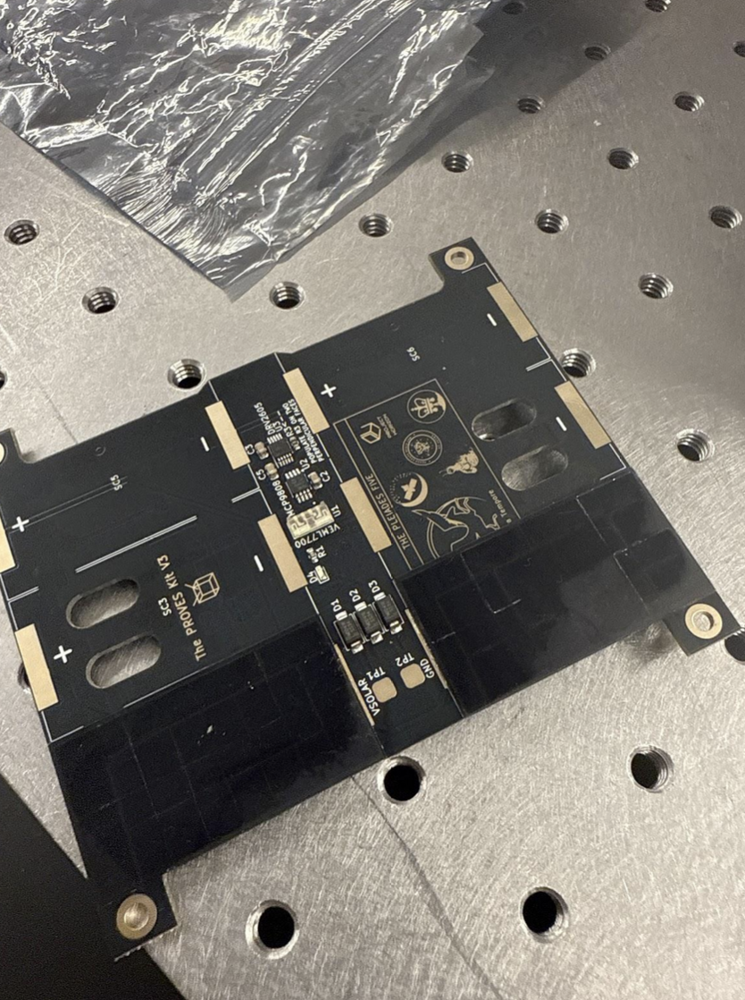

# Chapter 2: Face Assembly 
In this chapter the user will learn the steps to assemble the faces. There are 4 solar boards that go to the side of the satellite and a Z-board that goes on the bottom of the satellite. The antenna board goes on the top.

!!! Warning
    ***Before continuing:*** it is important to note that gloves should be worn prior to applying solder paste to avoid ingestion of a lead-based material.

**1.** Plug in connectors to the solar boards. Then plug all the solar boards into the flight controller board.

*
**Figure 2.1: Face Boards Plugged In**
*

**2.** Now its time for the first test!

You can type `all_faces_off()` to turn the faces off and `all_faces_on()` to turn them back on again. You should observe the lights turning on and off.

*
**Figure 2.2: Face Boards Plugged In**
*

Now to check the data that you get from the boards:

Type:

    `all_faces.face_test_all()`

This returns an array of arrays. The first 4 are the face boards and the fifth is the Z-board. Each board contains two values: [temperature, ambient light]. Shine a light on the different boards and run the commands again to see the numbers change and ensure the sensors are working.

!!! warning
    Test all sensors for full functionality prior to solar cell installation. If sensors are faulty and need to be reflowed or removed with a heat gun, the cells will be damaged in the process.

**3.** Next, add the solar cells to the solar boards.

First, check that the positive and negative terminals on the back side of the cells are matched with the plus and minus silk screened on the PCB.

!!!WARNING
    You **cannot** tell the orientation of the cell from the top of the cell, so make sure it is placed properly.

**4.** Apply Low Temperature Solder Paste to the pads on the Solar Board as seen in Figure 2.2.

For cells that are immediately next to each other, scoot them together so that the gap between them is as small as possible.

**5.** Reflow on low heat (the low temperature for the solder that you use is recommended) and do not touch until completely cool.

!!!WARNING
      Be very careful, it is easy to overheat the solar cells. Solar cells can’t exceed 175°C for over 50 seconds.

*
**Figure 2.2: Solar Cells on the board**
*

**6.** To test the connections, use a voltmeter to ensure each cell is connected and charges under light. You should see a voltage increase when the cells are exposed to light.