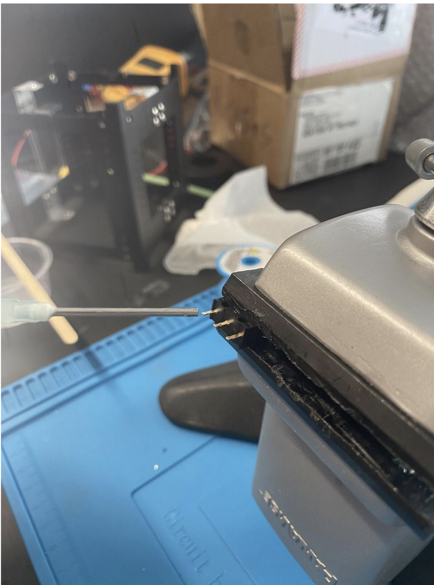
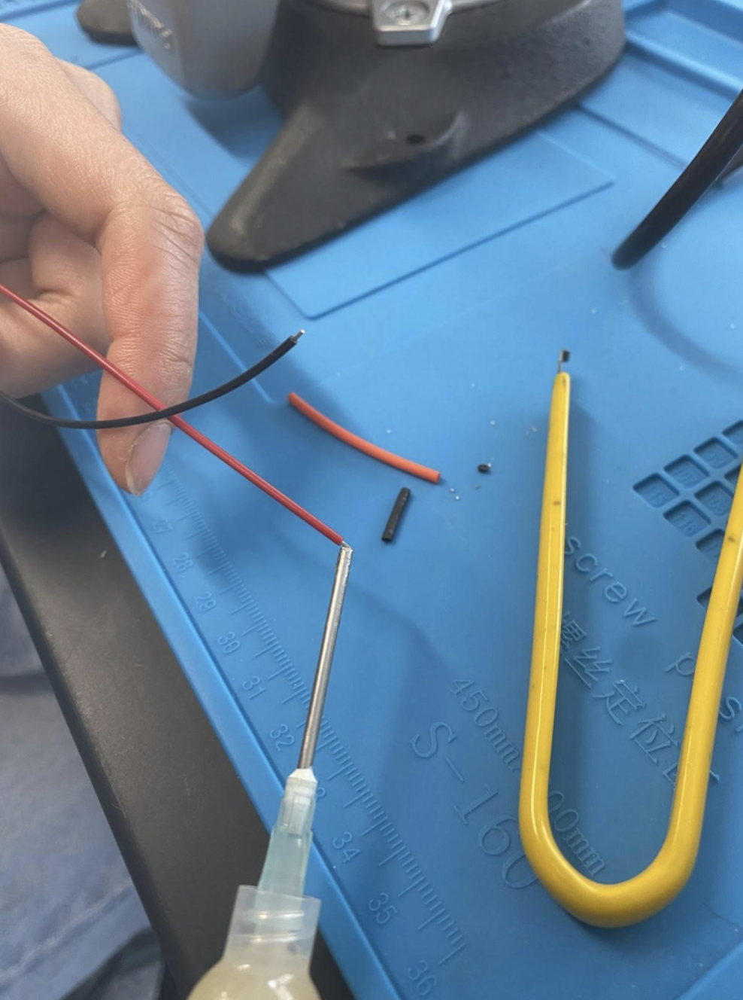
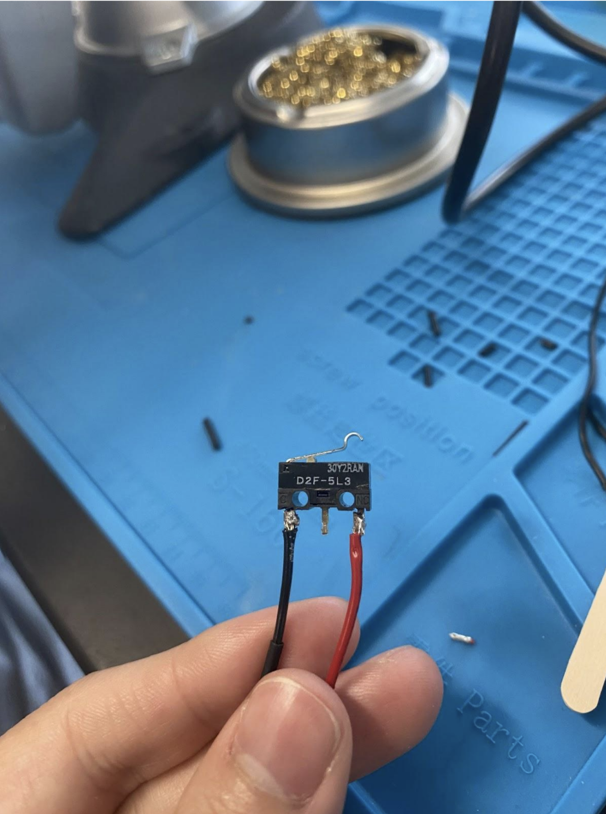
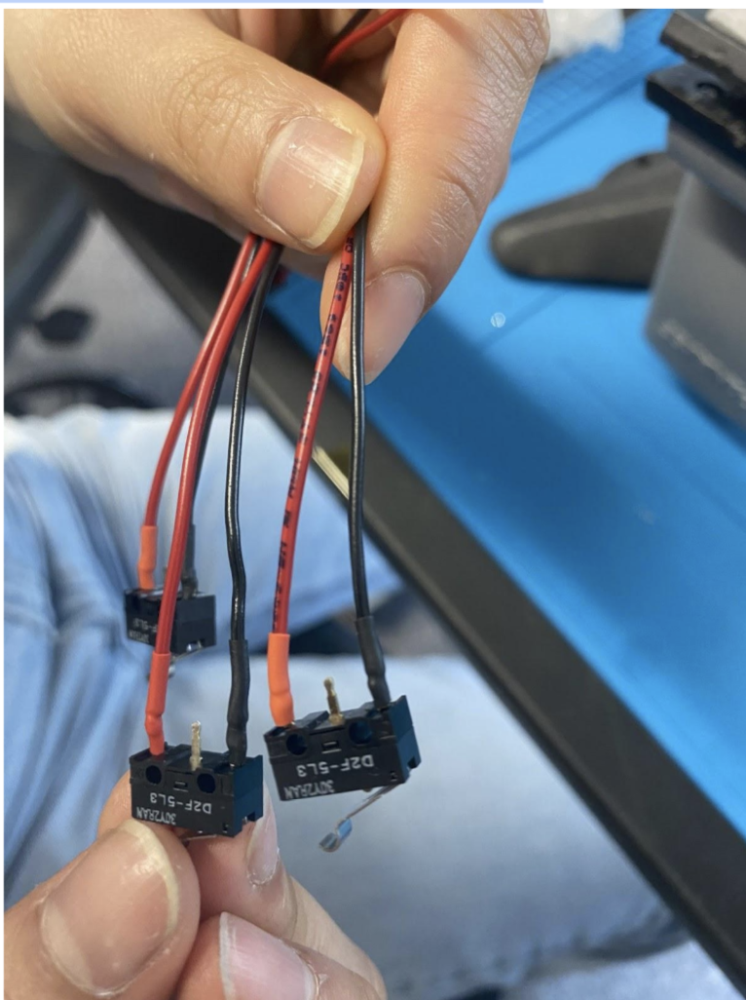
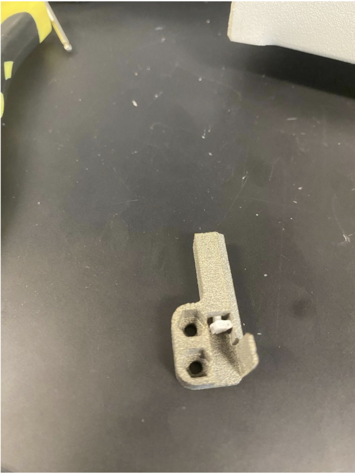
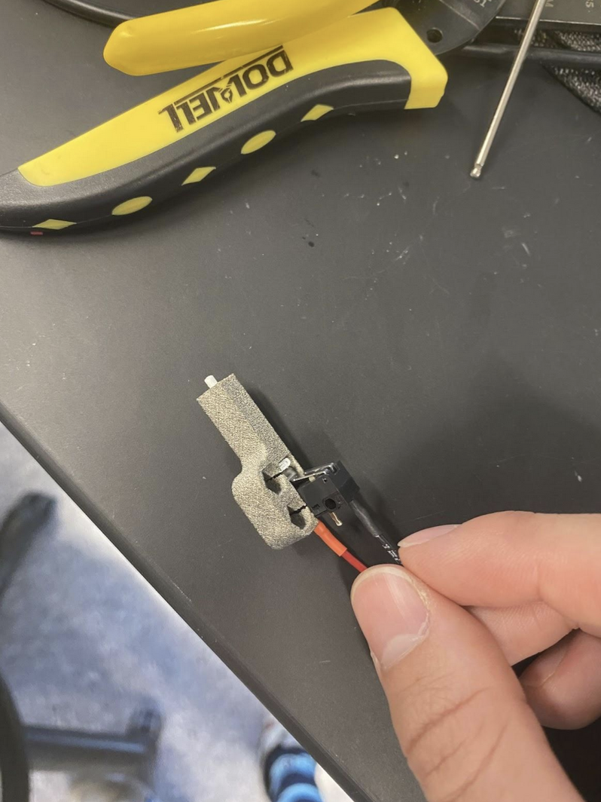

# Chapter 3: Power Stop
In this chapter, the user will learn how to properly assemble the Power Stop. These go on four of the eight feet on the satellite and turn the satellite off when it is not deployed.

!!!Warning
    ***Before continuing:** it is important to note that gloves should be worn when soldering and it should be done in a well-ventilated area to avoid the harmful fumes.*
**1.** Cut 7mm of black and 7mm of red heat shrink.
**2.** Insert heat shrink into the power stop harness and slide all the way to the end.
**3.** Apply flux to wire tips and power button ends.
*
**Figure 3.1: Flux on Button**
*

*
**Figure 3.2: Flux on Wire Tips**
*

**4.** Apply solder to wire tips and power button ends.
**5.** Re-apply flux to wire tip.
**6.** C is the black wire; CN is the red wire.
**7.** Solder the red wire to the pin labeled CN on the button.
**8.** Solder the black wire to the pin labeled C on the button.
*
**Figure 3.3: Completed Soldered Button**
*

**9.** Clean tips with alcohol to remove flux, so that flux does not corrode metal. Then push shrink wrap onto the soldered ends, and shrink with a heat gun.
*
**Figure 3.4: Heat Shrunk Button**
*

**10.** Insert pusher or screw into power stop harness casing.
*
**Figure 3.5: Pusher Inserted**
*

**11.** Assemble power stop harness into casing and glue tight. Use space-rated glue or epoxy. Follow the instructions on your glue.
*
**Figure 3.6:  Final Assembeled Power Stop**
*

**12.** Test the power stops by plugging them into the FC board and clicking them. Check that the light on the FC board blinks. This means the signal is going through.
**13.** Screw harness onto CubeSat case. It should not be possible to place the cases incorrectly, as if they are flush against the wall, they can only line up with their respective holes. Add nylocs, use the hex screws and a 1.5mm Allen wrench.
*
**Figure 3.7: Foot Placed on Structure**
*

Repeat these steps four times to make four power stops.

