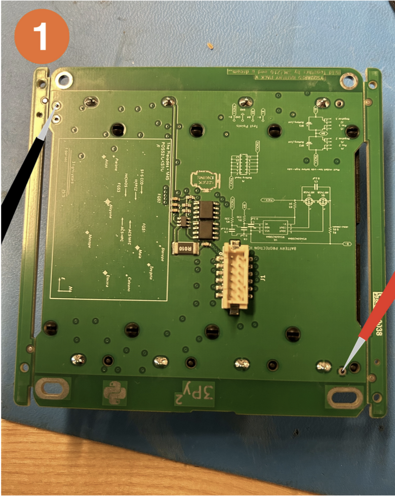
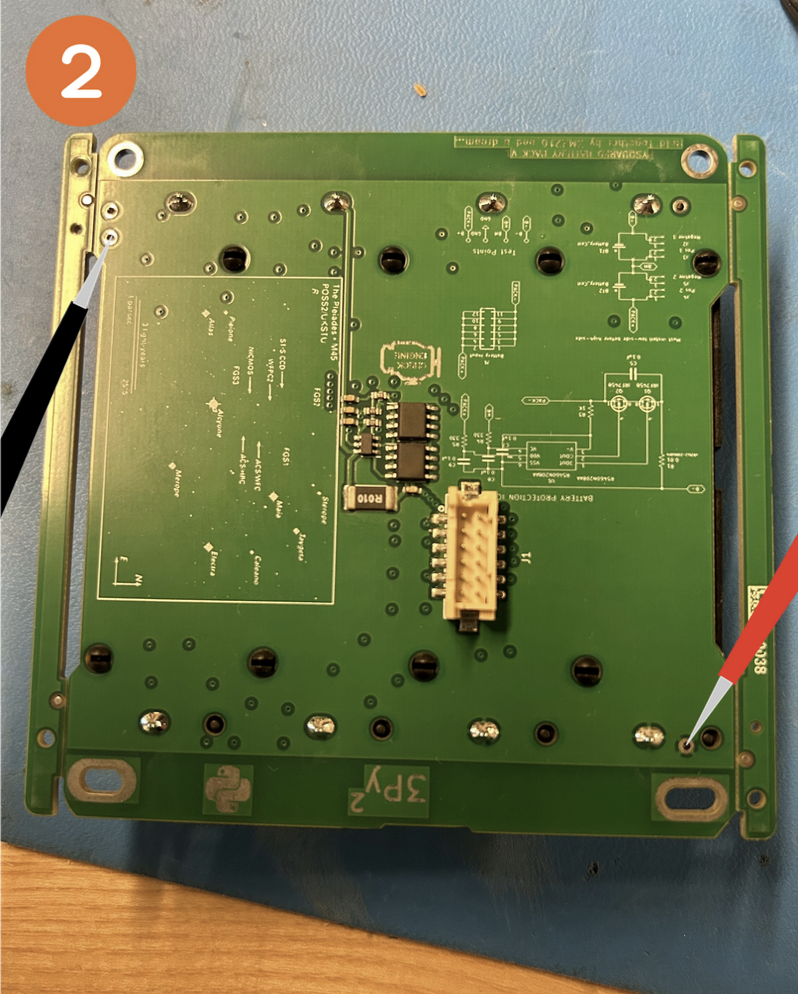
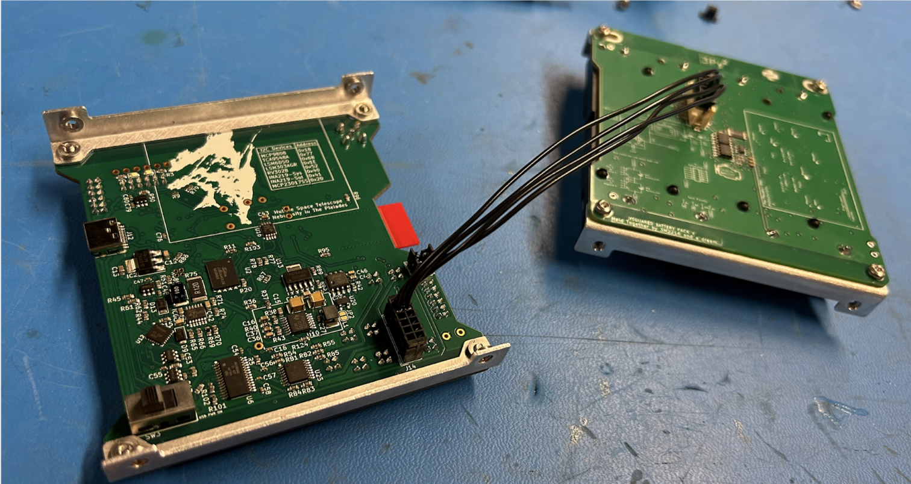
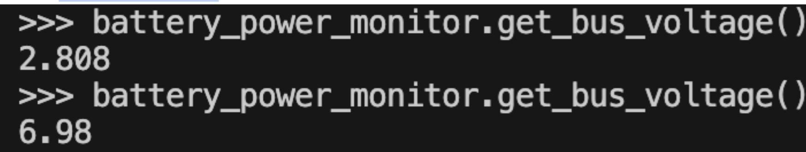

# Chapter 4: Battery 
In this chapter, the user will learn how to assemble the PROVES Flight Controller Battery Board.

!!!Warning
    ***Before continuing:** it is important to note that gloves should worn when soldering and it should be done in a well-ventilated area to avoid the harmful fumes.*

1. Place the batteries into the battery holder. Make sure the positive and negative ends are correct.

2.  Flip over the board to test the voltage. Take a Voltmeter and put the ends on the areas on the back. Place the positive end on the circle and test two points with the negative end

Both of the battery readings should be around 7.2V. If they are considerably less, charge or replace the batteries 

Both of the readings should read the same number. If they are unequal you should take the batteries out and then put them back in.

*
**Figure 3.7:**
*

  
  *
**Figure 3.7:**
*

3. Now plug the battery into the flight control board. Make sure your computer is connected to the board on Tabby.

  *
**Figure 3.7:**
*

Also make sure the power stops are plugged in from the previous step!! If not the next step won’t work

4. Run battery_power_monitor.get_bus_voltage() without the battery plugged in. Then plug it in (or vice versa). You should have ~7.2 when the battery is plugged in and significantly less when it is not.

  *
**Figure 4.4:**
*

Test the power stops. While the batteries are plugged in, run battery_power_monitor.get_bus_voltage(). Press one of the power stops. Wait a few seconds and run battery_power_monitor.get_bus_voltage() again. The voltage should be lower when the power stop is pressed. the power stops stop the power coming from the battery!
