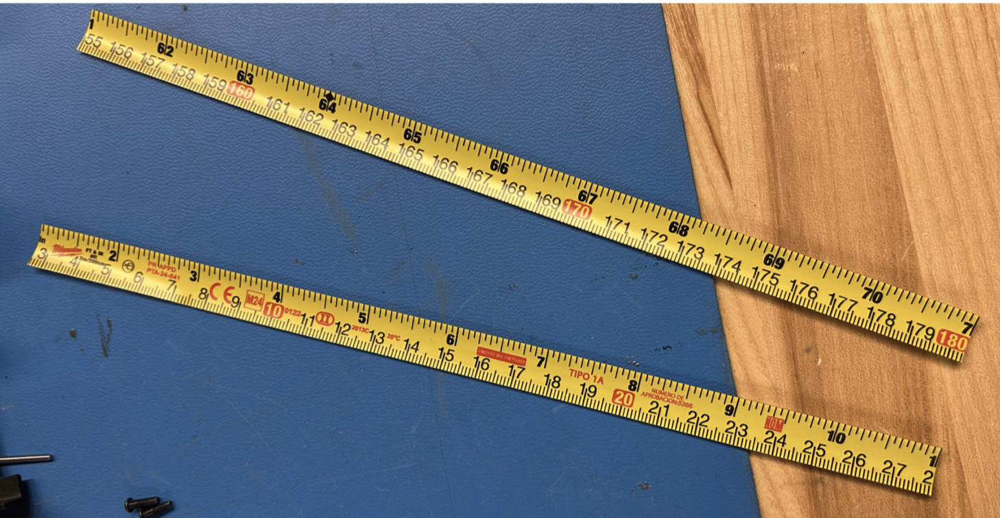
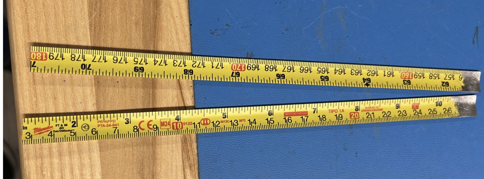
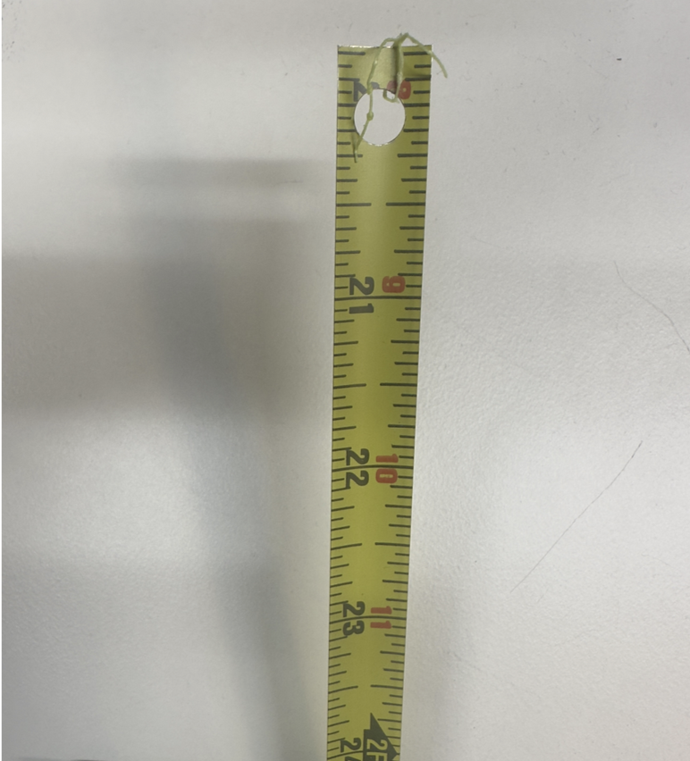
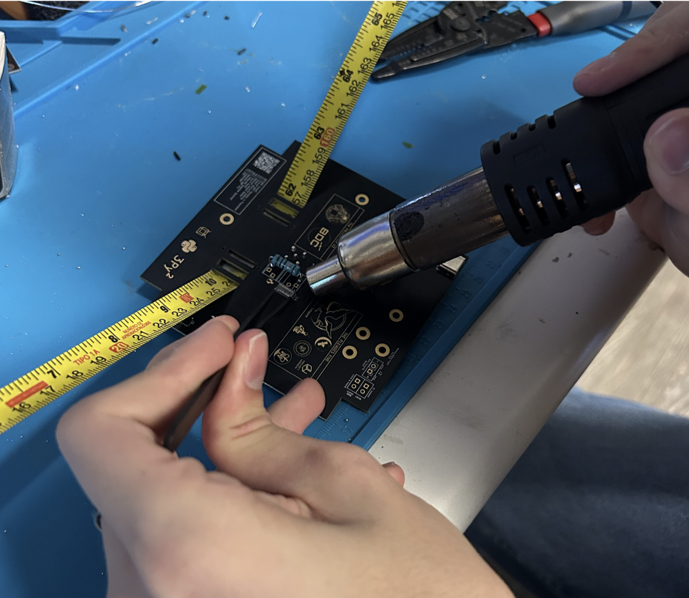
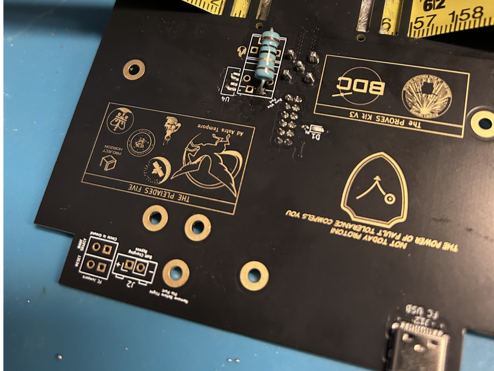
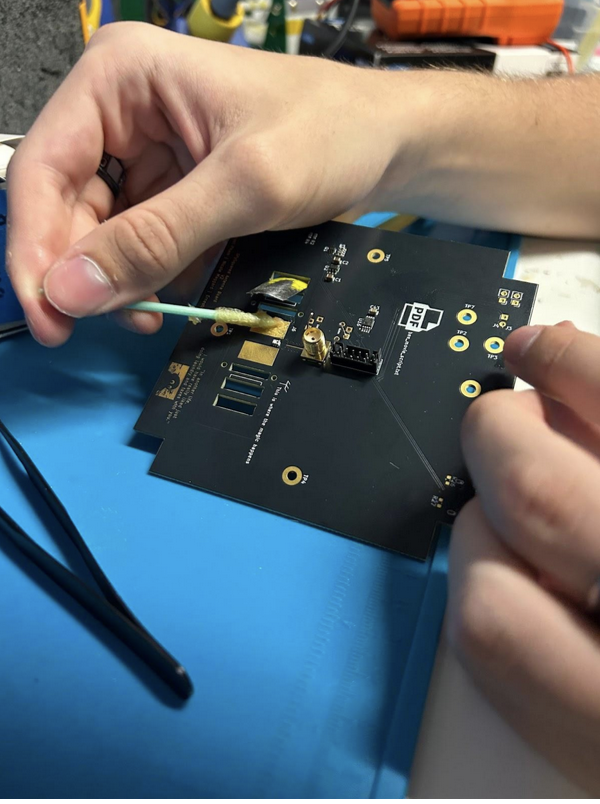
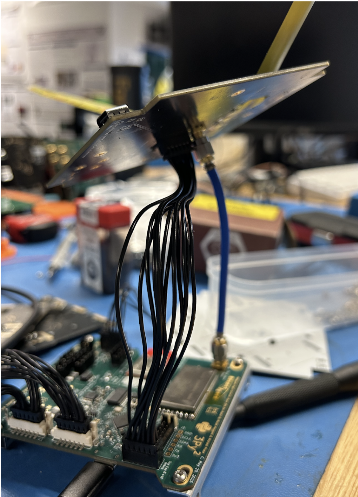
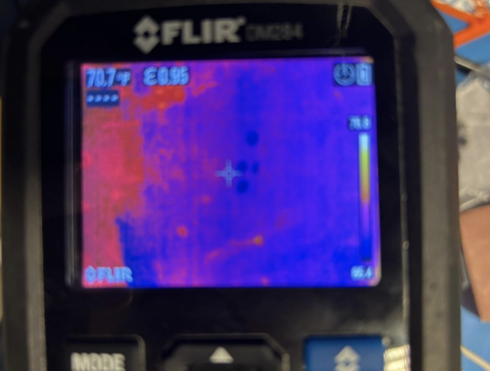
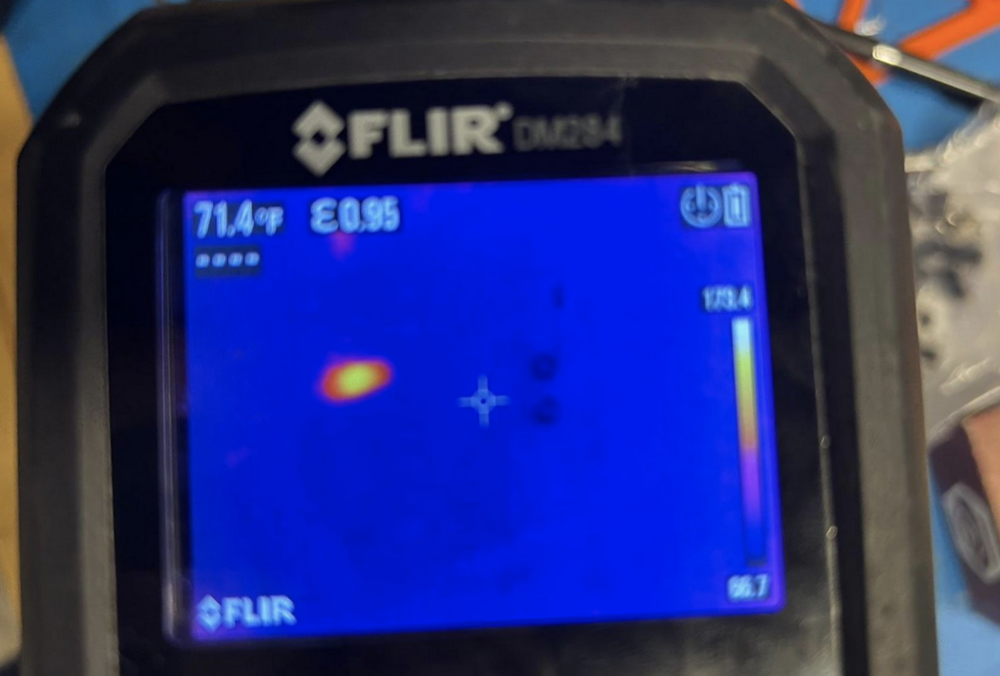

# Chapter 5: Antenna Board

## Cutting and Drilling the Antenna

**1.** Pull out the tape measure from a Milwaukee 6ft keychain measuring tape.

**2.** Cut the measuring tape into 180mm lengths using a pair of scissors and trim the lengths based on the desired radio frequency.

!!!Note 
The antenna lengths need to be **165mm** to broadcast in the 437.4MHz range. If you are interested in broadcasting in other frequencies, use a dipole antenna calculator to find out the proper element length for your desired frequency. Remember to divide the length in half, as the added lengths of the antennas should be the expected length 

*
**Figure 5.1: Cut antennas*

**3.** Using a Dremel or sandpaper, sand off roughly ½-inch of the paint off the end of the measuring tape. Do the same to the opposite side of the measuring tape.

*
**Figure 5.2: Sanded Antennas*

**4.** Drill a hole through the exposed aluminum roughly 1-3mm away from the end of the length of measuring tape. Ensure you create a horizontal hole precisely in the center of the tape measure. Refer to Figure 5.1a.

*
**Figure 5.3: Antennas with Hole**
*

!!!TIP 
        Make sure to feed through the outward-facing side of the Top Cap so when the Top Cap is flipped over, the drilled hole of the antenna lines up with the open hole on the inward-facing side of the Top Cap

**5.** Remove this piece from the antenna board. Use a heat gun or unsolder with a soldering iron the plastic area pictured in Figure 5.4. Be very careful – you will need to put the heat gun or soldering iron at ~400°C to remove the small plastic piece. (Note: ignore the resistor in the picture, that will be added in the next step.)

*
**Figure 5.4: Removing with Heat Gun**
*

**6.** Grab a 10 ohm resistor and solder it to the location marked in Figure 5.4. It can be any resistor between 5-15 Ohms if you do not have a 10 Ohm resistor. This resistor is what the burnwire attaches to. When the burn starts, it will get really hot, burning the wire which will detach and deploy the antennas.

*
**Figure 5.5: Added Resistor**
*

## Soldering the Antennas

**1.** Hold the antenna in place to solder it to the board. You can have someone hold it in place so it rests flush against the Top Cap or use a c-clamp to hold it as you are soldering. Refer to Figure 5.6 for how to feed the antenna through. 

*
**Figure 5.6: Adding Flux to Antenna**
*

**2.** Solder as shown.

*
**Figure 5.7: Soldered Antenna**
*

**3.** Wire the antenna board to the flight controller board.

*
**Figure 5.8: Antenna Board Connected to Flight Controller Board**
*

## Testing the Burnwire Circuit

**1.** Make sure you are connected to the battery board with the flight controller board and you have the power stops plugged in and connected to the flight controller board. We are going to test the burn wire! The burn wire allows the antenna to deploy. You would have a fishing line that collapses to the antenna tied to the resistor at the top of the flight controller board. The resistor gets really hot and eventually will burn the wire, which deploys the antenna. Run `antenna_deployment.burn()`. Burn optionally takes an argument for an amount of seconds, but watch out! A 10 Ohm resistor should not be powered for more than 15 seconds. You should feel the resistor getting warmer as shown in the before and after pictures taken of the resistor in the thermal camera.

*
**Figure 5.9: Thermal Camera before Burn Called**
*

*
**Figure 5.10: Thermal Camera after Burn Called**
*

