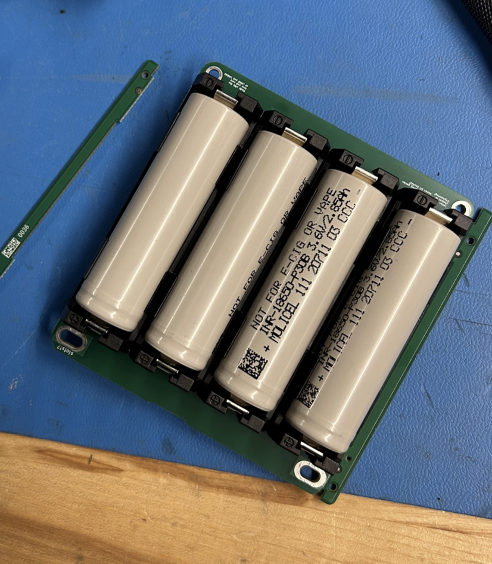
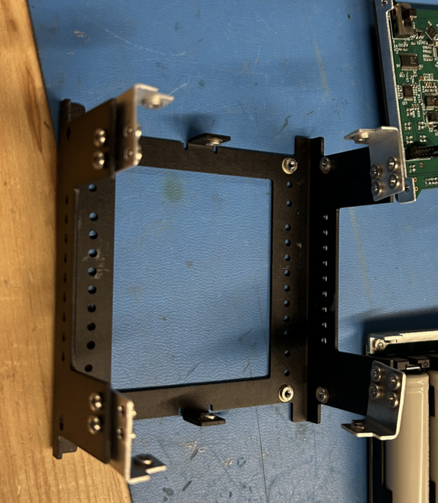
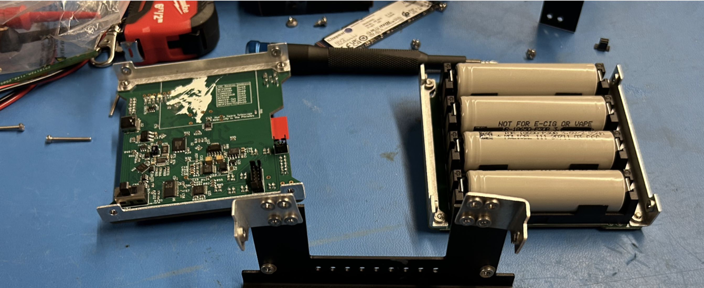
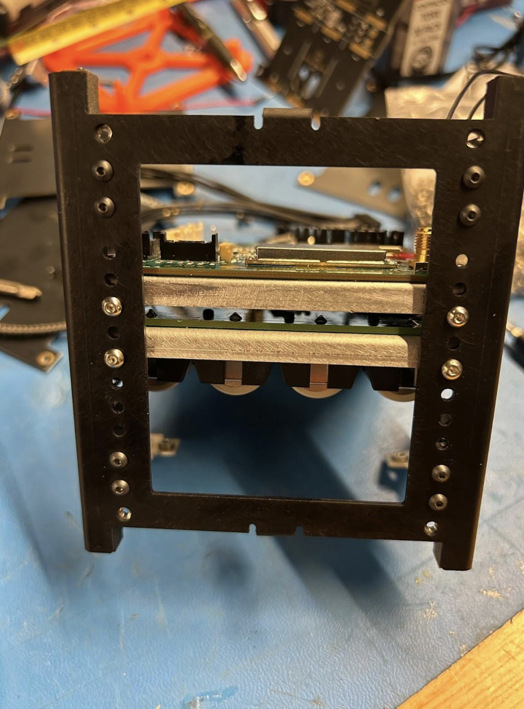
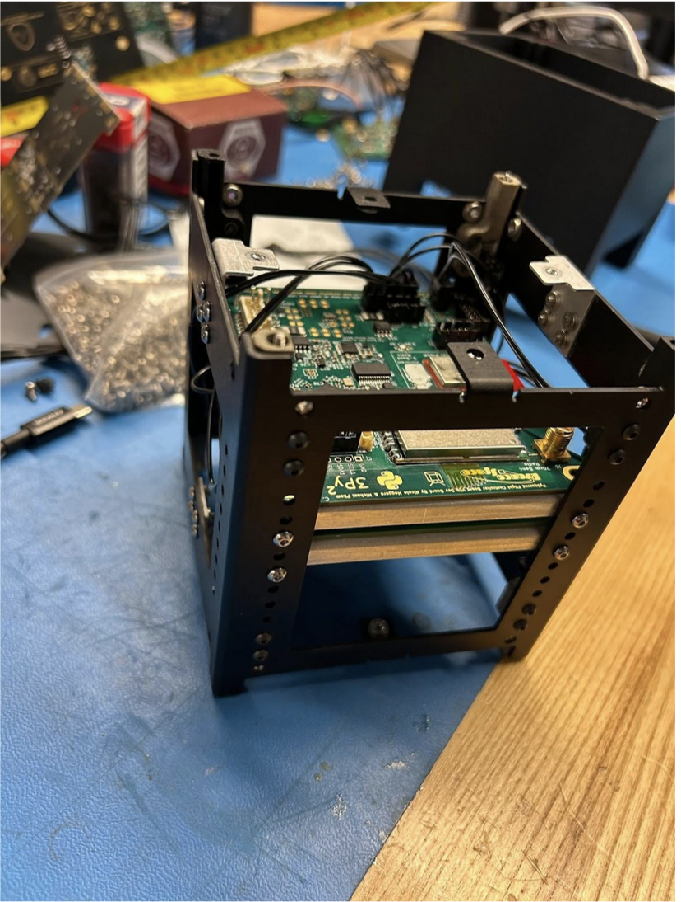
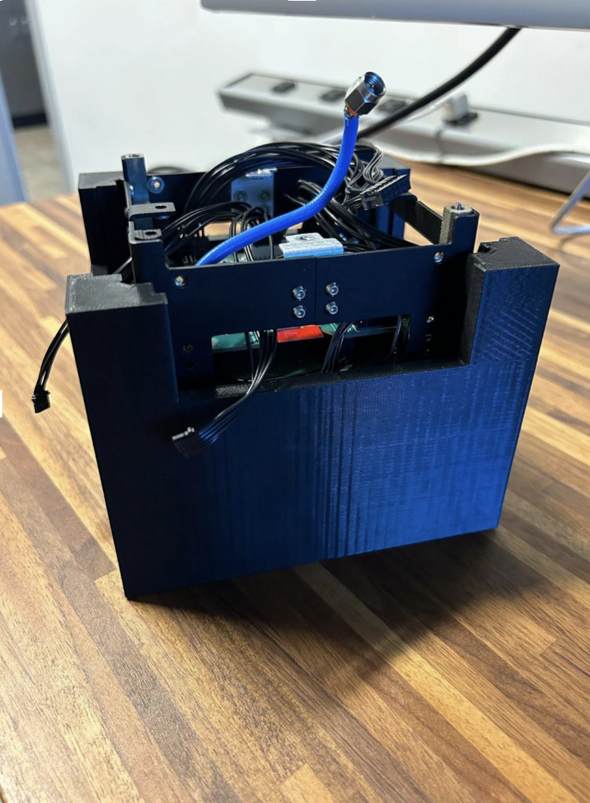
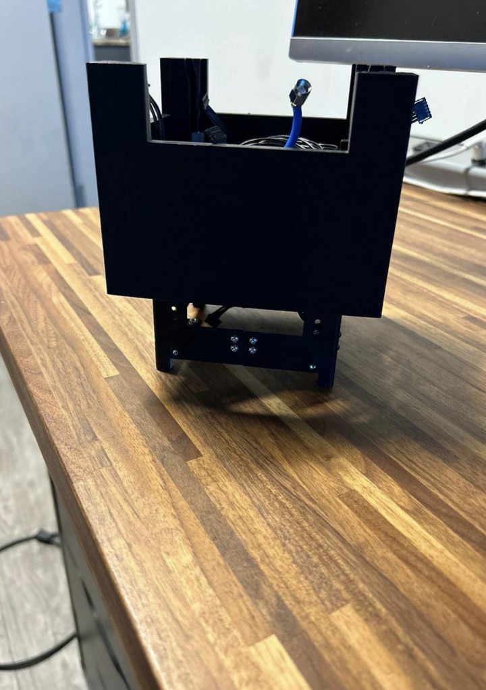
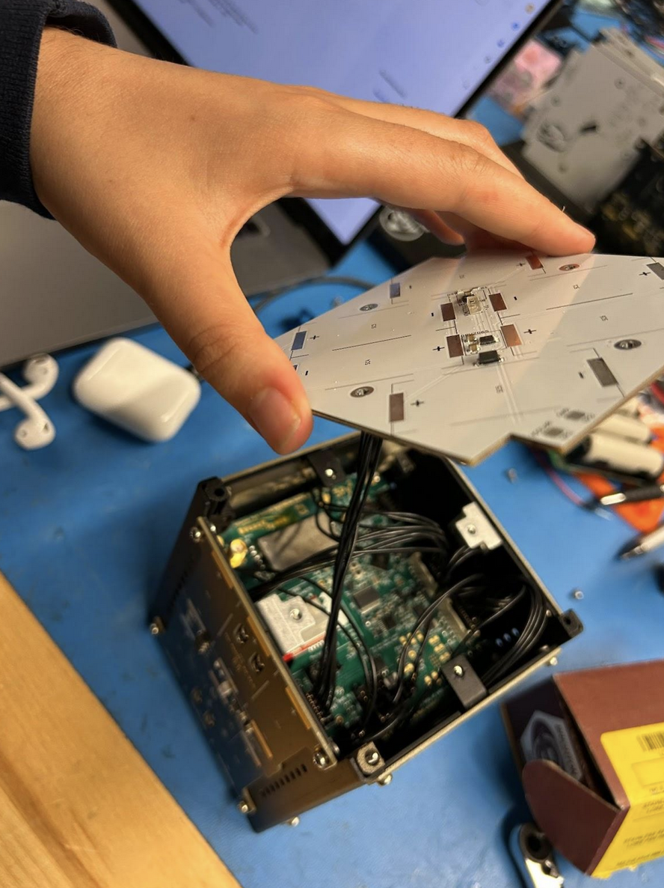

# Chapter 8: Integration Procedure

##  Building the Cube
### Initial Structure Assembly
   **1.** For this part of the integration, you will need two Main “U” halves, four small L-shaped brackets, and stainless steel 5mm long M2.5 Button Head fasteners. Remember to take all the tabs out of the boards

  *
**Figure 2.2:**
*

!!! note
    It is extremely important that the button head fasteners are used in this step and NOT the pan head fasteners for the L Brackets as this will allow the Solar Boards to fit on top of the fasteners.

   
   **2.** Loosely attach the two halves together using the four L-brackets and 5mm fasteners as shown in figure 8.1 below. Ensure not to over-tighten as we will “square up” the structure later using a jig.

  *
**Figure 6.2:**
*

!!! warning
    Make sure to ALWAYS screw in the fasteners horizontally when dealing with pre-installed pem-nuts.
   **3.** If you happen to pop out one of the pem-nuts, secure the fasteners with locknuts but be extra careful not to tighten them too much.

!!! warning
    TORQUE SPEC IS 0.59 N-M (5.22 IN-LB), DO NOT EXCEED THIS ON M2.5 BOLTS/FASTENERS.

###  Initial bracket mounting.
   **1.** Secure 2 battery board card brackets onto the board using M2.5x5mm Pan Head bolts as shown in Figure 8.3 below. Do the same for the flight controller board
 
  *
**Figure 2.2:**
*

  

 **a.** Angle the board diagonally with attached brackets and insert into the internal volume of the main structure.

  *
**Figure 2.2:**
*

 
  Plug the Flight Controller into the battery board. Then, use the board mounting holes on the main structure to secure the battery board using M2.5x5mm pan head bolts. 
  
  There are several mounting hole options through the vertical length of the structure although the two holes extend further to the bottom on each corner of the structure should be reserved for mounting the feet.

  *
**Figure 2.2:**
*

##  Integrating Satellite Feet
###  Installing Feet Assembly
  **1.** Use Blue Loctite, M2.5x10mm pan head fasteners, and M2.5 locknuts to install the feet.
   **2.** Install the feet so the feet with the switches inside them are all diagonal from one another.
   **3.** To install the feet on the structure, place locknuts in the small openings of the feet as shown in Figure 8.10 with the nylon side of the locknut facing towards the interior of the satellite. Press downwards on the top of the feet while also pressing them up against the side of the structure. Remember to plug them into the flight controller board!

 
  *
**Figure 2.2:**
*

  

###  Applying Thermocouple (Optional)
   **1.** Apply space-rated glue to the Thermocouple and place it on the side of one of the two middle batteries. Make sure that the metal part of the thermocouple is touching the battery casing.

###   Applying Thermal Blanket (Optional)
   **1.** Place strips of double-sided Kapton tape along the face of the batteries and press the thermal blanket down against the exposed tape.
   **2.** Fold the ends back against the outer-facing side of the thermal blanket.

   
   
## Squaring the Satellite
### It’s Jig Time!
Place the structure into the jig as shown in figure 8.11. Slide it back and forth multiple times through the jig to square up the structure.

!!! note
    If you cannot fit the satellite into the jig, loosen the fasteners on the structure (not including the feet) and attempt to fit it again.

  *
**Figure 2.2:**
*

 If preparing for a launch, apply Loctite. Without taking the satellite out, unscrew fasteners one at a time and secure them by dipping them in Blue Loctite and placing them back in the structure. Be careful with the fasteners that are screwed into the small L brackets.

## Adding the faces.
**1** Plug the faces to the flight controller board, including the Z-face. Then screw them onto the faces of the cube. Wiring the Z- before you fasten all the faces will make it easier to plug the Z-face in.

!!! note
   You will have to remove one of the faces to program the cubesat as of now the antenna board USBC doesn’t work. This should be in a later update.
