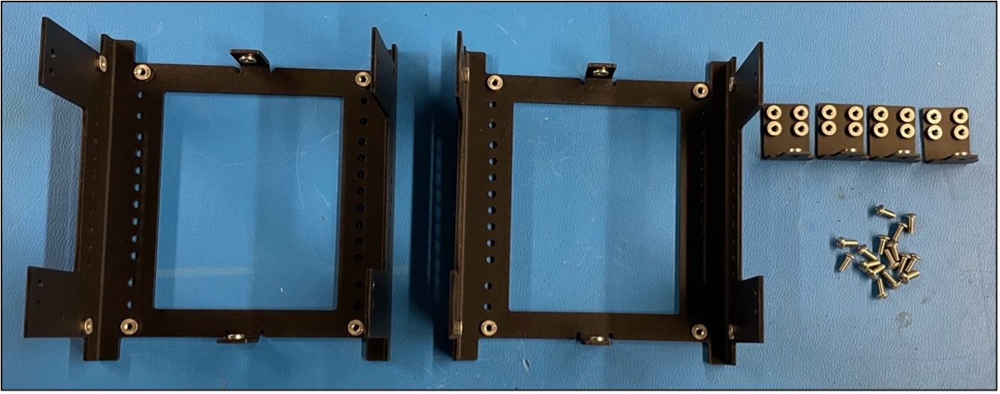
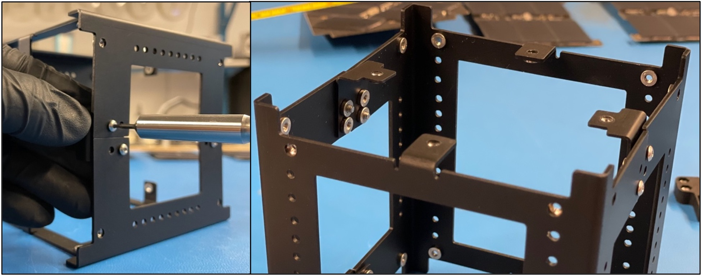
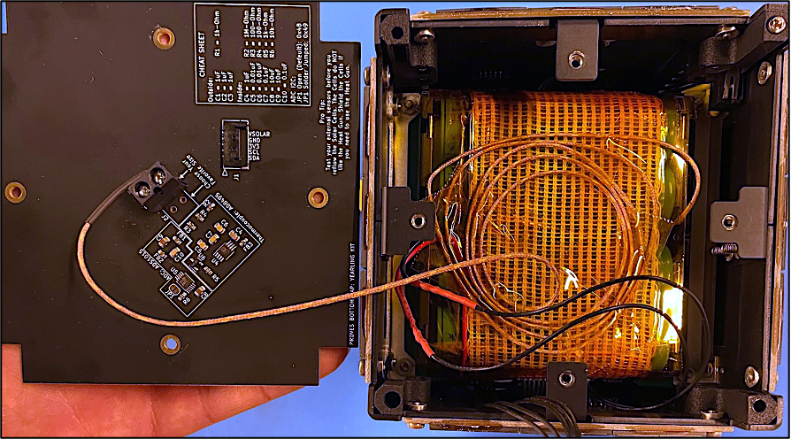
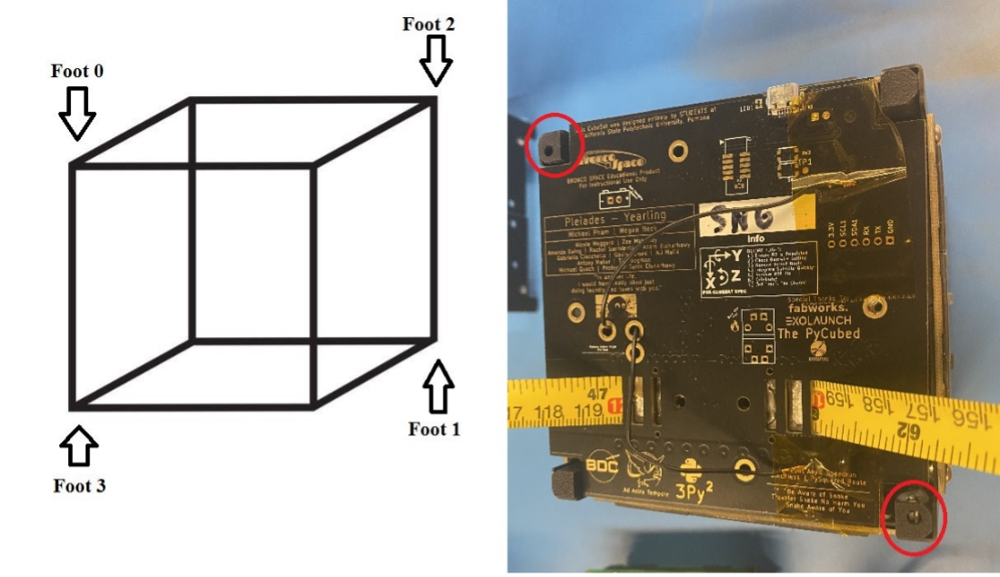
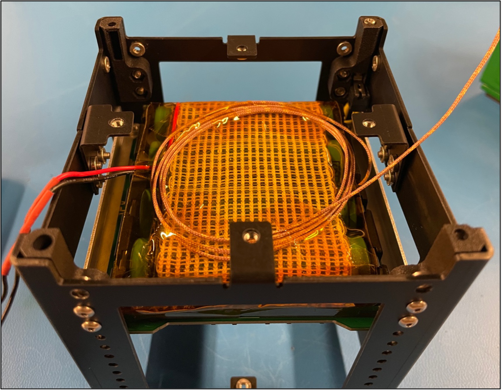
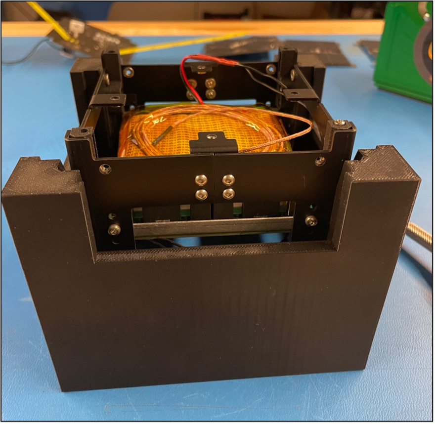
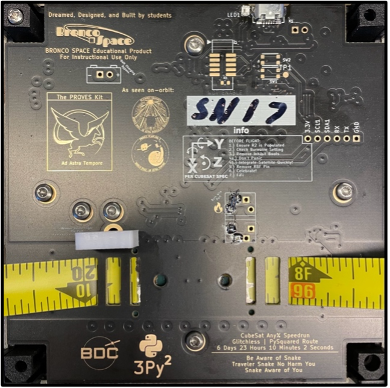
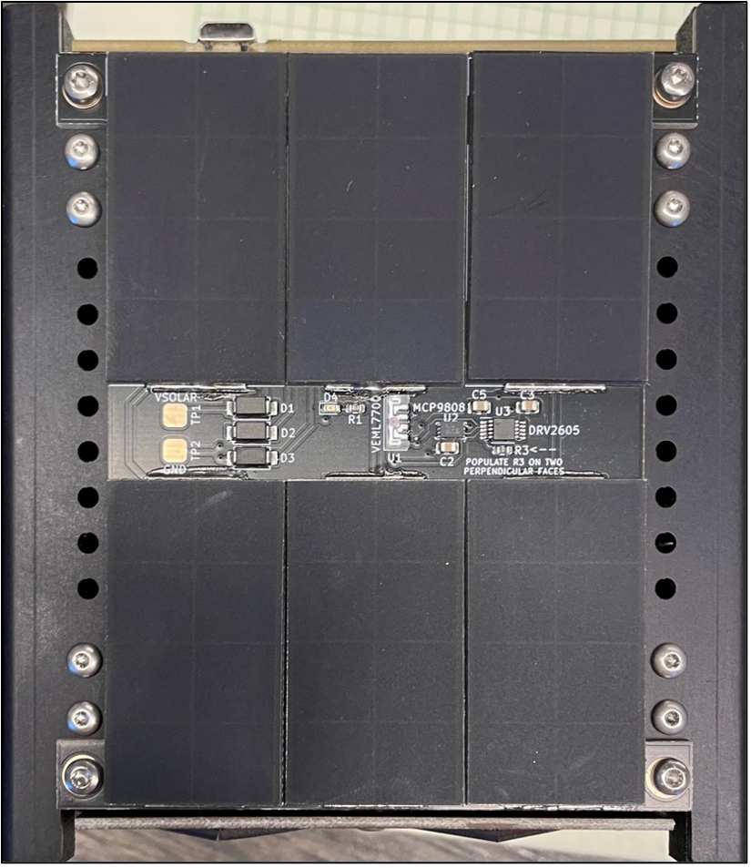

# Chapter 8: Integration Procedure

## 1) Building the Cube
### a. Initial Structure Assembly
  - **i.** For this part of the integration, you will need two Main “U” halves, four small L-shaped brackets, and stainless steel 5mm long M2.5 Button Head fasteners. 
    
    
Fig 8.1: Main structure components

>*Note*: It is extremely important that the button head fasteners are used in this step and NOT the pan head fasteners for the L Brackets as this will allow the Solar Boards to fit on top of the fasteners. 
  - **ii.** Loosely attach the two halves together using the four L-brackets and 5mm fasteners as shown in figure 8.1 below. Ensure not to over-tighten as we will “square up” the structure later using a jig.

    
Figure 8.2: Example of how to attach the L brackets to initial structure assembly.

> *Warning*: Make sure to ALWAYS screw in the fasteners horizontally when dealing with pre-installed pem-nuts.
  - **iii.** If you happen to pop out one of the pem-nuts, secure the fasteners with locknuts but be extra careful not to tighten them too much.
> WARNING: TORQUE SPEC IS 0.59 N-M (5.22 IN-LB), DO NOT EXCEED THIS ON M2.5 BOLTS/FASTENERS.

## 2) Card Brackets & Battery Board
### a. Initial bracket mounting.
  - **i.** Secure 2 battery board card brackets onto the board using M2.5x5mm Pan Head bolts as shown in Figure 8.3 below.
    
    
Figure 8.3: Initial Card Bracket Mount to Battery Board

  - **ii.** There are two separate approaches to this next step:
    1. Angle the board diagonally with attached brackets and insert into the internal volume of the main structure. Use the board mounting holes on the main structure to secure the battery board using M2.5x5mm pan head bolts. There are several mounting hole options through the vertical length of the structure although the two holes extend further to the bottom on each corner of the structure should be reserved for mounting the feet.  **Figure 8.4**
    
    
Figure 8.4: Approach 1 of Installing Battery Board Inside Structure

    
    2. The second approach to inserting the battery board would be taking the Structure Halves apart and inserting the board along with any additional boards (battery board(s), development boards, payloads, etc.) into one of the Half U’s. Once the board is inserted, the holes on the bracket is aligned with the structure and fastened with the M2.5x5 Pan Head fasteners. The other Half U can be brought back in and installed like in the Building the Cube step, and the remaining bracket holes can be mounted to the structure.  **Figure 8.5**

Figure 8.5: Approach 2 of Installing Battery Board Inside Structure

### b. Applying Thermocouple
  - **i.** Apply space-rated glue to the Thermocouple and place it on the side of one of the two middle batteries. 
  
    
Figure 8.6: Applied Thermocouple

### c. Applying Thermal Blanket
  - **i.** Place strips of double-sided Kapton tape along the face of the batteries and press the thermal blanket down against the exposed tape.
  
    
Figure 8.7: Applying Thermal Blanket

  - **ii.** Fold the ends back against the outer-facing side of the thermal blanket.
  
    
Figure 8.8: Thermal blanket placed over batteries

## 3) Integrating Satellite Feet
### a. Installing Feet Assembly
  - **i.** Use Blue Loctite, M2.5x10mm pan head fasteners, and M2.5 locknuts to install the feet.
  - **ii.** Install the feet so the feet with the switches inside them are all diagonal from one another.
  
    
Figure 8.9: Placement of Foot Switches on structure layout

  - **iii.** To install the feet on the structure, place locknuts in the small openings of the feet as shown in Figure 8.10 with the nylon side of the locknut facing towards the interior of the satellite. Press downwards on the top of the feet while also pressing them up against the side of the structure.
  
    
Figure 8.10: Feet with switch assembly

  - **iv.** Dip the ends of the 10mm long fasteners in Loctite and secure the feet in place.
    
    
Figure 8.11: The two different feet installed in structure

## 4) Squaring the Satellite
### a. It’s Jig Time!
- Place the structure into the jig as shown in figure 8.11. Slide it back and forth multiple times through the jig to square up the structure.
> **Note:** If you cannot fit the satellite into the jig, loosen the fasteners on the structure (not including the feet) and attempt to fit it again.

Figure 8.12: Example of squaring the satellite inside a 3D-printed jig.

- Without taking the satellite out, unscrew fasteners one at a time and secure them by dipping them in Blue Loctite and placing them back in the structure. Be careful with the fasteners that are screwed into the small L brackets.

## 5) Cable Management
### a. Connections

Figure 8.13: A battery board with necessary connections boxed in blue

> **Note:** Route wires through the sides of the battery board with cutouts to ensure that the solar panels will sit flush in later steps.

  - **1. Foot Switch Ports:** The foot assembly will terminate to a 2-position Pico-Lock connector. Pull the connected wires up along the open sides of the battery board.
  - **2. Remove Before Flight (RBF):** The RBF assembly will terminate to a 2-position Pico-Lock connector. This will be connected when the top-cap is installed.
  - **3. Direct Charge Port:** 2-position to 2-position Pico-Lock connector cable.
  - **4. Face Ports:** 5-position to 5-position Pico-Lock connector cable.
    - *Face 4* is reserved for the bottom or -Z solar face while Faces 0 to 3 are to be used for the side solar faces of the satellite.
  - **5. Main Board (Top Cap) Port:** 12-position to 12-position Pico-Lock connector cable.
    > **Note:** If a 915 MHz RF module is used instead of a 437.4 MHz, then a wire in the cable needs to be removed. This can be seen in Figure 8.14 below. 
  - **6. Burn Wire Port:** 2-position to 2-position Pico-Lock connector cable.
  - **7. Battery Heater Port:** The battery heater terminates to a 2-position Pico-Lock connector cable.

Figure 8.14: Battery board with Modified Connector 

## 6) Integrating Solar Faces & Top Cap
### a. Solar Faces
  - **i.** Determine the orientation of each face using the top cap as a guide.

    

<figure markdown>
  { width="300" }
  <figcaption>Figure 8.15: Showing the orientation diagram on the Top Cap.</figcaption>
</figure>

  
Figure 8.15: Showing the orientation diagram on the Top Cap.

  - **ii.** Connect each pin-out to the proper face (+-X, +-Y, +-Z) on the satellite.

    

  
Figure 8.16: Securing the solar faces onto the structure.

  - **iii.** Secure the solar faces of the satellite to the structure with 5mm stainless steel fasteners.

    

  
Figure 8.17: Securing the solar faces onto the structure.

  - **iv.** Connect the -Z face by securing the thermocouple wire into the proper terminals on the board. The yellow wire should go into the terminal with the square footprint, while the red wire should go into the terminal with the circular footprint.

    

  
Figure 8.17: Securing the solar faces onto the structure.

  - **v.** Connect the “face 4” connection to this face then secure the face with M2.5x5mm pan head bolts onto the structure.
  - **vi.** Connect the RBF wire and other wires to the corresponding connectors on the top cap.

## 7) Final Steps
### a. Tying down the antenna
  - **i.** Cut a long section of fishing line to secure the antenna in place around the satellite.
  - **ii.** Tie one end of the fishing line to the end of one antenna and wrap it around the satellite, weaving the line across the burn wire.
    
Figure 8.18: Finished satellite with RBF pin and antenna tied down securely.

