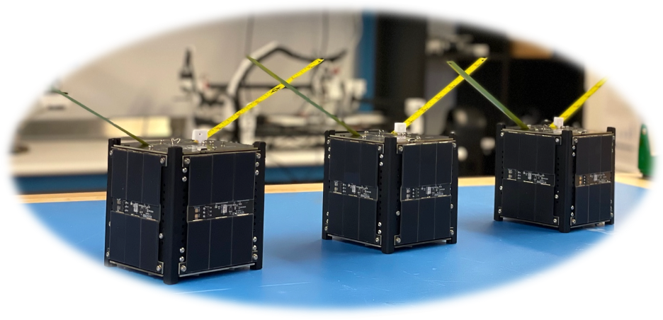

<h1 align="center">The PROVES Kit</h1>
<h2 align="center">Assembly and Integration Guide</h2>

Version 0.2 Pre-Release

Welcome to the assembly and integration guide for the PROVES (Pleaides Rapid Orbital Verification Experiment System) 1U CubeSat Kit. In this guide we will detail all the steps needed to take your kit and make it a functioning satellite! 

!!! Note
    Some images are still missing throughout this guide as it is in a pre-release state. If you require more specific guidence please contact Michael Pham: mlpham@cpp.edu

