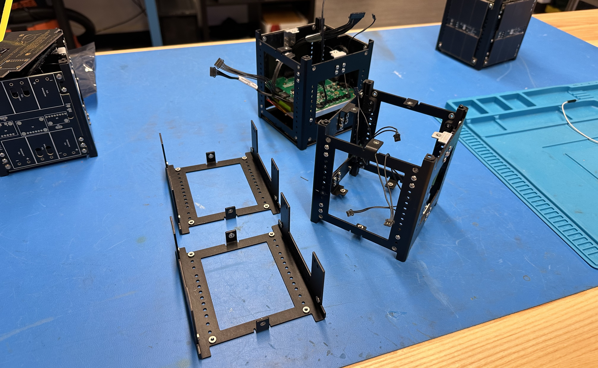

# Overview
The PROVES kit "1U" structure was designed around maximum customizability. With sixteen unique positions, several boards can fit inside to fulfill most mission requirements. The structure is laser cut, bent, and anodized Aluminum sheet metal, and is even strong enough to withstand the weight of a fully grown adult! Primary holes on the structure not joined with a bracket or hardware internally contain pressed PEM-Nuts for easy external mounting. The main structure was designed to be separate halves that are joined together by brackets and Printed Circuit Boards.

   
Figure 1: The PROVES Kit Structure

   
## Brackets
The strucutre can be populated with two separate brackets for joining the halves together. The "L Bracket" joins the alves at the top and bottom of the strucutre, while the card brackets mount PCBs internally and help provide structural rigidity.
## Peripheral Hardware
The structure also maintains mounting holes for feet on each structure half, and each SLS 3D printed foot can house switches for inhibitting the satellite. When the satellite is in the deployment pod on its way to space, it needs to remain off until it has been deployed. While the satellite is in the pod, it's feet are covered, and thus embedded switches can be depressed to inhibit the satellite. After the satellite is deployed, with nothing depressing the switches, the satellite can spring to life.

A Remove Before Flight ("RBF") switch and pin can also be added to the satellites top cap PCB for inhibitting the satellite as it is transported and placed in the deployment pod. The bracket that is mounted to the top cap PCB can house the switch and the top cap PCB features a hole for dropping a pin into place to depress the RBF switch.
## Expansion
The PROVES kit can be expanded to stack structures to meet larger satellite requirements (such as a "3u"). Special feet have been designed for this very concept to help join the structures together. This design implementation is completely experimental and has not ever been vibration tested or qualified for space. With the PROVES kit design being open-source, the concept could be tested and experimented with by anyone to further improve the community using the designs.
## Qualified for space
An Earlier version of the kit was vibration tested for 20 g's RMS. As stated earlier, the kit's structure can withstand the weight of an adult. The kit has been put through intense thermal cycling and has also survived. After two mission successes, the PROVES kit structure can easily qualify for space.