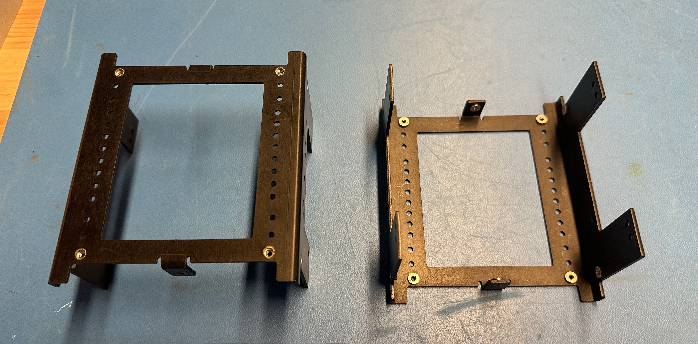
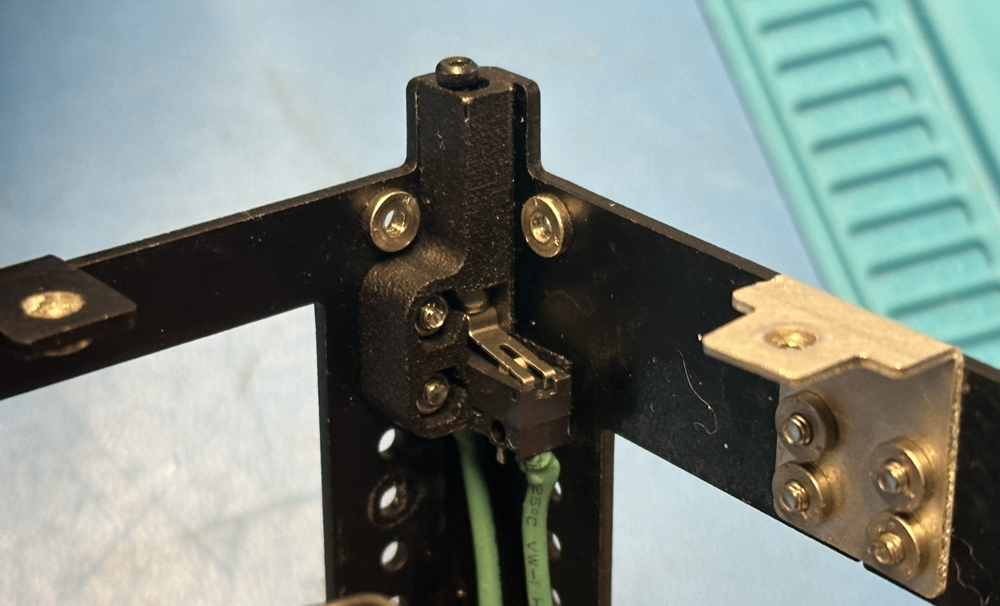

# Overview

Figure 1: The PROVES Kit Structure

The PROVES kit "1U" structure was designed around maximum customizability. With sixteen unique positions, several boards can fit inside to fulfill most mission requirements. The structure is laser cut, bent, and anodized 5052 Aluminum sheet metal, and is even strong enough to withstand the weight of a fully grown adult! Primary holes on the structure not joined with a bracket or hardware internally contain pressed PEM-Nuts for easy external mounting. The main structure was designed to be two separate halves that are joined together by brackets and Printed Circuit Boards.
   
## The Primary Structure
The primary structure of the satellite is usually considered the parts of the physical structure that will carry load during the launch environment and define the first resonant mode. Within the PROVES Kit we have two “Half U’s” that are joined by two “L-Brackets” connecting the top and bottom flanges of the half U’s”. The Half-U’s have a series of holes that run up and down the structure to provide spots for mounting “Card Brackets” which carry any component that needs to be held inside of the CubeSat. Additionally, there are eight “Foot Assemblies” that serve the dual purpose of providing a uniform satellite to satellite interface (when multiple 1U’s are stacked with each other) and containing the inhibit switches that keep the satellite turned off while it is inside the deployer. 

Figure 2: The Raw PROVES Kit Structure Components

!!! warning 
   
   When selecting fasteners do not use Zinc Plated. Although the risk is low, use of Zinc Plated Fasteners for flight can cause issues with your launch provider. See this [NASA site](https://nepp.nasa.gov/whisker/reference/tech_papers/Brusse2003-Zinc-Whisker-Awareness.pdf) for more details. 

### Half U's
- **Material:** 1.6mm Thickness 5052 Formable Aluminum Sheet Metal 
- **Recommended Fasteners:** CLS-M2.5-2, Self-Clinching Nuts | 18-8 Stainless Steel M2.5x5mm T8 Torx Panhead

Figure 3: The Half U's

### Brackets 
- **Material:** 1.6mm Thickness 5052 Formable Aluminum Sheet Metal 
- **Recommended Fasteners:** CLS-M2.5-2, Self-Clinching Nuts | 18-8 Stainless Steel M2.5x5mm T8 Torx Panhead

### Feet Assemblies 
- **Material:** PA-12 Nylon made in MJF or SLS 3D Printing Process
- **Recommended Fasteners:** 

The structure also maintains mounting holes for feet on each structure half, and each 3D printed foot can house switches for inhibiting the satellite. When the satellite is in the deployment pod on its way to space, it needs to remain off until it has been deployed. While the satellite is in the pod, its feet are covered, and thus embedded switches can be depressed to inhibit the satellite. After the satellite is deployed, with nothing depressing the switches, the satellite can spring to life. 

Figure 4: The Current Footswitch Design

There doesn’t seem to be a coined term for the method we use for the inhibit switches, so we just call them the “BroncoSat Style” because we first used it on BroncoSat-1. This style of inhibit features a mechanical limit switch that is wired in the Normally Closed (NO) form, with an M2 screw is used as a plunger that travels through the foot and clicks the circuit into the Open state when the plunger is depressed. We take advantage of the built in leaf spring on the limit switch to reject the plunger when there is nothing holding it down, and a nut is present to retain the plunger within the satellite. 

The primary reason that we opted to 3D print the feet rather than machine them is to save a radical amount of cost for the complex geometry needed. For anecdotal comparison, each of the 3D printed feet costs exactly $1 to manufacture whereas one of our CNC feet would cost about $54. 

There also exists an older part number that uses SDS005R microswitches to detect deployment. We refer to this as “BIRDS Style” because it is used by the Japanese BIRDS Open Source CubeSat Bus. The reason these switches are no longer used is that they are an incredible pain to assemble into the satellite and sometimes can be burned through by the burn wire circuit. These older feet can be used if you must absolutely optimize internal volume or need a part that can be CNC machined when the extra strength is needed or a launch provider will not budge on the requirement that all the touch points for the structure must be made of metal. 

## Peripheral Hardware

A Remove Before Flight ("RBF") switch and pin can also be added to the satellites top cap PCB for inhibitting the satellite as it is transported and placed in the deployment pod. The bracket that is mounted to the top cap PCB can house the switch and the top cap PCB features a hole for dropping a pin into place to depress the RBF switch.

## Expansion
The PROVES kit can be expanded to stack structures to meet larger satellite requirements (such as a "3u"). Special feet have been designed for this very concept to help join the structures together. This design implementation is completely experimental and has not ever been vibration tested or qualified for space. With the PROVES kit design being open-source, the concept could be tested and experimented with by anyone to further improve the community using the designs.

## Qualified for space
An Earlier version of the kit was vibration tested for 20 g's RMS. As stated earlier, the kit's structure can withstand the weight of an adult. The kit has been put through intense thermal cycling and has also survived. After two mission successes, the PROVES kit structure can easily qualify for space.