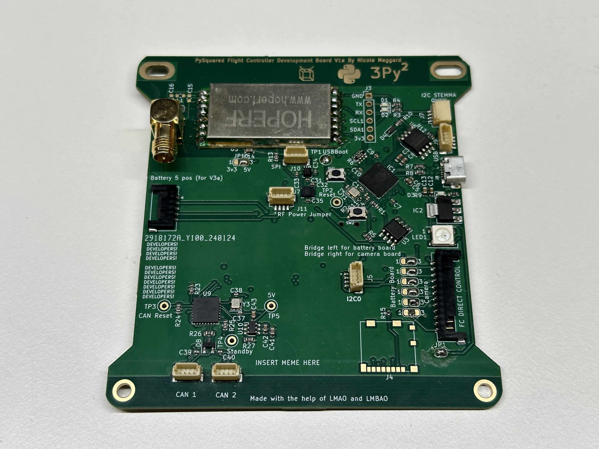
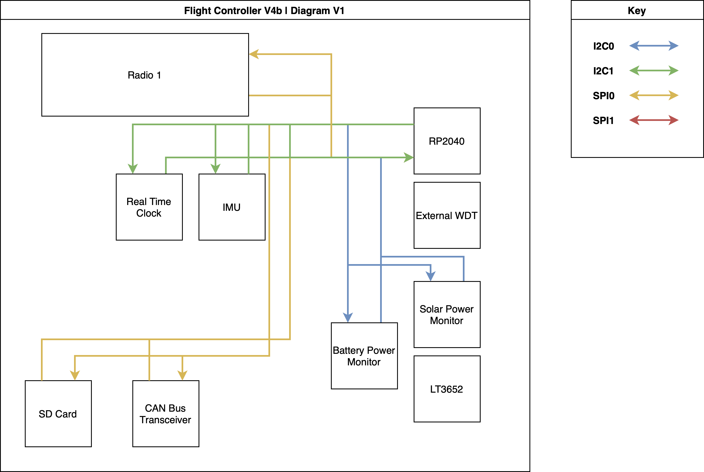
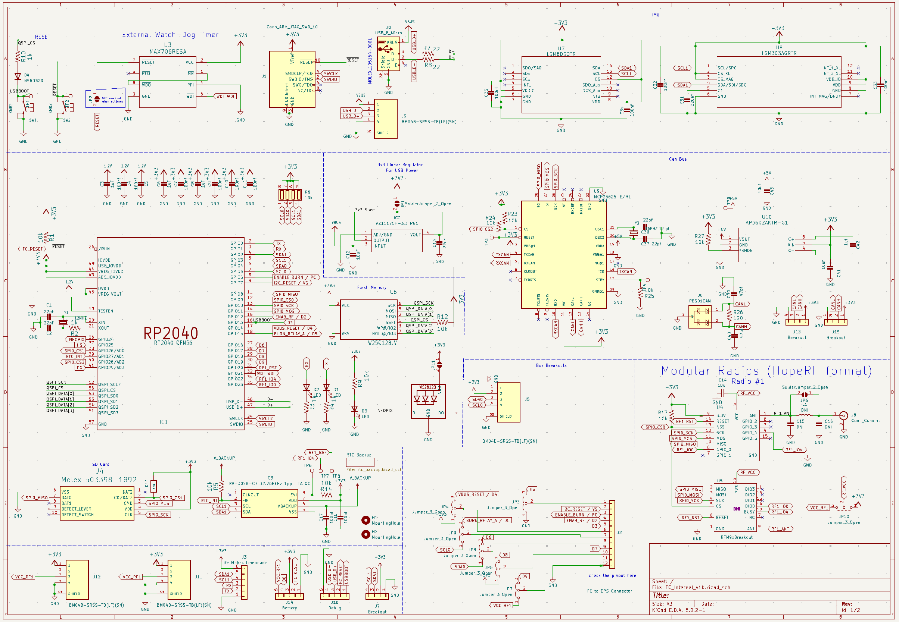
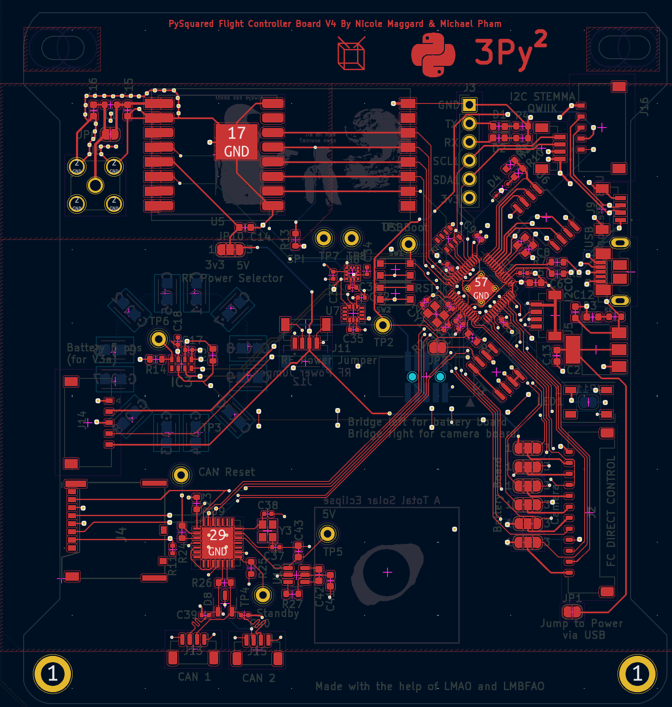
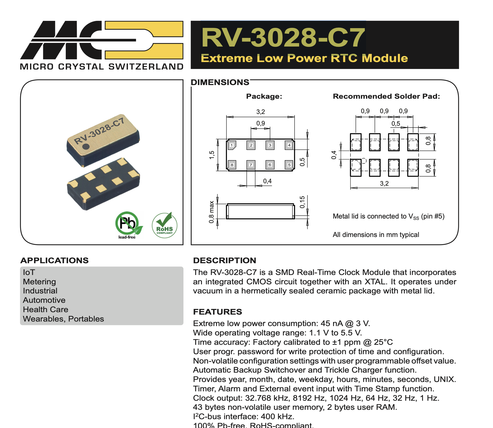

# Overview

<p align="center">Figure 1: The Internal Flight Controller Board</p>

The PROVES Kit Flight Controller is part of the PySquared architecture that harbors all of the satellites core operations. There are two variants of the Flight Controller, an internal variant and an external variant.

| Version | Flights | Status |
| ----------- | ----------- | ----------- |
| V0 | Unflown | Not Supported |
| V1 | Pleiades - Yearling, Pleiades - Squared | Legacy Support |
| V2 | Unflown | Unsupported |
| V3 | Unflown | Legacy Support |
| V4a (aka V1a Internal) | Unflown | Supported |
| V4b | Unflown | In Development |
| V4c | Planned | In Development |

## Getting Started
!!! note 
    These instructions are valid for Flight Controller Boards V1a (Internal), V4a, V4b. V4c. 

1. If you do not plan on connecting a battery board, ensure that the ```JP1``` solder jumper is connected to enable powering the board via USB.
2. Solder on the Radio Module and an antenna or compatible SMA connector as needed.
3. Solder the JP10 V_RF Power selector as desired. 
    - Bridge the center pad to left for 3.3V or right for 5V. 
    - Generally, the smaller (more square) radio modules require 3.3V whereas the larger (more rectangle) radio modules require 5V. 
4. Plug in a USB Cable!
5. If a CircuitPython file system does not appear, you may have to flash the board with firmware. 
    - The most up to date firmware can be found [here](https://github.com/proveskit/flight_controller_board/tree/main/Firmware). 
    - If you have never installed CircuitPython before you can find instructions [here](https://learn.adafruit.com/welcome-to-circuitpython/installing-circuitpython).
6. Continue to the [PROVES Quick Start Guide](https://docs.proveskit.space/en/latest/quick_start/proves_quick_start/) for more!

## Utilized Parts



#### V4b Schematic


#### V4b Layout


### RP2040 Microcontroller
The RP2040 is a powerful and versatile microcontroller developed by Raspberry Pi Ltd. It features a dual-core ARM Cortex-M0+ processor running at 133 MHz, 264 KB of SRAM, and flexible digital interfaces. The RP2040 was selected for use in the PROVES Kit thanks to its industry leading $1 price and abundance during the global chip shortage. Today we continue to use it thanks to the growing community of users worldwide. 

Key features of the RP2040 include:

- Dual-core ARM Cortex-M0+ processor
- 264 KB of on-chip SRAM
- Support for up to 16 MB of off-chip flash memory
- Programmable I/O (PIO) blocks for flexible interfacing
- USB 1.1 host and device support
- Low power consumption

The RP2040 can be programmed using various languages, including C, C++, MicroPython, and CircuitPython. Currently we support programming in CircuitPython or C++ (through the PicoSDK). 

### RFM98PW 433 MHZ Radio Module
To communicate between satellites or to ground stations. This module was selected based on its flight heritage on the PyCubed lineage of CubeSats. The RFM98 specifically supports the 435Mhz - 438Mhz range that is allocated to amateur radio satellites. The footprint on the board is a hybrid footprint that also allows the mounting of an RFM95 radio module that can operate in the ISM 915Mhz band as well. 

### RV-3028-C7 Real Time Clock (RTC)
The RV-3028-C7 is an I2C connected real time clock module that provides UNIX time in seconds, minutes, hours, date, month, year and weekday counters. The RTC also has the ability to deliver microcontroller interupts based on a predetermined time or through an external event. The primary use case for the RTC onboard the flight controller board will be for pin alarms that can be used to either wake up the microcontroller from a preset sleep period or alert the microcontroller to send a radio message on a predetermined schedule. This is the same IC as the RTC used on the OreSat C3. 



[Datasheet](https://www.microcrystal.com/fileadmin/Media/Products/RTC/Datasheet/RV-3028-C7.pdf)

[Application Guide](https://www.microcrystal.com/fileadmin/Media/Products/RTC/App.Manual/RV-3028-C7_App-Manual.pdf) 

### VL6180 LiDAR
To detect antenna deployment. As of V4 of the flight controller board the VL6180 is instead connected to the battery board to work in concert with the burn wire circuit. 

### MOLEX Micro SD Card Reader
Any SD Card up to 16Gb is supported by CircuitPython. We recommend using [Sandisk Industrial SD Cards](https://www.mouser.com/datasheet/2/669/SanDisk_Industrial%20Grade%20SD%20%20MicroSD%20Product%20Brief-805940.pdf) for flight, but any SD card will do for ground testing. 

### MAX706RESA Watch Dog Timer
To ensure the Flight Controller stays operational, this is a component that is borrowed from the PyCubed. 

### AZ1117CH 3.3V Linear Voltage Regulator
To power the Flight Controller without a Battery Board. This linear regulator uses the 5V V_Bus line from the USB port and supplies 3.3V when the JP1 solder jumper is connected.

## Change Log
The change log keeps track of major differences between the various versions of the flight controller board. 

### Version 4
With the introduction of V4 Flight Controller Boards (also known as V1 Internal Flight Controller Boards) we moved the main flight controller from being the inside of an exterior panel to its own dedicated board on the inside of the satellite. This was done to better protect the main avionics package from thermal and radiation effects. 

#### V4a
The `a` variant of the flight controller board introduced some layout changes and part package swaps from the base V4. No fundamental functionality was changed in this version. 

#### V4b
The `b` variant of the board repositioned certain connectors, added a debug Picolock, variant added a Real Time Clock circuit to the board. 

#### V4c 
The `c` variant of the board adds the OreSat based watchdog timer circuit to try and better defend against radiation upsets. 


## Known Issues
- Microcontroller and radio possibility have a high suspectibility failure due to thermal and radiation effects. In a future version imrpoved placement and redundancy will be implemented to protect these core components from those effects.  
- Antennas are very annoying to install and may also be suceptible to failure due to thermal effects. 

## Troubleshooting
