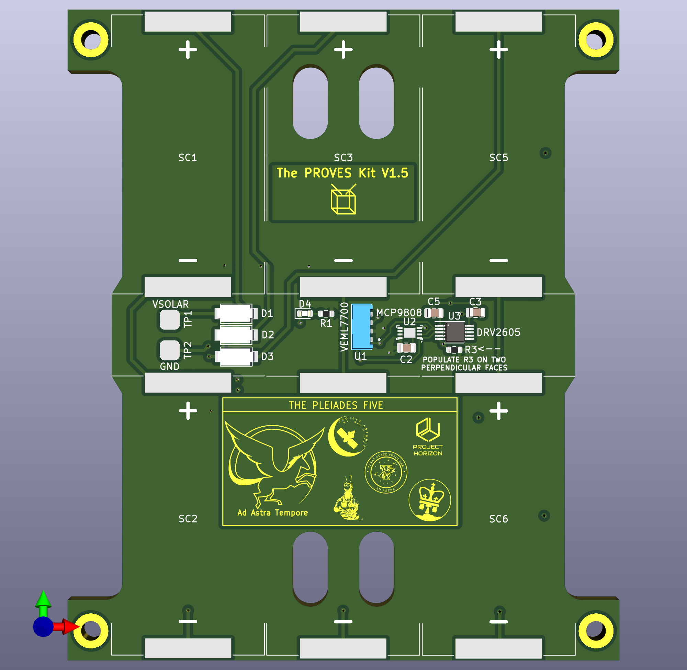

# Overview
The PROVES kit XY Solar Boards...

Figure 1: A Render of the Pleiades Five XY Solar Board

## Getting Started

## Utilized Parts
Each XY solar panel implements the following elements:

### (6) AnySolar KXOB101K08TF Solar Cells in a 2s3p configuration 
These are silicon solar cells from the Korean company AnySolar. They seem to be of a similar makeup to those employed by calculators. There is an EVA film that protects the cells and is fairly resilient. 

One of the big things that the really expensive triple junction cells bring to the table is guarantee of performance in the space environment over a 25 year mission life. We have no idea how well these AnySolar cells would do after years of being in space, but the Stanford team has validated at least 3 solid months of lifetime out of them with no noticeable degradation. 

### Microchip MCP9808T-E/MC I2C Temperature Sensor 
This is a temperature sensor. Not much else to say about it. 

### TI DRV2605LDGSR I2C Haptic Motor Drivers 
These low current motor drivers are used to energize the magnetorquer coils inside the PCB. 

### Vishay VEML7700-TT Ambient Light Sensors 
The ambient light sensor returns a luminance value proportional to the angle of incidence of the sun. It tracks roughly a bell curve. 

### Fun Blue LED!
A great indicator that everything is powered up! 

### 5-pin Molex 1.5mm Pitch Picolock for VSolar, 3.3V Power, and I2C connections

## Known Issues
There are no known issues with the solar panels. Amanda kind of hit it out of the park on the first try! 

## Troubleshooting