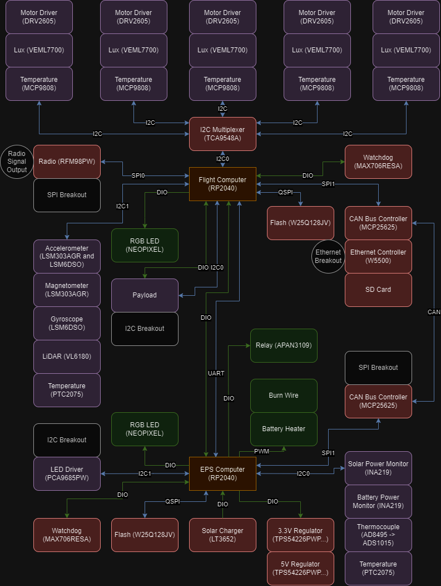

# The FlatSat Dev Board 
We decided that it would be a good idea to create a single board that has all of the core electrical compoenents of the PROVES Kit for use in the classroom, on the lab bench, and in field testing! This board would be pretty difficult to fit in a 100mm x 100mm envelope, so it is not CubeSat form factor, but it still captures all of the core CubeSat functionalities! 

Figure 1: The FlatSat Block Diagram
