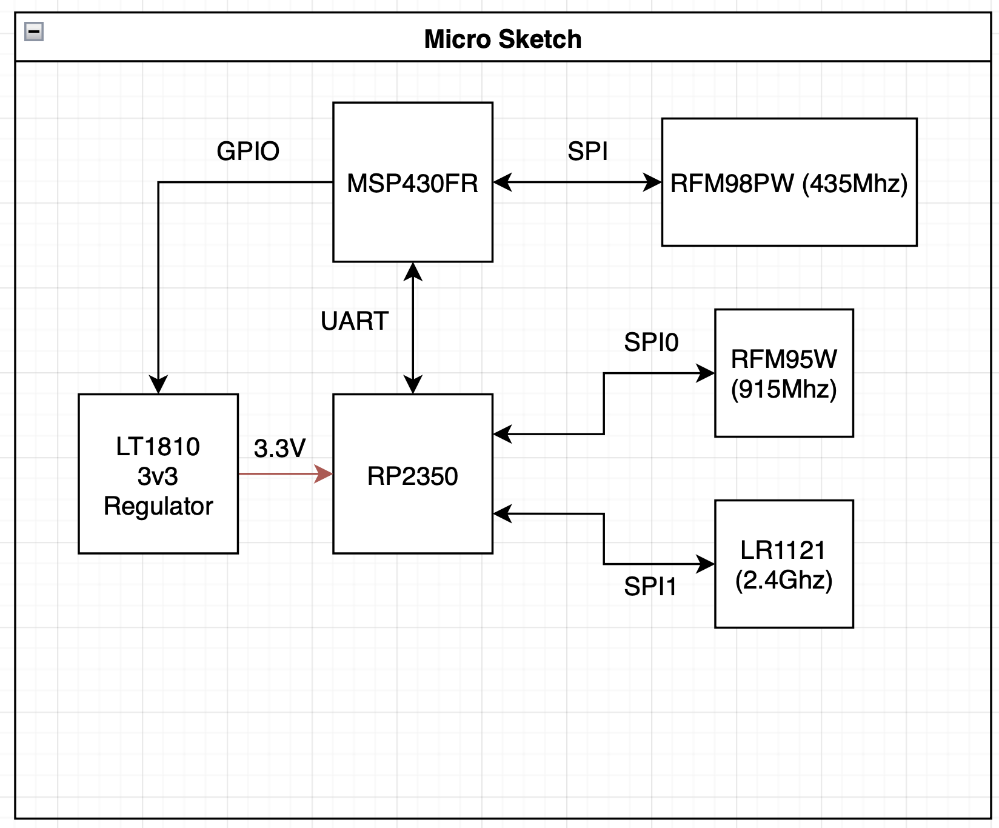

# The PROVES Prime Mainboard
Trying out a single board implementation for the PROVES Kit again! 

# Design Objectives
The core goal of the PROVES Kit is to provide a low cost and accessible means of getting working hardware and software in outer space. We interpret that goal as the following:  
```
Having a satellite architecture that:
- Costs approximately $1000 
- Can be built in one day and 
- Will die when it deorbits. 
```
Depending on how the Pleiades - Orpheus mission goes, V1.5 of the kit may have already acomplished that! There is a big problem with V1.5 though, technical debt from patchwork development over the last year has made it rather complicated and not easy to replicate outside of the Bronco Space Lab. As a result, here we are trying to semi clean sheet a V2 design of the kit for much quicker and easier builds! 

# Planned Changes From V1.5 

Major Updates: 
- Returning to a PyCubed Style Mainboard / Battery Board Scheme 
- Removing the secondary microcontroller 
- Reworking the electrical power subsystem
- Adding options for multi-radio setup 
- Rework of the connectors and harnessing system 
- Designing for scalability with larger and more complex payloads

# Dev Logs
This section is for a running log of development activities! The goal is with regular "dev diary" sort of updates to be able to track the logic behind alot of the PROVES Prime Design Decisions. 

## January 26, 2025 | The First Devlog! 
Okay so this is where we're starting with trying to actively track the development of this board! Currently the two design contributors are Michael Pham, Rachel Rakushkin, and the Hacker LMBFAO. At this stage we have some preliminary component select and schematic migration from the existing PROVES boards complete. 

### Overall Architecture Plan
Right now our thought is to run a hybrid architecture where there is a ultra-low power microcontroller (the MSP430FR line most likely) that runs a "Minimum Viable Satellite" (MVS) alongside an RP2350 microcontroller that will run most of the satellite systems and interface with payload data collection. The attatched block diagram reflects the thinking here. 



The big idea here is that we have a somewhat modular MVS section of the board, that is able to support the most essential satellite systems in the safest and simplest way possible, running alongside the core systems connected to the RP2350, which will do all of the mission data collection and satellite management. The thought is that we can rely on the MVS at all times to provide a satellite beacon with the most important satellite metadata while allowing the core systems to run a little more fast and loose with the RP2350.  

The MSP430 (despite being a pretty ancient microcontroller) has plenty of proven heritage in spaceflight and industrial applications. Particularly the **FR** varients use FRAM which lends an increased resistance to radiation upsets and permits the microcontroller to run a very low power. As a center of the MVS, this microcontroler will have access to the 435Mhz band UHF radio, the system and solar power monitors, and GPIO that connects to the enable pins of the 3v3 and 5v regulators. That last element giving the MVS the ability to "turn the sateliite off and on again" if it is ever needed. This system will then interface with the RP2350 core through a UART connection. 

# Quick References
This is a section for storing quick reference images and notes regarding the design of the PROVES Prime Mainboard. 

## RP2350 Pin Definitions
!!! "Source"
    https://datasheets.raspberrypi.com/rp2350/rp2350-datasheet.pdf


