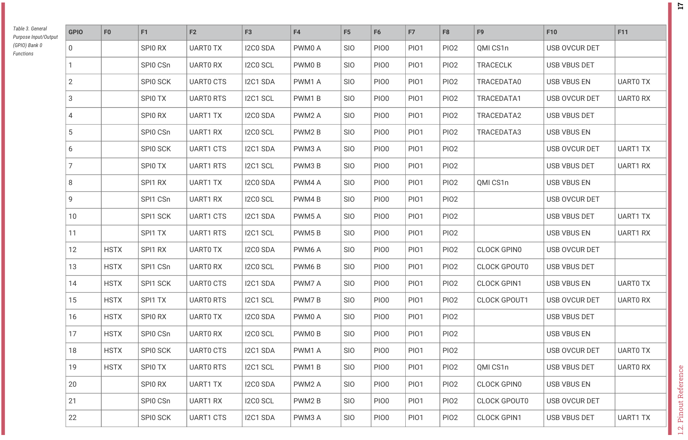
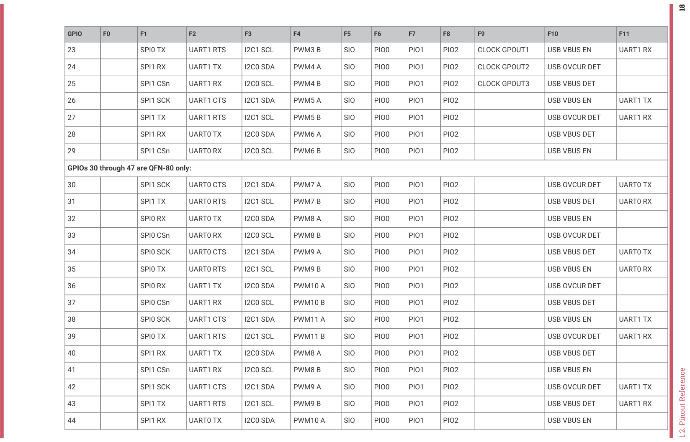
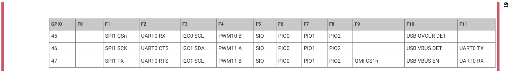

# The PROVES Prime Mainboard
Trying out a single board implementation for the PROVES Kit again! 

# Design Objectives
The core goal of the PROVES Kit is to provide a low cost and accessible means of getting working hardware and software in outer space. We interpret that goal as the following:  
```
Having a satellite architecture that:
- Costs approximately $1000 
- Can be built in one day and 
- Will die when it deorbits. 
```
Depending on how the Pleiades - Orpheus mission goes, V1.5 of the kit may have already acomplished that! There is a big problem with V1.5 though, technical debt from patchwork development over the last year has made it rather complicated and not easy to replicate outside of the Bronco Space Lab. As a result, here we are trying to semi clean sheet a V2 design of the kit for much quicker and easier builds! 

# Planned Changes From V1.5 

Major Updates: 
- Returning to a PyCubed Style Mainboard / Battery Board Scheme 
- Removing the secondary microcontroller 
- Reworking the electrical power subsystem
- Adding options for multi-radio setup 
- Rework of the connectors and harnessing system 
- Designing for scalability with larger and more complex payloads

# Quick References
This is a section for storing quick reference images and notes regarding the design of the PROVES Prime Mainboard. 

## RP2350 Pin Definitions
!!! "Source"
    https://datasheets.raspberrypi.com/rp2350/rp2350-datasheet.pdf



