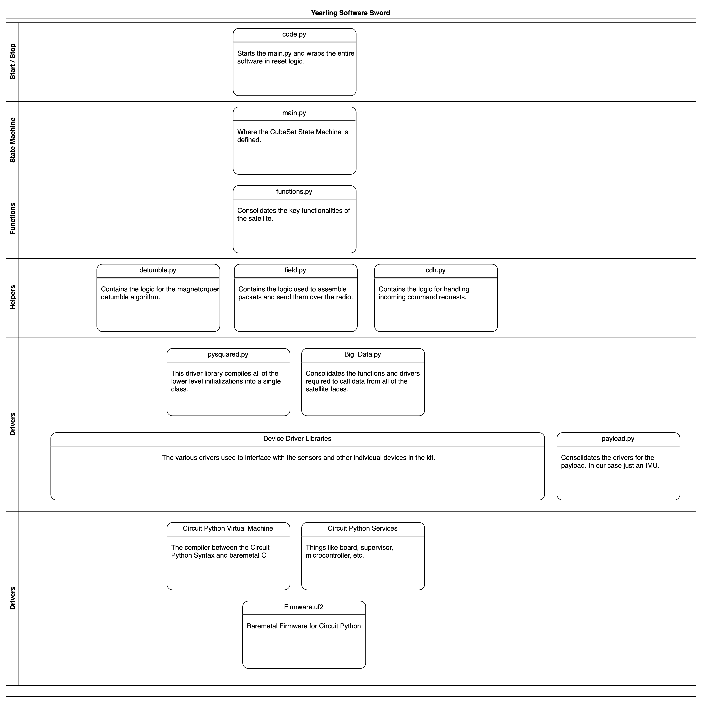

## The Yearling Software Sword

This is a bit of an interesting one! We recently were trying to figure out what the best way of describing what the flight software stack looks like and a sword is what it eneded up being! 


<p align="center">Figure 1: The Software Sword for Pleiades - Yearling 1</p>

This diagram expresses the overall class structure of the Yearling Flight Software from the baremetal firmware all the way at the bottom up to the highest level ```cody.py``` at the top. We generally recommend that the end user only goes down to the ```functions.py``` level when defining their own software, unless they are added their own custom hardware to the stack! 

Here is a visualization of the development process for our software! 
<iframe width="560" height="315" src="https://www.youtube.com/embed/9-mW69L0Mcs?si=EHgs19kBj3hEUDcQ" title="YouTube video player" frameborder="0" allow="accelerometer; autoplay; clipboard-write; encrypted-media; gyroscope; picture-in-picture; web-share" referrerpolicy="strict-origin-when-cross-origin" allowfullscreen></iframe>


## Pleiades - Yearling 2
| Parameter | Value |
| -------- | -------- |
| Operational?   | No   |
| Frequency   | 437.4 Mhz   |
| Modulation   | LoRa   |
| Spreading Factor   | 8   |
| Callsign   | KN6NAQ   |

## Pleiades - Squared
| Parameter | Value |
| -------- | -------- |
| Operational?   | No   |
| Frequency   | 437.4 Mhz   |
| Modulation   | LoRa & FSK  |
| Spreading Factor   | 8   |
| Callsign   | KN6NAT   |