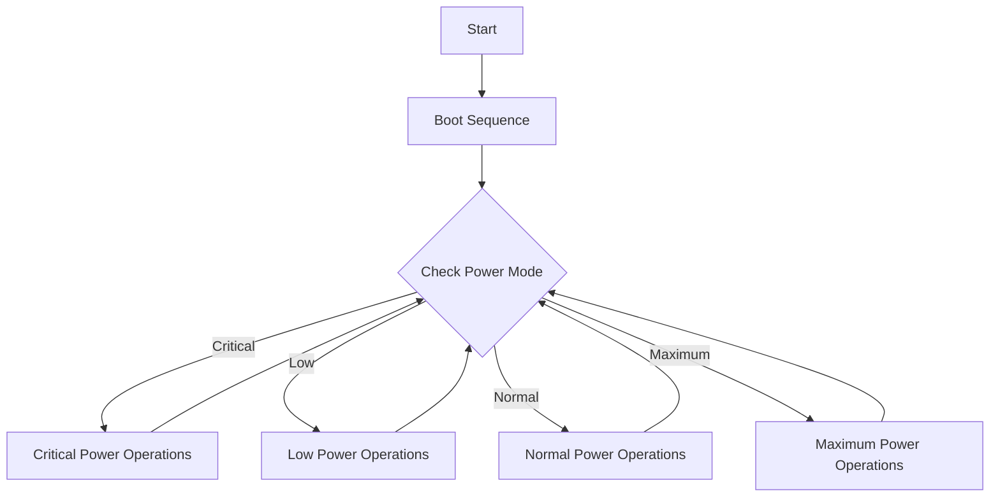

# Overview
The PROVES kit Battery Board was designed around
## Getting Started
Currently there is one officially supported version of the batery board and one in development version: 

| Version |Flight Heritage| Description |
|---------|---------------|--------------------|
| **V2a** | Pleiades - Yearling 2, Pleiades - Squared | This version contains the core functionalities needed for battery and sensor management. |
| **V3**  | None| This version is a significant overhaul of the battery board, and it implements a RP2040 microcontroller for power management. |
 
## Functionalities

## Utilized Parts
The battery board flown on the Pleiades-Yearling and Pleiades-Squared missions. The board serves as an interface with the rest of the satellite. A 12 position picolock is utilized to interface between the Flight Controller and the Battery Board. The board interfaces with 5 solar faces of the satellite using 5 position picolocks. The other 2 position picolocks are used for interfacing with the inhibit scheme, battery heater, burn wire, and direct charging port. The hardware utilized on the module is the following:

### LT3652 Solar Charger 
This component is used to charge the satellite's batteries using power harvested from solar panels. This part is not a true MPPT solar charger, but it emulates one. There is debate as to whether true MPPT is worth it on small 1U class satellites due to its extra complexity. In the future we will look towards using the microcontroller on the battery board to manage a true MPPT charging curcuit. 

### PCA9685 LED Driver
The PCA9685 LED Driver controls the power distribution to the solar faces. It enables selective powering of solar face components, facilitating isolation and power-down of specific faces in case of malfunction, thus protecting the system and conserving energy.

### TCA9548 I2C Multiplexer
The TCA9548 I2C Multiplexer expands a single I2C bus from the flight computer into multiple channels. This design simplifies the communication with multiple sensors on different solar faces while keeping their addresses identical, enhancing the modularity and scalability of the system. The TCA also appears to provide some level of bus protection, so in the case of an I2C sensor failure the fault is limited to only the face that the sensor is on rather than also interupting all other I2C sensors on the satellite. 

#### TPS54226PWP Switching Voltage Regulator
This Switching Voltage Regulator is the primary regulator for supplying the microcontroller and sensors onboard the satellite. It creates a stable 3.3V power supply from the variable battery voltage, and its "One Shot" Regulator Reset feature provides a way to reset the power bus, aiding in system recovery and fault tolerance. This part is borrowed from Max Holliday's PyCubed, and is believed to be slightly more radiation tolerant than other switching regulators due to there being a radiation hardened version in the part family. 

### TPS7A4501 LDO Voltage Regulator
The TPS7A4501 LDO Voltage Regulator is essential for supplying a stable 5V power to critical components like the radio on the flight controller. Although a linear regulator is more inefficient than a switching one, there are significantly lower concerns of noise on the power lines. This is important for ensuring an electrically clean enviroment for the radio to operate in. This part is borrowed from Max Holliday's PyCubed, and is believed to be slightly more radiation tolerant than other switching regulators due to there being a radiation hardened version in the part family. 

### INA219 Power Monitors
These Power Monitors are crucial for real-time tracking of power input from solar cells and power consumption across the system. They provide valuable data for monitoring the health of the electrical power system and for optimizing power usage. These power monitors have extensive flight heritage across many CubeSats. 

### PTC2075 Temperature Sensor
The PTC2075 Temperature Sensor provides ambient temperature data from inside the satellite. This information is vital for thermal management, ensuring that the satellite's components operate within their safe temperature ranges.

### R5460N208AA
The R5460N208AA plays a protective role by disconnecting the battery in cases of overcharge or overdischarge. This function is critical for battery health and safety, preventing potential damage to the power system. This part is borrowed from Max Holliday's PyCubed. 

### APAN3109 Relay
The APAN3109 Relay is used to control the flow of current to the battery heater and burn wire MOSFETs. It is an essential component for managing the deployment mechanisms and thermal systems of the satellite.

## Known Issues
- Although the R5460N208AA is supposed to auto-release in the case of a battery protection event, it does not appear to actually do this. If you find that the satellite is not delivering power because of a battery protection event that has now been cleared, you can reset the protection circuit by "jump starting" the satellite by applying a voltage higher than the current voltage of the batteries. On-orbit these jump starts should be automatically applied by the solar charger, if they are needed. 

## Troubleshooting
