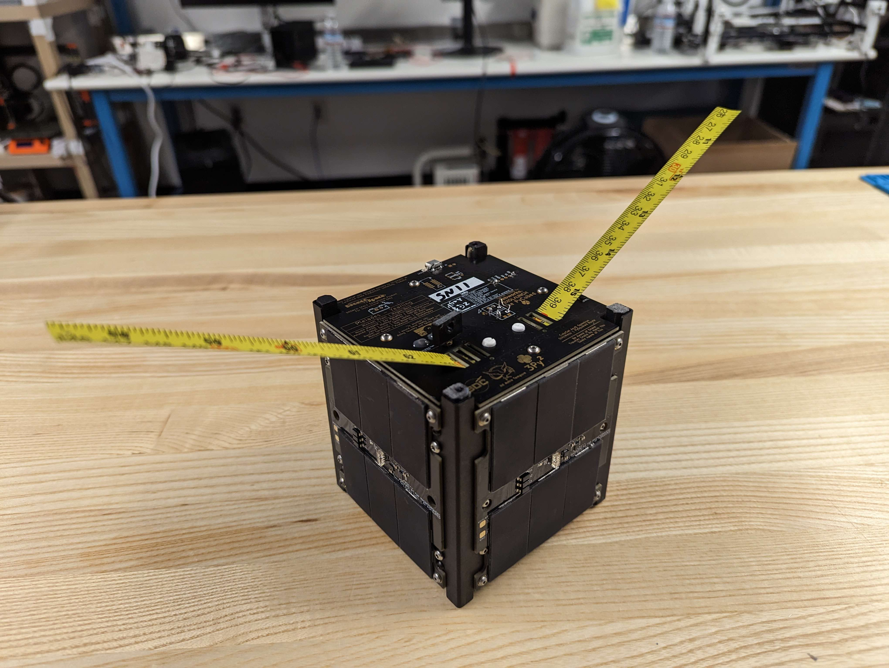
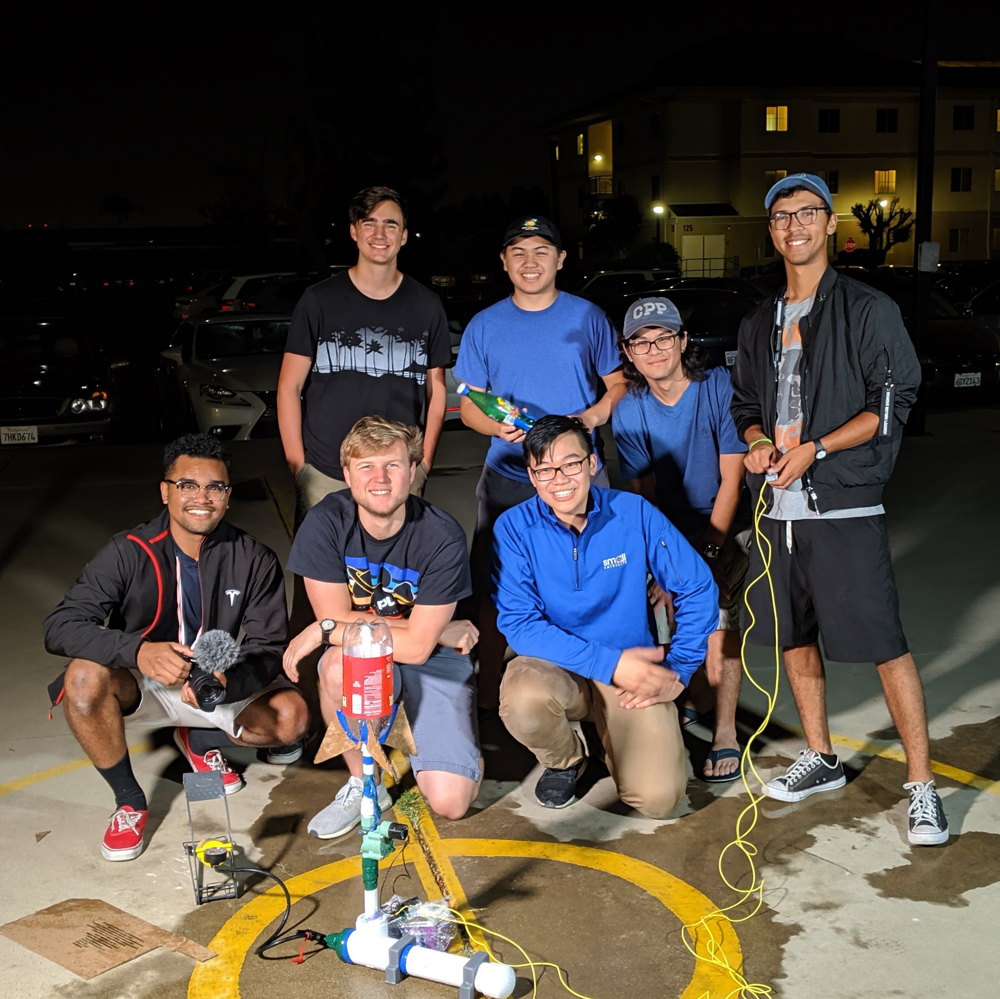
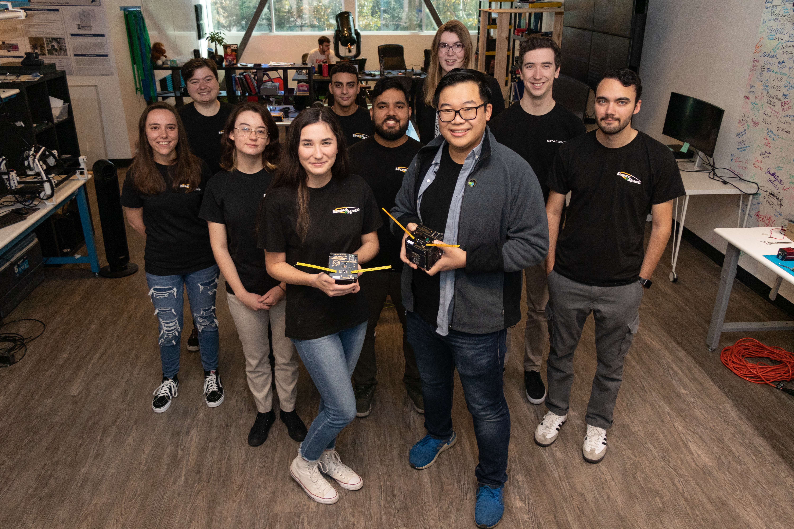

# Welcome to the PROVES Kit!
The Pleiades Rapid Orbital Verification Experiment System (PROVES) 1U kit is intended as an education first option for members of academia and industry who look to be first time or returning CubeSat developers. 

Figure 1: A Picture of Pleiades - Yearling SN11

## Trials and Tribulations in CubeSats
Hey you! You’re finally awake. You were trying to cross the border into CubeSats too weren’t you? Walked right into all the complexities and costs and wondering what even is a quasi-static load? Just like those guys over there.

We were right where you were not too long ago. As founding members of Bronco Space at Cal Poly Pomona we started our journey into the land of CubeSats as a group of extremely naive undergrads in Spring of 2019. We wanted to bring something with our names on it and get it to outer space by 2022, whatever it took. How hard could it be? 

Figure 2: That Extremely Naive and Ambitious Group With Their First Creation

Well, it turned out to be the most difficult thing that any of us had ever undertaken in our entire lives. Maybe even the hardest thing ever done at our university in all time. We had to fight against a complete lack of institutional knowledge or support, a complete lack of funding, and a global pandemic to get our first satellite BroncoSat-1 to orbit in May of 2022. Overcoming all of that just for it to not work. Dead on arrival, not even a peep. 

Figure 3: The BroncoSat-1 EM and FM

By then our little student club had managed to carve out an existence as a small lab at Cal Poly Pomona, and we managed to persevere through to doing NASA backed instrument development and many more satellites on their way to space. We bet the farm on BroncoSat-1 and it still worked out despite the on-orbit failure, but it could have very easily gone the other way and been the end of our dreams of space. Most teams don't aren't able to catch that lightning in a bottle intersection between talent, opportunity, and luck to survive this long. 

## The PROVES Kit: Past, Present, and Future

Figure 4: The Team That Built Yearling

This is what inspired us to dream of a world where the CubeSat developer never has to wonder whether or not their satellite will work. They would only have to ask “how well will my satellite work.” The PROVES CubeSat Kit is just the beginning of how we are planning to make this world a reality. Inspired by the work of open source space community pioneers such as Max Holliday, the Stanford Student Space Initiative, the Portland State Aerospace Society, and the Hawaii Spaceflight Lab, the PROVES CubeSat Kit is just the beginning of how we are planning to make this world a reality.

Figure 5: The Future in the Pleiades Five

The Pleiades - CubeSat Cluster and the Yearling line of satellites was where we sought to lay the ground work for a radically low cost and open source CubeSat architecture. Now we invite the rest of the New Space community to join us in our quest for a more open, accessible, and successful future in the stars! 

## Documentation Layout
This documentation site is split into five sections: 
- **Overview:** Detailing the general background and flight heritage of the PROVES Kit.
- **Design:** Which presents the key design decisions that have gone into the PROVES Kit.
- **Assembly Guide:** A chapter by chapter walkthrough of building a PROVES Kit. 
- **Core Documentation:** Detailed accounts of the components of the PROVES Kit. 
- **Publications:** A record of the presentations and papers presented at conferences and workshops regarding the PROVES Kit. 
