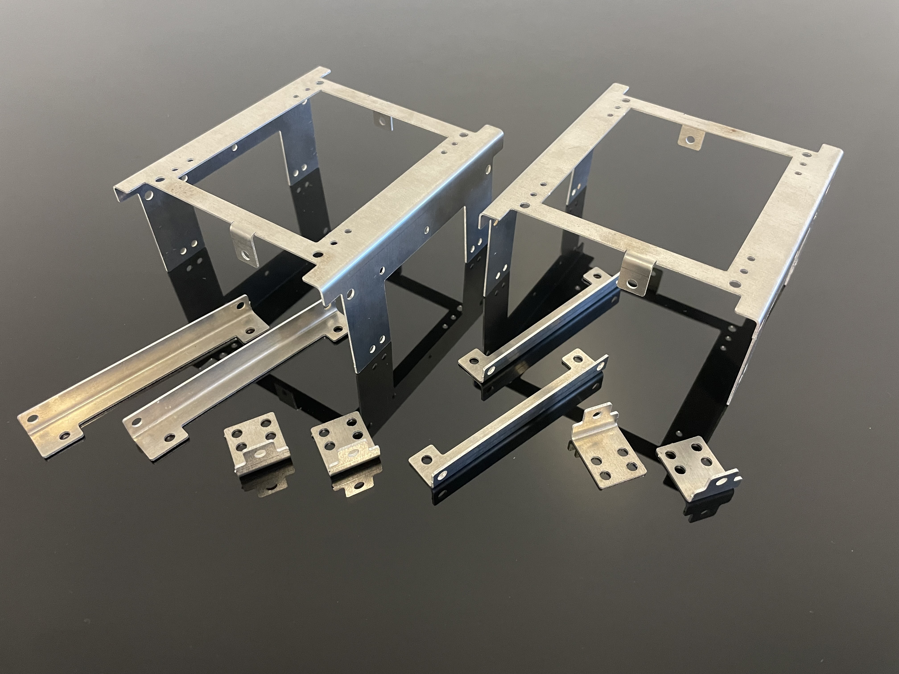
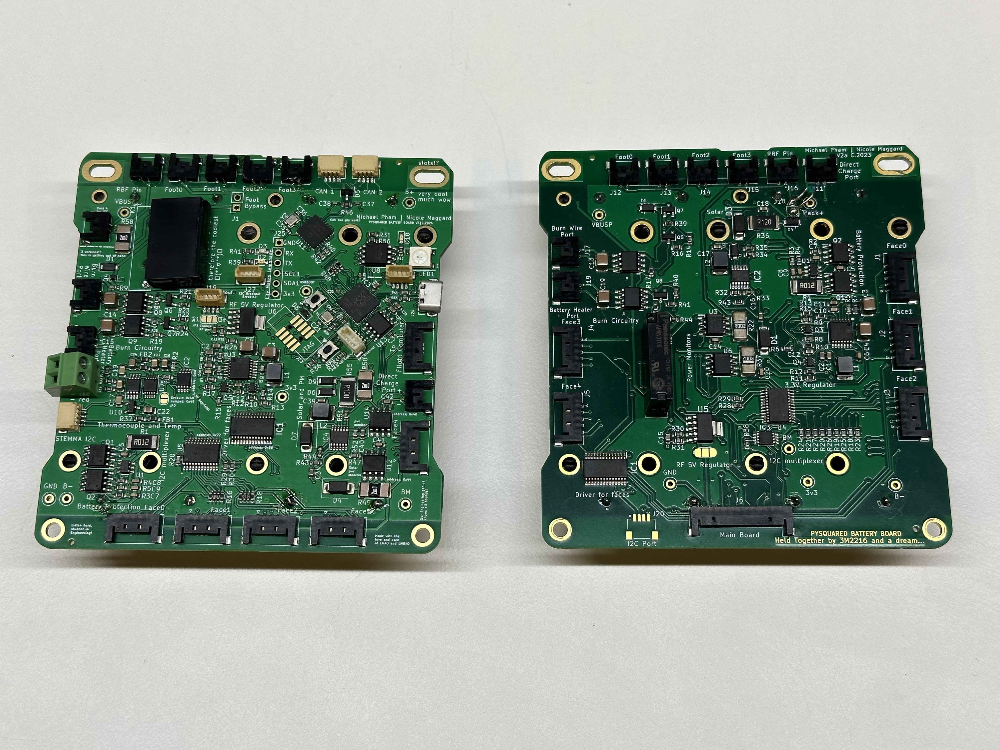
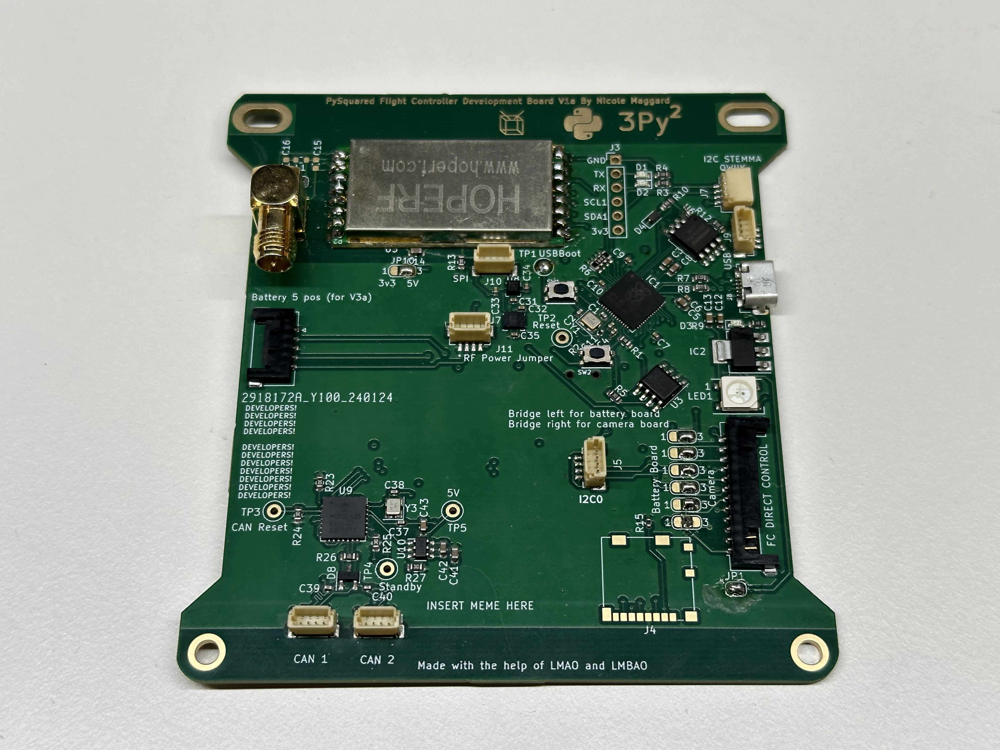
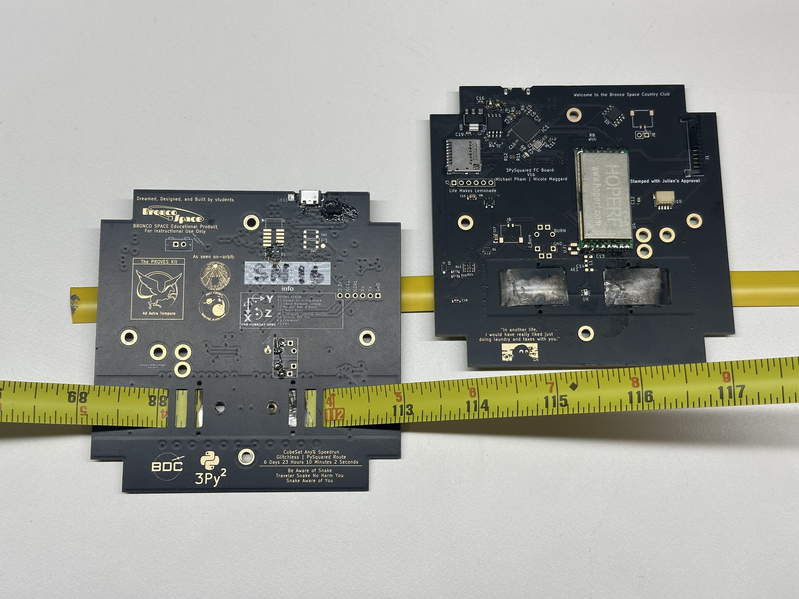

# Elements of the Kit 
There are a few key components of the kit that align with the usual lineup of satellite sub-systems: 
- Structure 
- Electrical Power System
- Flight Controller 
- Communications
- Attitude Determination and Control
- Flight Software 
- Ground Support Systems

-   :material-cube-unfolded:{ .lg .middle } __1U CubeSat Structure__

    ---

    The backbone of the CubeSat! Made out of bent 5052 Aluminum sheet metal, self clinching fasteners, and 3M 2216.
    
    

    **Status:** V2.1 is Supported!  
    V1 has 3x Flight Heritage. 

    [:octicons-arrow-right-24: Core Documentation Link](https://docs.proveskit.space/en/latest/core_documentation/hardware/1U_structure/)  
    [:octicons-arrow-right-24: GitHub Repo Link](https://github.com/proveskit/1U_structure)

-   :material-battery-charging-100:{ .lg .middle } __Battery / EPS Board__

    ---

    The Battery / EPS (Electrical Power System) board maintains all of the juice that is needed to run the satellite.
    
    

    **Status:** V3 / V3a is Supported!  
    V2 has 2x Flight Heritage. 

    [:octicons-arrow-right-24: Core Documentation Link](https://docs.proveskit.space/en/latest/core_documentation/hardware/battery_board/)  
    [:octicons-arrow-right-24: GitHub Repo Link](https://github.com/proveskit/battery_board)

-   :fontawesome-solid-computer:{ .lg .middle } __Internal Flight Controller__

    ---

    The brain of the CubeSat, this is where the radio and main microcontroller lives on an internal board for temperature stability.
    
    

    **Status:** V1a is Supported!  
    No Flight Heritage Yet. 

    [:octicons-arrow-right-24: Core Documentation Link](https://docs.proveskit.space/en/latest/core_documentation/hardware/FC_board/)  
    [:octicons-arrow-right-24: GitHub Repo Link](https://github.com/proveskit/flight_controller_board)

-   :fontawesome-solid-computer:{ .lg .middle } __External Flight Controller__

    ---

    The brain of the Yearling CubeSats! All mounted on the Z+ endcard of the satellite. Great for education maybe not for flight. 
    
    

    **Status:** V2 is Supported!  
    V1 has 2x Flight Heritage. 

    [:octicons-arrow-right-24: Core Documentation Link](https://docs.proveskit.space/en/latest/core_documentation/hardware/FC_board/)  
    [:octicons-arrow-right-24: GitHub Repo Link](https://github.com/proveskit/flight_controller_board)

-   :material-clock-fast:{ .lg .middle } __XY Solar Board__

    ---

    The backbone of the CubeSat! Made out of bent 5052 Aluminum sheet metal. 
    
    

    **Status:** V2.1 is Supported!  
    V1 has 3x Flight Heritage. 

    [:octicons-arrow-right-24: Core Documentation Link](https://docs.proveskit.space/en/latest/core_documentation/hardware/1U_structure/)  
    [:octicons-arrow-right-24: GitHub Repo Link](https://github.com/proveskit/1U_structure)

-   :material-clock-fast:{ .lg .middle } __Z- Solar Board__

    ---

    The backbone of the CubeSat! Made out of bent 5052 Aluminum sheet metal. 
    
    

    **Status:** V2.1 is Supported!  
    V1 has 3x Flight Heritage. 

    [:octicons-arrow-right-24: Core Documentation Link](https://docs.proveskit.space/en/latest/core_documentation/hardware/1U_structure/)  
    [:octicons-arrow-right-24: GitHub Repo Link](https://github.com/proveskit/1U_structure)

-   :material-clock-fast:{ .lg .middle } __Camera Payload__

    ---

    The backbone of the CubeSat! Made out of bent 5052 Aluminum sheet metal. 
    
    

    **Status:** V2.1 is Supported!  
    V1 has 3x Flight Heritage. 

    [:octicons-arrow-right-24: Core Documentation Link](https://docs.proveskit.space/en/latest/core_documentation/hardware/1U_structure/)  
    [:octicons-arrow-right-24: GitHub Repo Link](https://github.com/proveskit/1U_structure)

-   :material-clock-fast:{ .lg .middle } __Mechanisms__

    ---

    The backbone of the CubeSat! Made out of bent 5052 Aluminum sheet metal. 
    
    

    **Status:** V2.1 is Supported!  
    V1 has 3x Flight Heritage. 

    [:octicons-arrow-right-24: Core Documentation Link](https://docs.proveskit.space/en/latest/core_documentation/hardware/1U_structure/)  
    [:octicons-arrow-right-24: GitHub Repo Link](https://github.com/proveskit/1U_structure)

