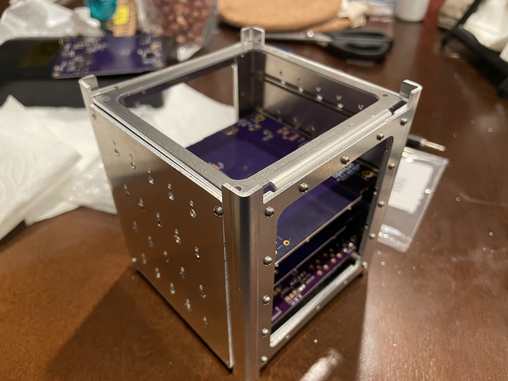
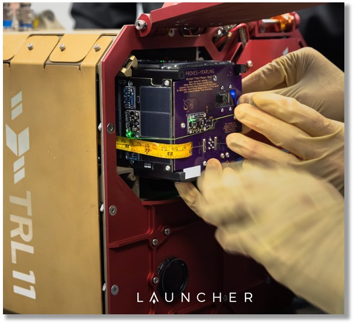
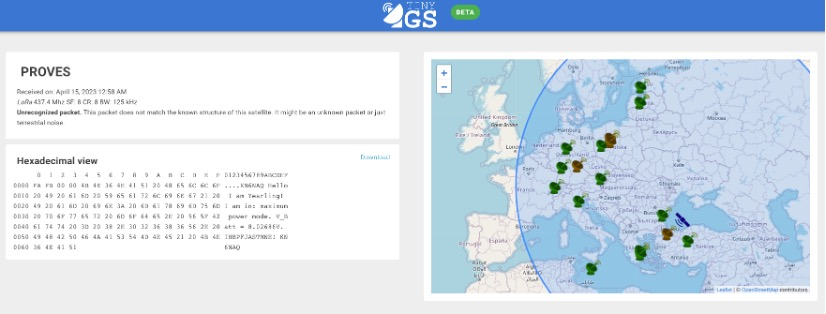
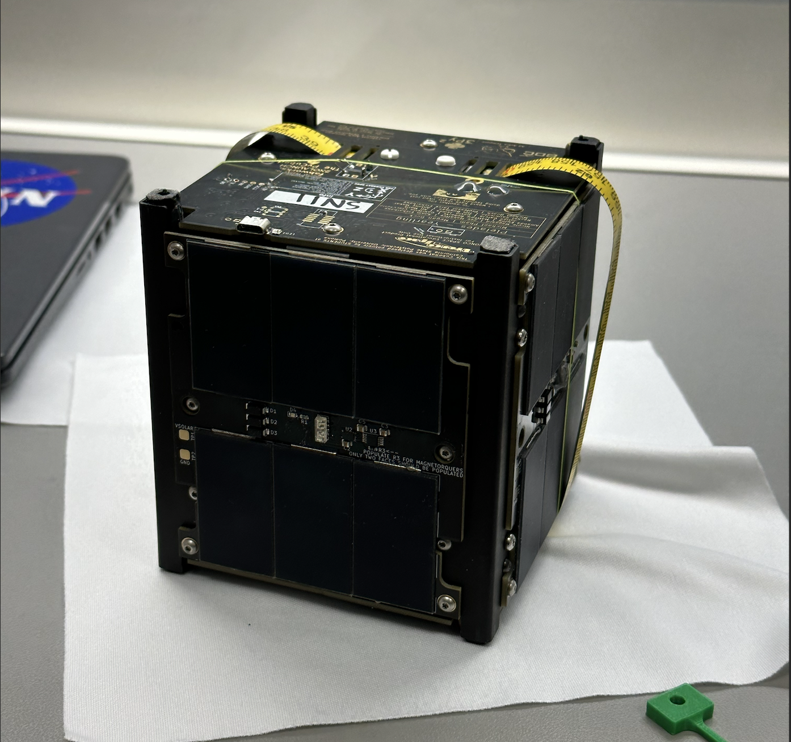

# A PROVES Kit Overview
The PROVES Kit blends Open-Source Hardware and Software. The Hardware developed includes the entire educational satellite structure, brackets, and printed circuit boards. One of the major issues that we sought to solve with the kit was to develop a single solution for an end to end space mission engineering education. Many other open source projects avalible to the community only feature a single element, like just a radio or just a flight computer. 

Figure 1: The Yearling-2 Satellite

## Flight Heritage
In order to ensure that the educational experience provided by using a PROVES Kit here on Earth is as authentic as possible we strove to fly it in outer space and verify that something can indeed be built with a BOM cost of less than $1k and do all of the core functions of a satellite. 

## Pleiades - Yearling: The Chaotic First Attempt 
***
We began this process with Pleiades - Yearling, which was conceived in Feburary 2022 as the brain child of Michael Pham and Megan Beck. This satellite was hot on the heels of BroncoSat-1 and, inspired by our friends at PSAS, we first tried to use a modular backplane solution that we were going to call the Lovelace Architecture. 

With a graceous endowment from our benefactor, Mike Beckage, we purchased a commerical rideshare opportunity for a 1U CubeSat and looked to the skies for the first journey of the PROVES Kit. Unfortunately a fully modular backplane system proved to be too complicated for us to finish developing in few short months we had from signing the launch contract to launch day. As a result, we did a massive rescope and brought back the PyCubed architecture (at the time in newly minted V5 form!) to pilot our ultra-low cost satellite. 

??? note "A Structural Sidebar"
    The sheet metal structure that we now know and love as a part of the PROVES kit was designed by Gavin James after the Yearling rescope. What many people don't know though is that our sheet metal lineage actually began much earlier than that with multiple prototype structures being designed by Bronco Space Founder and one time **CAD God** Ben Narita. 

    
    
Figure B1: Ben and Kelsey with the Proto Structure in the El Monte Branch!

    This design was really interesting, because it tried to emulate the OreSat card cage system with significantly less parts and greatly simplified manufacturing. The idea was to use a slotted sheet metal sandwich structure to create a clinching force when set screws were threaded in to deform an inner layer. It could have been pretty cool! We never followed through with trying to make it work long term though, since the much simpler half-u style structure won out in the long run. 

    
    
Figure B2: A Close Up of the Proto Structure

We didn't really have a whole lot of money to play with or deep engineering talent to pull it off, so we went as cheap and simple as possible. This manifested in even going as far as soldering Adafruit sensor breakout boards to every face of the satellite to try and save as much engineering effort as possible! 

Pleiades - Yearling was launched in January 2023 alongside Sapling - Sempervirens from the Stanford Student Space Initative. Despite sucessfully reaching orbit, the orbital transfer vehicle that we were hosted on suffered a critical systems failure after seperating from the Falcon 9. As a result, the satellite was never deployed and is now stuck orbiting the Earth in its deployer pod. 

Figure 2: Yearling 1 Being Loaded into the Deployer (Credit: Launcher Space)

## Pleiades - Yearling 2: The Unexpected Second Try 
***
We never expected Yearling 1 to be Yearling 1. Kind of like how they didn't expect it to be World War I. Yearling 2 came very shortly after Yearling 1 was pronounced dead by failure of the deployment vehicle. We began R&D into an entirely new generation of the PROVES Kit on January 25, 2023 and had a completed Version 2 of the kit completed and qualified for spaceflight by March 1, 2023. This satellite went through two complete design iterations in that time and rolled in a significant amount of improvements over the Yearling 1 architecture. 

Figure 3: The Launch of Yearling 2 (Credit: SpaceX)

This satellite was launched on April 8th, 2024, and contact was sucessfully made through the TinyGS network just 7 minutes after deployment. Unfortunately, contact was soon lost with the satellite before it could be transitioned into its amateur radio mission. Valuable experience and validation of our ultra low cost satellite thesis was nonetheless gained. 

Figure 4: The First Packet From Yearling 2!

## Pleiades - Squared: Third Time's the Charm! 
***
Due to the early loss of Pleaides - Yearling 2, our plan was to spend many months ironning out potential issues with the kit before attempting another spaceflight. This plan was totally served at the last minute though, when just a couple weeks after the launch of Yearling 2 we needed to do an emergancy delivery of a 1U satellite for a use it or lose it launch slot. This satellite was built, tested, and delivered for launch in only 1 calendar week. 

Figure 5: The Pleaides - Squared Satellite Right Before Integration!

This satellite was launched on June 12, 2024. Due to an unexpectedly early deployment from the host vehicle the satellite was actually lost in space for the first 5 hours of its mission life. Through a herculean emergancy ground station effort from the amateur radio community though, contact was established and valuable mission telemetry was downlinked. This satellite unfortunately also suffered an early loss. 

## Pleiades - Orpheus: Going Upstream
***
Scheduled to launch in Fall 2024, Pleiades - Orpheus will be the launch of a PROVES Kit based satellite from the Irvington High School Girls in STEM Club! Funded by the gracious donations of Christie English, the Orhpeus project will be a trail of flowing the educational potential of the PROVES Kit upstream to a group of students from a public highschool in Fremont, California. 

## The Pleiades Five: This is Getting Out of Hand
***
Now there are six of them! With its very confusing name, the Pleiades Five mission is tasked with taking six 1U CubeSats to orbit from five different colleges and universities (not including the lead, Cal Poly Pomona). This mission was selected in the 2024 round of NASA's CubeSat Launch Initative (CSLI).

*[PSAS]: Portland State Aerospace Society
*[Lovelace Architecture]: Named for computer scientist Ada Lovelace and a callback to the roots of our tech stack in the Adafruit ecosystem. 