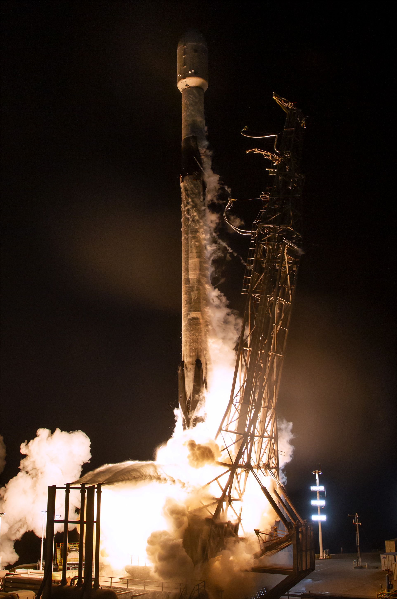

# How to Contact an Orbiting PROVES Satellite
Pleaides - Orpheus is currently in space and operationl as of December 25, 2024!

## Pleiades - Orpheus
| Parameter | Value |
| -------- | -------- |
| Operational?   | Launch Planned Q4 2024   |
| Frequency   | 437.4 Mhz   |
| Modulation   | LoRa & FSK  |
| Spreading Factor   | 8   |
| Callsign   |  K06AZM  |


<p align="center">The Launch of Pleiades - Orpheus</p>
<p align="center">Image Courtesy: SpaceX</p>

### Orpheus Radio Config Settings
These are the radio configuration settings defined in the `pysquared.py` file for the Orpheus satellite. Although it is possible to change these settings in flight, whenever the satellite reboots it will default back to these settings. 
```py
        self.radio_cfg = {
            "id": 0xFB,
            "gs": 0xFA,
            "freq": 437.4,
            "sf": 8,
            "bw": 125,
            "cr": 5,
            "pwr": 23,
            "st": 80000,
        }
```

### Tracking Orpheus 
You can view a live ground track of the Orpheus Satellite on its [TinyGS Page](https://tinygs.com/satellite/PLEIADES-ORPHEUS).

!!! tip "Latest TLE"

    We are currently following this predicted TLE for the satellite. As of December 25th we were still able to get packets on this TLE from both partner stations in Europe and our own operators in the US. 

    ```
    1 99999U 1800100  24356.55210831  .00000000  00000-0  54728-3 0  9999
    2 99999  44.9918   0.5192 0006321 333.9104 162.3426 15.19156729    15
    ```

    This TLE was generated using open-source [TLE Tailor Tool](https://github.com/dcajacob/tle-tailor).

Pleiades - Orpheus was launched on December 21, 2024 on SpaceX Bandwagon-2! This satellite is jointly built by Bronco Space at Cal Poly Pomona and the Irvington High School Girls in STEM Club. On launch the satellite will beacon appoximately every 40 seconds and listen for 10 seconds after every ping for commands from ground. 

### Contacting Orpheus 
At this time we are working through an on-orbit anomoly that is resulting in an expectedly low transmit power from the satellite (only 20 dBm instead of the planned 30 dBm). As a result, we have only seen sucessful links closed to very well tuned stations with good high gain antennas and low noise floors. This page will be updated with our progress in improving that link budget and openning Orpheus communications up to the world! 

At this time, if you would like to make an attempt to hear from or contact Orpheus anyways, we provide the following scripts written in CircuitPython as a means of attempting to receive and transmit an up to 250 byte repeat request digitally to the satellite. 

Note that both of these scripts are intended to work with HopeRF derived RFM9x modules that are tuned to the 433Mhz band. An example is provided at [this link](https://www.adafruit.com/product/3073?gad_source=1&gbraid=0AAAAADx9JvQXwuDKkPXEYqhwTx7lV2l6M&gclid=CjwKCAiA34S7BhAtEiwACZzv4aEF1Gl3jxhedn1GFJA7pVquZxcC4hMkUjeo_qG3vD-uE3D836smVxoCKkQQAvD_BwE). 

In these scripts, simply replace the mentions of `cubesat` and `radio1` with your own instance of an `adafruit_rfm` or `adafruit_rfm9x` object. The scripts are designed to be used with our satellite's flight controller board, which automatically creates a `radio1` object with based on the board's internal wiring. 

#### Simple Receiver Script
This script will listen for potential packets and print out any candidates to the terminal. Note that because `enable_crc` is set to `False` it will also print out partially received and garbled packets! Because we do not bit pack our data, it is possible to still reconstruct information about the satellite from a partial packet. 
```py
import time
from pysquared import cubesat as c

print("=" * 70)
print("Initializing Simple Receiving Script")
print("=" * 70)

c.radio1.node = 0xFA
c.radio1.destination = 0xFB
c.radio1.enable_crc = False
c.radio1.spreading_factor = 8
c.radio1.coding_rate = 5

while True:
    
    print(f"Time[{time.monotonic()}] Received: {c.radio1.receive(keep_listening=True)} RSSI: {c.radio1.last_rssi}")

    time.sleep(1)
```

#### Simple Repeater Script 
If you have a second radio module that you can use for transmit this script allows you to send a message (up to around 245 Bytes) that will be repeated by the satellite if it is received within the 10 second `listen()` window that follows every beacon!

```py
import time
from pysquared import cubesat as c

print("=" * 70)
print("Initializing Simple Repeater Commanding Script")
print("=" * 70)

c.radio1.node = 0xFA
c.radio1.destination = 0xFB
c.radio1.tx_power = 20
c.radio1.spreading_factor = 8
c.radio1.coding_rate = 5
passcode = ""

while True:

    packet = (
            b"\x00\x00\x00\x00"
            + passcode.encode()
            + b"RP"
            + input("Message to Repeat: ")
        )
    
    c.radio1.send(packet, keep_listening=True)

    time.sleep(1)

    print(f"{c.radio1.receive(keep_listening=True)} RSSI: {c.radio1.last_rssi}")
```

