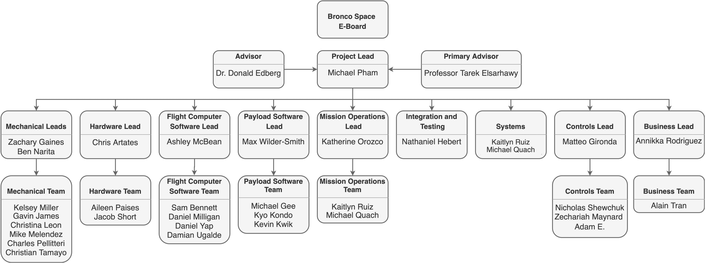
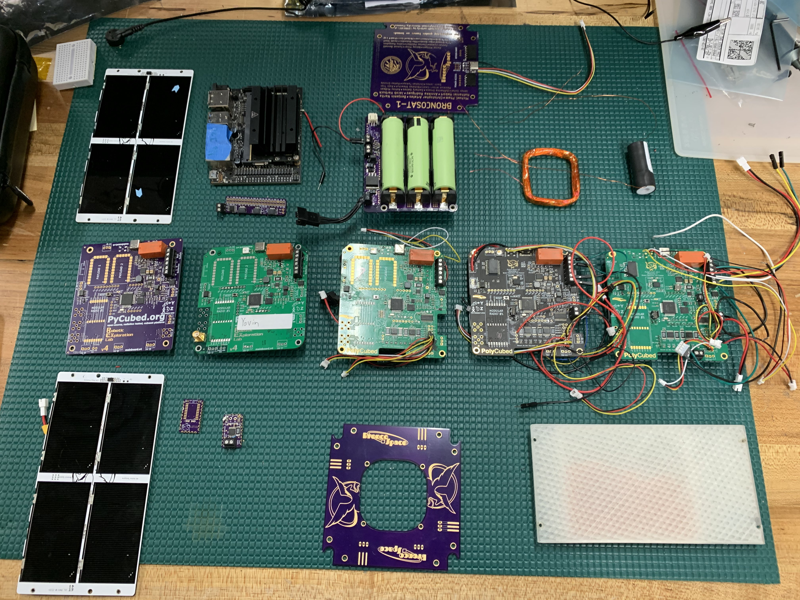
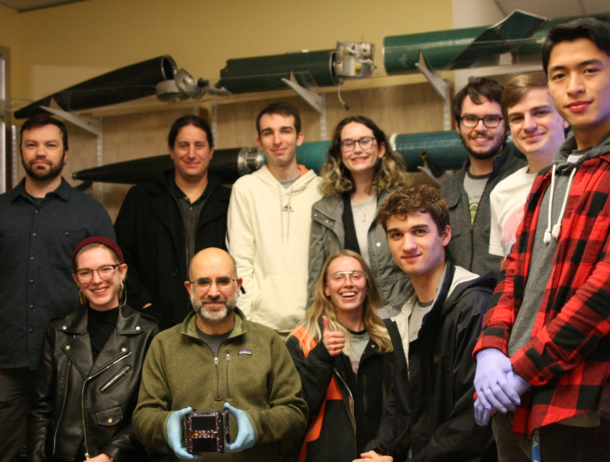
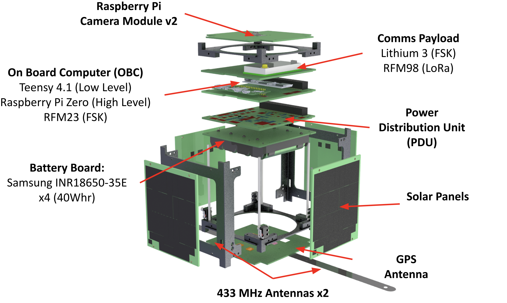

# Foundational Info About CubeSats

Figure 1: Bronco Space Satellites and Deployers!  Courtesy: Momentus Space, Launcher Space, and Exolaunch

So this is your first time ever getting into CubeSats, welcome! This page contains a list of resources that are useful for understanding the CubeSat community and developing a foundational understanding of the space we work in. 

## CubeSat 101

Although it is a bit of a toss up between the US and Japan on who came up with the idea of a "picosatellite" form factor that can ride along with the bigger satellites, it is generally accepted that a Stanford Professor, Bob Twiggs, and a Cal Poly San Luis Obispo Professor, Dr. Jordi Puig-Suari, jointly developed the first CubeSat specification in 1999. It would be a couple years before the first CubeSat would take to the skies, but that was to be the start of an unprecedented revolution in small spacecraft. 

Although it was last updated in 2017, the CubeSat 101 document from NASA is still fantastic as a foundational document laying out what it takes to launch a CubeSat. It is nessicarily brief in many regards, but for someone entirely new to the community it is a good idea to at least give it a skim to get a feel for things! 

Check out [CubeSat 101 here](https://www.nasa.gov/wp-content/uploads/2017/03/nasa_csli_cubesat_101_508.pdf)

#### The CubeSat Subsystems
Although on the PROVES team we prefer to work in a very flat and dynamic team structure, it is still very useful to seperate the CubeSat into sub-systems so people can have areas of responsibility that they can sort themselves into. **Figure 2** shows the mid project org chart for BroncoSat-1, and illustrates the most common pattern for dividing up elements of the CubeSat into sub-systems with sub-teams that are assigned to each of them. 

Figure 2: The BroncoSat-1 Mid Project Org Chart

You will usually find a chart like this and a similar breakdown of sub-systems across most space engineering organizations that subscribe to more traditional space mission engineering. Sometimes, in especially big organizations, you'll see even more stratification with a sub-system like **hardware** being split into **a command and data handling system** and **electrical power system** for example. 

??? tip "A Tip on Org Structure"
    Although it is very common to see hierarchical team structures like the one seen in **Figure 2** we strongly advise against any hierarchy that goes more than three levels deep unless you are an exceptionally well funded and organized team. The 2011 print of the Space Mission Analysis and Design (SMAD) textbook (the space engineering bible by some regards) has a specific section on SmallSats that also recommends not exceeding around 20 people on the entire engineering team if possible. 

    These recommendations stem from a simple issue, as the org gets bigger it becomes an exponentially more unweidly and difficult to manage beast. This can be handled, for well funded and full time staffed engineering teams, but will be the death of leaner and more strapped for cash projects. Although it can seem attractive to enlist as many hands as possible (especially in a voulenteer student organization where the labor costs are pizza money!) too many cooks in the kitchen will quickly lead to chaos and confusion. 

    To read more about our recommendations for structuring your organization, see this page [WORK IN PROGRESS]. 

## Some of Our Favorite CubeSat Missions! 
Learning about past CubeSat missions can be an excellent way to get inspired about what is possible inside the box. These missions are some great examples of how these tiny satellites can have a big impact on the world! 
***
#### ELFIN | The Electron Losses and Fields INvestigation

Figure 3: ELFIN Exploded View  Courtesy: UCLA ELFIN

In our opinion the ELFIN mission from UCLA is the shining example for what is possible with a university led scientific CubeSat mission. As a pair of 3U CubeSats, this mission generated remarkable scientific data from deployment all the way until deorbit. 

Check out their website [here!](https://elfin.igpp.ucla.edu)
And read their mission summary paper [here.](https://link.springer.com/article/10.1007/s11214-020-00721-7)
***

#### Seahawk-1 | Sustained Ocean Color Observations with Nanosatellites (SOCON)

Figure 4: A Gallery of Images from Seahawk  Courtesy: NASA Earthdata

The Seahawk-1 CubeSat from UNCW is an amazing example of how small satellites can have big impacts! Ocean color is a remarkable but rather niche field of scientific inquiry. As a result, it is difficult to fund dedicated satellite missions to collect high resolution ocean color data. The SOCON mission demonstrated that it was possible ot use these shoebox sized satellites to collect useful scientific data far beyond what the current state of the art is. 

Check out a summary of thier mission [here!](https://www.earthdata.nasa.gov/learn/articles/seahawk-hawkeye-ocean-color)
***
## The Other Open Source CubeSat Architectures

#### The PyCubed
The PyCubed architecture was developed by the man, the myth, the legend, Max Holliday while he was a Ph.D student at Stanford University. Since it was announced to the world at the SmallSat 2019 the PyCubed took the world by storm with the promise of being an easy to use and very low cost solution for CubeSat avionics. 

Figure 5: The Py4 CubeSats | The Latest Flight of the PyCubed  Courtesy: NASA/Don Richey

The PyCubed v5 is the forebearer of our 3PySquared architecture that now powers the PROVES Kit. Much has changed since we were PyCubed users, but we still owe a huge ammount of our sucess to the existence of the PyCubed platform.

??? danger "The PolyCubed"
    For BroncoSat-1 we created a private fork of the PyCubed architecture that we called the "PolyCubed." This architecture took the PyCubed V4 to what we thought was a logical conclusion, loading it up with as many features as possible inside of the single board form factor. This design was never open sourced, as we had a fundamental change in mindset for how to design the avionics (leading to the 3PySquared used today!), but design files can be shared privately if anyone would like to take a look. 

    

    
Figure 6: A Breakdown of BroncoSat-1 Showing the Iterations from PyCubed v4 to PolyCubed V2a

#### OreSat

Figure 7: The OreSat Team with OreSat-0!  Courtesy: OreSat

The OreSat architecture has been in development one way or another since the founding of the Portland State Aerospace Society in 1996! They have a really cool modular card cage system. Today it has sucessfully been to space once on OreSat-0 and will be flying again soon on OreSat-0.5! 

#### The Artemis CubeSat Kit

Figure 8: An Expanded View of the Artemis CubeSat Kit  Courtesy: Hawaii Space Flight Lab

Developed by the Hawai'i Space Flight Lab (HSFL), located at the University of Hawai'i at Manoa, the Artemis CubeSat kit was designed to cost less than $5k to fabricate and have an accompanying space mission education course that could be implemented anywhere from universities all the way down to middle and high schools. 