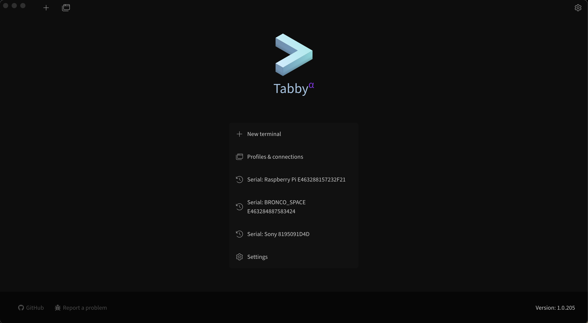
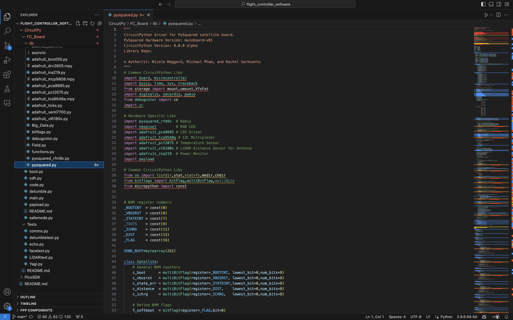

# So You Have a PROVES Kit!

We are assuming that you have received a fully assembled PROVES Kit to get started. If you only have the indivudual components please refer to the the assembly guide to get things together or the individual checkout procedures for individual components. 

## Prerequisites 

Before we crack into using our PROVES Kit it is important to acquire or install a few useful tools. 

#### Required Items
In order to interact with the hardware, we will need to install some software that will give us the ability to view and change the code from a serial terminal, download the latest code from the the Github, and edit the code if we desire. Make sure all of these tools are installed on your computer using the links below before proceeding! 

!!! success "A Serial Terminal Software"
    We need some way to read the output of the satellite on a serial port and ideally a way to also type serial commands back during debugging.Any software that is capable of opening a serial port will do (even the built in terminal on Linux and MacOS will work!), but we recommend installing something like Tabby for a better user experience.  

    

    <p align="center">Figure 1: An example Tabby Landing Page</p>

    Learn more about Tabby [here](https://tabby.sh). 

!!! success "A Code Editor"
    If you're a Linux lunatic you could view and edit all of your code on the command line using Vim or something, but our recommendation for a good user experience is something like Visual Studio Code!   

    

    <p align="center">Figure 2: An example VS Code Page Page</p>

    Learn more about VS Code [here](https://code.visualstudio.com). 

Note that these recommendations are for Windows and MacOS users. We presume that if you’re joining us from Linux you probably have your own way of doing all of this. 

#### Recommended Items

???+ info "Github Desktop"
    Another one where if you are a power user you probably don't need this, but GitHub Desktop puts a really nice GUI in front of the Git experience. We use this to pull and push all of the code and design files from the GitHub repos.
    
    Learn more about GitHub Desktop [here](https://desktop.github.com).


There are a few hardware tools that are helpful when working with the satellite as well. A micro USB cable is essential, to connect to the satellite and pull data from it. The multimeter is useful for measuring the voltages across various parts of the kit to verify functionality. An SDR (Software Defined Radio) is completely optional, but very useful for verifying that the radio is working and it is also cool to listen into the airwaves around you. 

Hardware:

- Multimeter 
- Micro USB Cable
- SDR (Optional) 

## Initial Checkouts 

Assuming that you have a fully assembled PROVES Kit in front of you, we will go through a quick tour of the major features of the kit!

### Function Check
Currently there is no dedicated function check script. The best way to validate if all of satellite's subsystems are online is to use the built in state of health functionality in the ```pysquared.py``` class. To do this, take the following steps: 

1. Connect to the satellite via the micro usb cable. You should see a USB drive pop up if you're using the CircuitPython firmware.
2. Open a serial connection using Tabby. 
3. Use the keyboard shortcut ++ctrl+c++ to interupt any currently running code and follow the instructions that pop up to enter the REPL
4. Type the following command: 
```py
from pysquared import cubesat as c
```
!!! info "What does this command do?"
    This line of code instantiates the ```cubesat``` class within ```pysquared.py``` and names it an object ```c```. 
    
    This gives us access to all of the core functionalities of the the satellite within a single object. We borrowed this design pattern from Max Holliday's PyCubed software implementation, so alot of the functionalities cross over. 
5. Call the ```c.hardware``` dictionary to determine if all of the satellite functionalities are ```true```. 

### Radio Check
With an active instance of the ```cubesat``` class we can quickly send some packets to validate that the radio is operational. Make sure to check the properties in the ```self.radio_cfg``` dictionary before proceeding: 

!!! info "Default ```self.radio_cfg```" 
    ```py 
        self.radio_cfg = {
            'id':   0xfb,   # The ID of the sender
            'gs':   0xfa,   # The ID of the receiver
            'freq': 437.4,  # Transmit frequency
            'sf':   8,      # LoRa Spreading Factor
            'bw':   125,    # Transmit bandwidth
            'cr':   8,      # LoRa Coding Rate
            'pwr':  23,     # Transmit power
            'st' :  80000   
        }
    ```

1. First, configure something to listen in and monitor the radio waves

??? info "Using an SDR"
    If you have a SDR hooked up, tune into to frequency that you're transmitting on and watch the waterfall. 

??? info "Using another HopeRF Radio Module"
    If you have a second PROVES Kit, a Flight Controller Dev Board, or a standalone RFM98PW you can use that to monitor for transmissions as well. Make sure that the ```'id'``` and ```'gs'``` parameters are the opposite of what 

!!! warning
    If your PROVES Kit is equipped with the RFM98PW (the 433 Mhz Band radio) use caution when calling 

2. You can send a packet using a command such as: 
```c.radio1.send("Hello World!")```


*[REPL]: Read Print Evaluate Loop
*[SDR]: Software Defined Radio