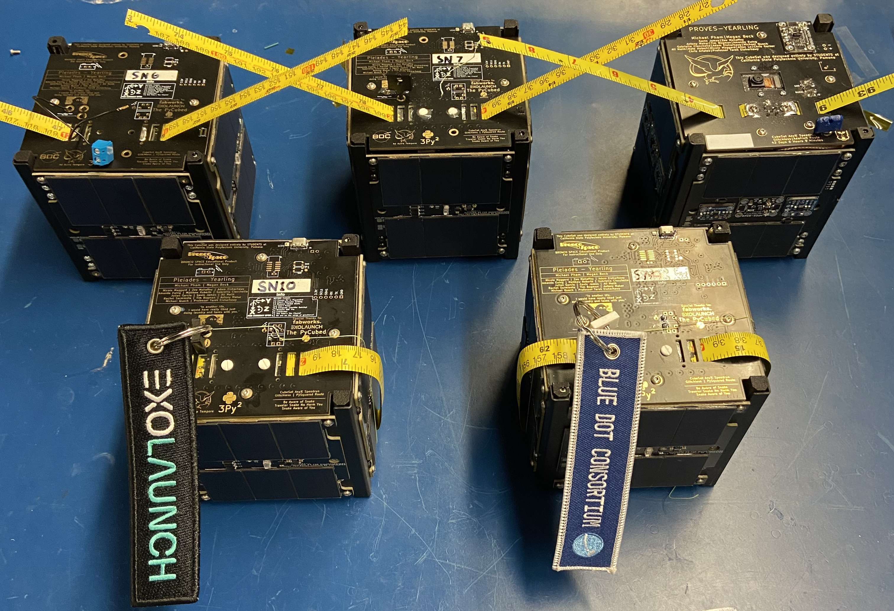
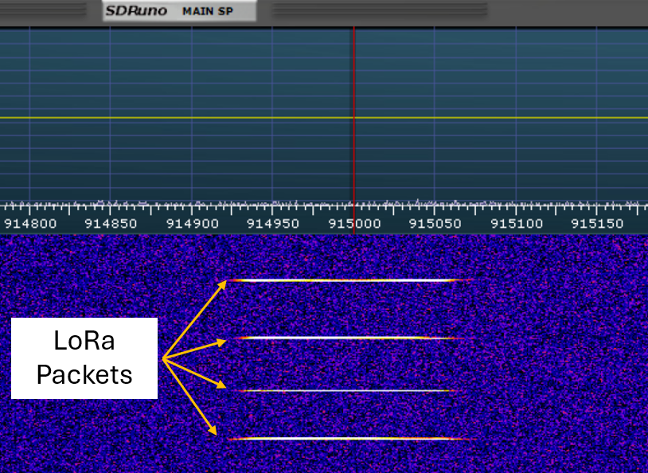
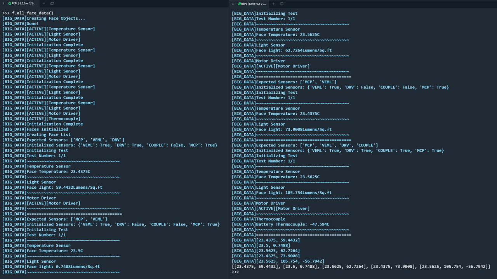
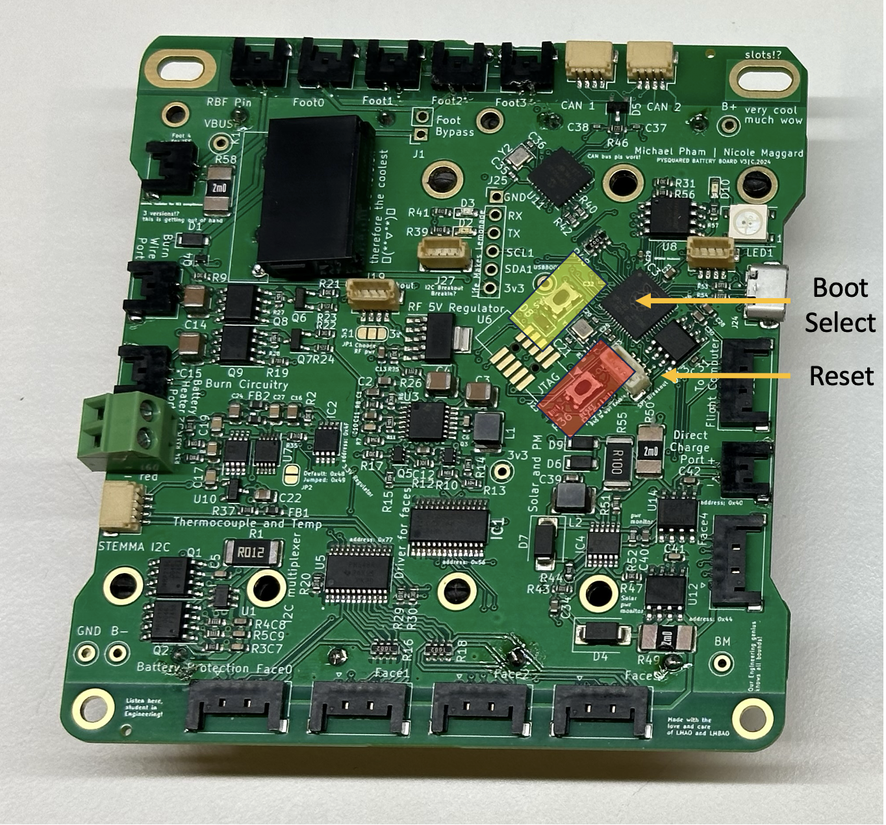

# So You Have a PROVES Kit!

<p align="center">The Pleiades - Yearling Fleet</p>

We are assuming that you have received a fully assembled PROVES Kit to get started. If you only have the indivudual components please refer to the the assembly guide to get things together or the individual checkout procedures for individual components. 

## Prerequisites 

Before we crack into using our PROVES Kit it is important to acquire or install a few useful tools. 

#### Required Items
In order to interact with the hardware, we will need to install some software that will give us the ability to view and change the code from a serial terminal, download the latest code from the the Github, and edit the code if we desire. Make sure all of these tools are installed on your computer using the links below before proceeding! 

??? success "A Serial Terminal Software"
    We need some way to read the output of the satellite on a serial port and ideally a way to also type serial commands back during debugging.Any software that is capable of opening a serial port will do (even the built in terminal on Linux and MacOS will work!), but we recommend installing something like Tabby for a better user experience.  

    

    <p align="center">Figure 1: An example Tabby Landing Page</p>

    Learn more about Tabby [here](https://tabby.sh). 

??? success "A Code Editor"
    If you're a Linux lunatic you could view and edit all of your code on the command line using Vim or something, but our recommendation for a good user experience is something like Visual Studio Code!   

    

    <p align="center">Figure 2: An example VS Code Page Page</p>

    Learn more about VS Code [here](https://code.visualstudio.com). 

Note that these recommendations are for Windows and MacOS users. We presume that if you’re joining us from Linux you probably have your own way of doing all of this. 

#### Recommended Items

???+ info "Github Desktop"
    Another one where if you are a power user you probably don't need this, but GitHub Desktop puts a really nice GUI in front of the Git experience. We use this to pull and push all of the code and design files from the GitHub repos.
    
    Learn more about GitHub Desktop [here](https://desktop.github.com).

There are a few hardware tools that are helpful when working with the satellite as well. A micro USB cable is essential, to connect to the satellite and pull data from it. The multimeter is useful for measuring the voltages across various parts of the kit to verify functionality. An SDR (Software Defined Radio) is completely optional, but very useful for verifying that the radio is working and it is also cool to listen into the airwaves around you. 

Hardware:

- Multimeter 
- Micro USB Cable
- SDR (Optional) 

## Initial Checkouts 

Assuming that you have a fully assembled PROVES Kit in front of you, we will go through a quick tour of the major features of the kit!

### Function Check
Currently there is no dedicated function check script. The best way to validate if all of satellite's subsystems are online is to use the built in state of health functionality in the ```pysquared.py``` class. To do this, take the following steps: 

1. Connect to the satellite via the micro usb cable. You should see a USB drive pop up if you're using the CircuitPython firmware.
2. Open a serial connection using Tabby. 
3. Use the keyboard shortcut ++ctrl+c++ to interupt any currently running code and follow the instructions that pop up to enter the REPL
4. Type the following command: 
    ```py
    from pysquared import cubesat as c
    ```
    
    !!! info "What does this command do?"
        This line of code instantiates the ```cubesat``` class within ```pysquared.py``` and names it an object ```c```. 
        
        This gives us access to all of the core functionalities of the the satellite within a single object. We borrowed this design pattern from Max Holliday's PyCubed software implementation, so alot of the functionalities cross over. 

5. Call the ```c.hardware``` dictionary to determine if all of the satellite functionalities are ```true```. 

### Radio Check
With an active instance of the ```cubesat``` class we can quickly send some packets to validate that the radio is operational. Make sure to check the properties in the ```self.radio_cfg``` dictionary before proceeding: 

```py 
    #Default Configuration 
    self.radio_cfg = {
        'id':   0xfb,   # The ID of the sender
        'gs':   0xfa,   # The ID of the receiver
        'freq': 437.4,  # Transmit frequency
        'sf':   8,      # LoRa Spreading Factor
        'bw':   125,    # Transmit bandwidth
        'cr':   8,      # LoRa Coding Rate
        'pwr':  23,     # Transmit power
        'st' :  80000   
    }
```

1. First, configure something to listen in and monitor the radio waves:

    ??? info "Using an SDR"
        If you have a SDR hooked up, tune into to frequency that you're transmitting on and watch the waterfall. 

    ??? info "Using another HopeRF Radio Module"
        If you have a second PROVES Kit, a Flight Controller Dev Board, or a standalone RFM98PW you can use that to monitor for transmissions as well. Make sure that the ```'id'``` and ```'gs'``` parameters on the receiving node are the opposite of what they are on the sending node. 

        Once you're ready to start receiving you can setup a receiving loop with the following coding pattern: 

        ```py
        from pysquared import cubesat as c
        import time

        while True:
            time.sleep(1)
            print(c.radio1.receive())
        ```

        This code will print either ```none``` when there is no received message or a whatever message has come over the airwaves if there is a valid packet. It can either be implemented as its own script and called or you're a pro gamer you can type it line by line into the REPL. 

        If you are using a stand alone RFM98PW with a dev board you'll have to go through setting up the pins and radio object for the specific microcontroller you're pairing it with. We recommend referring to the [Adafruit RFM9x documentation](https://learn.adafruit.com/adafruit-rfm69hcw-and-rfm96-rfm95-rfm98-lora-packet-padio-breakouts/circuitpython-for-rfm9x-lora) for how to do that. 

        This is the most basic pattern for receiving and demodulating messages. For more advanced (and useful) test patterns please refer to our dedicated page on [RFM9x Radio Usage](https://docs.proveskit.space/en/latest/core_documentation/software/rfm_radio_usage/).

2. You can now send a packet using a command such as: 
    ```c.radio1.send("Hello World!")```

    !!! warning
        If your PROVES Kit is equipped with the RFM98PW (the 433 Mhz Band radio) use caution when calling ```c.radio1.send()``` directly, as it bypasses the ```c.is_licensed``` parameter that will usually stop you from violating FCC regulations unless you've verified you have a valid license to operate the radio.  

3. Check if the message comes through! Each call of ```c.radio1.send()``` should return ```True``` if the radio accepts the string and sends it out sucessfully. You should also see the following things on whatever receiving device you're using as well: 

    ??? info "Using an SDR"
        You should see a blip on the SDR shortly after using the ```send``` command. What that blip looks like will be different, depending on which modulation you are using: 

        - LoRa Mode 
        
        <p align="center">Example LoRa Messages</p>

        - FSK Mode

    ??? info "Using another HopeRF Radio Module"
        If you are receiving from a HopeRF module your serial terminal should look someting like this: 

### Acquiring Face Data

Unless you have already implemented a payload into the PROVES Kit, most of the data you'll be interested in is the data reported by the satellite's faces. In order to poll this: 

1. Connect either to your top cap FC board or the EPS Board running Circuit Python and enter the REPL. 
2. Set up the ```cubesat``` object. 
    ```py 
    from pysquared import cubesat as c
    ```
3. Import the functions library. 
    ```py 
    import functions
    ```  
4. Instantiate a functions object and pass the ```c``` object to it. 
    ```py 
    f = functions.functions(c)
    ```
5. Call ```f.all_face_data()```. You should expect an output like this: 

<p align="center">Example Face Data Output</p>

### Conducting a Range Test
One of the number one things that keeps us up at night with the satellite is whether or not we will actually hear back from it after sending it off on its journey in outer space. As a result, a fundemental test to do for every build is a verification of the performance of the radio at long range. We will have a seperate page forthcoming that goes into detail about the reasons and methedology behind this test, but we will quickly reference some of the key steps here: 

1. Position a sending and receiving node some distance away from each other. We recommend at least 1km of seperation and a clear line of sight between the two nodes. 
2. 

## Changing the Code
Inevitably you'll want to change the code out on one of your boards. By default we recommend the CircuitPython implementation be loaded on the boards for ground testing, but this should be swapped out for more resiliant code before flight. 

### Flashing Firmware 
Changing out the firmware on the microcontrollers is how we can switch between using CircuitPython or C/C++ binaries for our flight software. Ocasionally the dev team will also push an update directly to firmware, but this usally only happens when we have a hardware update, want to use a newer compiler, or have discovered a critical bug. 

1. Connect to the board using USB 
2. Locate the **RESET** and **BOOTSELECT** buttons on the board in question: 

    ??? info "Flight Controller Board"

    ??? info "Internal Flight Computer" 
        
        <p align="center">Internal FC Board Button Locations</p>

    ??? info "Battery Board"
        
        <p align="center">Battery Board Button Locations</p>

3. While holding the **BOOTSELECT** button, tap the **RESET** button 
4. The board will now reboot into bootloader mode 
5. Once in bootloader mode you can drag and drop a new ```.uf2``` file in as needed. 

??? note "Can't Reach the Buttons?" 
    If you're currently using binaries, and want to switch to CircuitPython or update the firmware, sorry but you'll have to disassemble to access the buttons for a swap. 

    If you're currently using CircuitPython you're in luck! There are some REPL commands that can come to the rescue. Just type the following into a fresh terminal: 
    ```py
    import microcontroller
    microcontroller.on_next_reset(microcontroller.RunMode.UF2)
    microcontroller.reset()
    ```

### Updating CircuitPython Software 
Updating the CircuitPythong software is remarkably easy and painless, which is part of why we love using it so much in the lab and in the classroom!

1. Get the code you want to update from the GitHub or your local machine. 
2. Connect to the board you want to update via USB. You should see a removable drive pop up when it is plugged into your computer. 
3. Drag and drop the new code over top of the old code! 

*[REPL]: Read Print Evaluate Loop
*[SDR]: Software Defined Radio